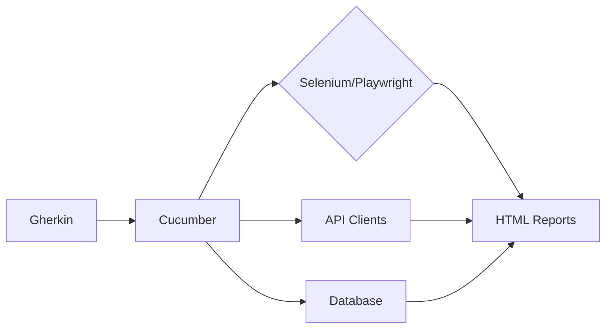

Here's a concise guide to BDD/Cucumber/Gherkin best practices with examples:

### 1. **Feature Files Structure**
```gherkin
Feature: User login
  As a registered user
  I want to log into the system
  So I can access my account

  # Use Background for setup steps
  Background:
    Given the user database is initialized

  # Keep scenarios focused
  Scenario: Successful login with valid credentials
    When I enter "test@example.com" as email
    And I enter "validPass123!" as password
    And I click the login button
    Then I should see the dashboard

  # Use outlines for data-driven testing
  Scenario Outline: Login validations
    When I enter "<email>" and "<password>"
    And I click login
    Then I should see "<error>"
    
    Examples:
      | email             | password      | error                     |
      | test@example.com  |               | Password is required     |
      |                   | validPass123! | Email is required        |
      | invalid@email.com | wrongPass     | Invalid credentials      |
```

### 2. **Step Definition Best Practices**
```javascript
// Use declarative over imperative style
When("I enter {string} as email", (email) => {
  cy.get('#email').type(email); // Using Cypress for web
});

// Reuse steps with parameters
Then("I should see {string}", (expectedText) => {
  cy.contains(expectedText).should('be.visible');
});

// Handle complex data with data tables
Given("the following users exist:", (dataTable) => {
  const users = dataTable.hashes();
  users.forEach(user => createUser(user));
});
```

### 3. **Key Principles**
- **Atomic Scenarios**: Each scenario tests exactly one behavior
- **Declarative Language**: Focus on WHAT not HOW
- **DRY Steps**: Extract common patterns into helper functions
- **Tagging**: `@smoke`, `@wip`, `@api` for test organization
- **Avoid UI Details**: Don't reference specific buttons/IDs in Gherkin

### 4. **Anti-Patterns to Avoid**
❌ Imperative scripting:  
`When I click the #login-btn element`  
✅ Instead: `When I submit the login form`

❌ Overly broad scenarios:  
`Scenario: Test entire checkout flow`  
✅ Split into: `Add to cart` -> `Payment` -> `Confirmation`

❌ Step duplication:  
`Then I should see "Success"` and `Then I see "Success!"`  
✅ Standardize wording

### 5. **Project Structure**
```
features/
├── authentication/
│   ├── login.feature
│   └── password_reset.feature
├── step_definitions/
│   └── auth_steps.js
└── support/
    ├── hooks.js
    └── world.js
```

### 6. **Recommended Tools**
- **Cucumber.js**: JavaScript implementation
- **Cypress**: Popular for E2E testing
- **Allure**: Reporting with living documentation
- **Cucumber Expressions**: For better parameter matching

### 7. **Living Documentation**
Generate HTML reports that become:
- Executable specifications
- Always-updated documentation
- Collaboration tools between dev/QA/product

**Golden Rule**:  
*"If your business stakeholders can't understand your scenarios, you're not doing BDD right."*

Start with high-value features first (e.g., authentication, core transactions) and iterate based on team feedback. Focus on creating a shared language between technical and non-technical team members.

Here's a comprehensive best practice guide based on the official Cucumber Gherkin reference, distilled into actionable principles with examples:

### 1. **Core Structure Best Practices**
```gherkin
Feature: Account management
  Rule: Password requirements
    Scenario: Reject weak passwords
      When I set password to "1234"
      Then I should see "Password must be 8+ characters"

  Rule: Email validation
    Scenario: Reject invalid emails
      When I register with "invalid-email"
      Then I should see "Invalid email format"
```

### 2. **Keyword Mastery**
- **`Rule` (Gherkin 6+):** Group related scenarios under business rules
- **`Example`:** Synonym for `Scenario` (use consistently)
- **`But`:** Use instead of `And` for negative assertions
```gherkin
Scenario: Failed login
  Given I'm a registered user
  When I enter wrong credentials
  Then I should not be logged in
  But I should see "Invalid credentials"
```

### 3. **Data Handling Techniques**
**a) Tables for structured data:**
```gherkin
Given products exist:
  | name       | price | category    |
  | Laptop     | 999   | Electronics |
  | Notebook   | 5     | Stationery  |
```

**b) Doc strings for multi-line content:**
```gherkin
When I create a post with:
  """
  Title: API Best Practices
  Content: Use RESTful principles...
  Tags: [api, design]
  """
```

### 4. **Scenario Outline Optimization**
```gherkin
Scenario Outline: Credit card validation
  When I enter <card_number>
  Then validation should be <status>

  Examples:
    | card_number       | status   |
    | 4111111111111111 | valid    |
    | 12345            | invalid  |
    |                  | invalid  |

  # Separate tables for clarity
  Examples: Edge cases
    | card_number           | status   |
    | 4222222222222222      | valid    |
    | 0000-0000-0000-0000   | invalid  |
```

### 5. **Tagging Strategy**
```gherkin
@authentication @sprint-15
Feature: Multi-factor authentication

  @critical @ui
  Scenario: SMS verification

  @api @security
  Scenario: JWT expiration
```

### 6. **Anti-Patterns to Avoid**
- **UI scripting:**  
  ❌ `When I click "#submit-btn"`  
  ✅ `When I submit the form`
  
- **Technical jargon:**  
  ❌ `Then HTTP 200 response`  
  ✅ `Then the request should be successful`

- **Overly broad steps:**  
  ❌ `Given everything is set up`  
  ✅ `Given I have 5 products in cart`

### 7. **Living Documentation Principles**
1. **Business-readable:**  
   Use domain terms: "shopping cart" not "CartController"
2. **Declarative style:**  
   "Customer completes purchase" vs. "Click checkout button"
3. **Single responsibility:**  
   Each scenario tests exactly one behavior
4. **Traceability:**  
   Link scenarios to requirements (e.g., `@req-AC-425`)

### 8. **Advanced Gherkin Features**
**a) Ranged tables:**
```gherkin
Given prices in range:
  | from | to   | tax |
  | 0    | 50   | 0   |
  | 51   | 100  | 5   |
```

**b) Step hooks:**
```gherkin
# In step definitions
After('@db', function() {
  // Clean test database
});
```

### 9. **Collaboration Workflow**
```
Product Owner → Features → 
Developer → Step Definitions → 
Tester → Automation → 
CI/CD → Living Documentation
```

### 10. **Validation Checklist**
For every scenario, verify:
- [ ] Uses active voice ("User does X" not "X is done")
- [ ] No technical details
- [ ] < 15 steps
- [ ] Independent from other scenarios
- [ ] Contains verifiable outcome ("Then...")

### Recommended Tool Integration


**Golden Rule:**  
*"If your grandmother can't understand the scenario, rewrite it."*  
– Cucumber team mantra

For implementation:
1. Start with high-risk features
2. Conduct 3-amigo sessions (dev + QA + PO)
3. Generate living documentation weekly
4. Treat failing scenarios as requirements bugs

Official reference: [cucumber.io/docs/gherkin](https://cucumber.io/docs/gherkin/reference)
