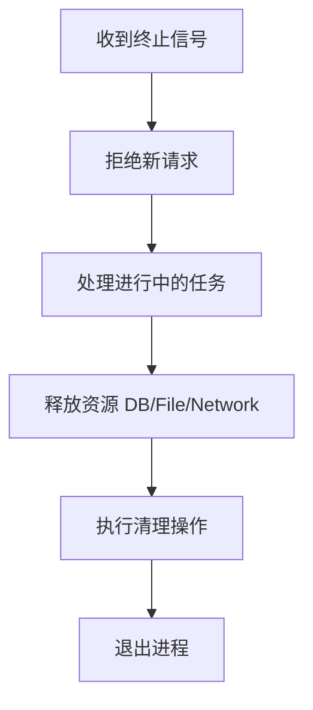

### 理解 Graceful Shutdown（优雅关闭）

Graceful Shutdown 是一种系统或应用关闭策略，核心思想是**在终止前完成关键任务、释放资源并拒绝新请求**，避免数据丢失或服务中断。以下是完整学习指南：

---

### 一、为什么需要 Graceful Shutdown？
| 场景 | 非优雅关闭的风险 | 优雅关闭的解决方案 |
|------|------------------|-------------------|
| 网络请求 | 中断正在处理的请求 | 完成当前请求后关闭 |
| 数据库连接 | 数据未提交/连接未释放 | 提交事务并关闭连接 |
| 文件操作 | 文件损坏/数据丢失 | 确保写入完成再退出 |
| 分布式系统 | 服务注册残留 | 先注销服务再关闭 |

---

### 二、实现原理（通用流程）


---

### 三、具体实现示例（Go语言）

```go
package main

import (
	"context"
	"log"
	"net/http"
	"os"
	"os/signal"
	"syscall"
	"time"
)

func main() {
	// 1. 创建HTTP服务器
	server := &http.Server{Addr: ":8080"}

	// 2. 注册路由
	http.HandleFunc("/", func(w http.ResponseWriter, r *http.Request) {
		time.Sleep(2 * time.Second) // 模拟耗时操作
		w.Write([]byte("Request processed"))
	})

	// 3. 独立goroutine启动服务
	go func() {
		log.Println("Server starting on :8080")
		if err := server.ListenAndServe(); err != http.ErrServerClosed {
			log.Fatal("Server error:", err)
		}
	}()

	// 4. 监听终止信号
	quit := make(chan os.Signal, 1)
	signal.Notify(quit, syscall.SIGINT, syscall.SIGTERM) // Ctrl+C/kill
	<-quit // 阻塞直到收到信号
	log.Println("Shutdown signal received")

	// 5. 设置超时上下文
	ctx, cancel := context.WithTimeout(context.Background(), 10*time.Second)
	defer cancel()

	// 6. 优雅关闭
	if err := server.Shutdown(ctx); err != nil {
		log.Fatal("Forced shutdown:", err)
	}
	log.Println("Graceful shutdown complete")
}
```

**关键步骤解析：**
1. `signal.Notify`：捕获系统终止信号（如 `SIGINT`/`SIGTERM`）
2. `server.Shutdown()`：停止接受新请求，等待活跃请求完成
3. `context.WithTimeout`：设置最大等待时间（超时强制退出）

---

### 四、其他语言实现

#### Node.js 示例
```javascript
const express = require('express');
const app = express();

app.get('/', (req, res) => {
  setTimeout(() => res.send('Done'), 2000);
});

const server = app.listen(3000);

process.on('SIGTERM', () => {
  server.close(() => {
    console.log('Server closed');
    // 此处添加资源清理代码
  });
});
```

#### Python (Flask) 示例
```python
from flask import Flask
import signal

app = Flask(__name__)

@app.route("/")
def home():
    return "Hello World"

def shutdown_handler(signum, frame):
    print("Shutting down...")
    # 添加清理逻辑
    exit(0)

signal.signal(signal.SIGINT, shutdown_handler)
signal.signal(signal.SIGTERM, shutdown_handler)

if __name__ == "__main__":
    app.run()
```

---

### 五、生产环境最佳实践
1. **超时设置**：根据业务需求设置合理超时（如10-30秒）
2. **健康检查**：Kubernetes/Docker中配置`SIGTERM` + 就绪检查
   ```yaml
   # Kubernetes 配置示例
   lifecycle:
     preStop:
       exec:
         command: ["sleep", "30"] # 留出清理时间
   ```
3. **资源释放顺序**：
   - 先关闭外部依赖（数据库、消息队列）
   - 再释放内部资源（线程池、文件句柄）
4. **日志监控**：记录关闭过程中的关键事件
5. **拒绝新请求**：负载均衡器移除节点后再关闭

---

### 六、测试方法
1. 发送请求后立即触发关闭：
   ```bash
   curl http://localhost:8080 & kill -SIGTERM <PID>
   ```
2. 验证：
   - 活跃请求应完成处理
   - 新请求立即被拒绝
   - 资源（端口/连接）正确释放

---

### 七、常见问题解决
| 问题 | 解决方案 |
|------|----------|
| 关闭超时 | 分析阻塞原因/缩短超时后强制退出 |
| 僵尸请求 | 使用context传递关闭信号 |
| 第三方库未响应 | 添加超时控制/wrapper处理 |
| Kubernetes Pod不终止 | 调整terminationGracePeriodSeconds |

> 关键原则：**宁可超时强制退出，也不要永久阻塞！**

通过理解这些概念和示例，你已掌握Graceful Shutdown的核心实现逻辑。实际应用中需根据框架特性调整（如Java Spring的`@PreDestroy`、Rust的`ctrlc`库等）。
