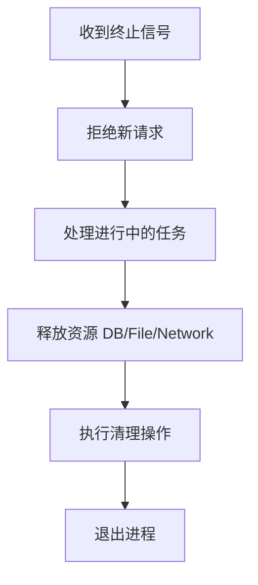

### 理解 Graceful Shutdown（优雅关闭）

Graceful Shutdown 是一种系统或应用关闭策略，核心思想是**在终止前完成关键任务、释放资源并拒绝新请求**，避免数据丢失或服务中断。以下是完整学习指南：

---

### 一、为什么需要 Graceful Shutdown？
| 场景 | 非优雅关闭的风险 | 优雅关闭的解决方案 |
|------|------------------|-------------------|
| 网络请求 | 中断正在处理的请求 | 完成当前请求后关闭 |
| 数据库连接 | 数据未提交/连接未释放 | 提交事务并关闭连接 |
| 文件操作 | 文件损坏/数据丢失 | 确保写入完成再退出 |
| 分布式系统 | 服务注册残留 | 先注销服务再关闭 |

---

### 二、实现原理（通用流程）


---

### 三、具体实现示例（Go语言）

```go
package main

import (
	"context"
	"log"
	"net/http"
	"os"
	"os/signal"
	"syscall"
	"time"
)

func main() {
	// 1. 创建HTTP服务器
	server := &http.Server{Addr: ":8080"}

	// 2. 注册路由
	http.HandleFunc("/", func(w http.ResponseWriter, r *http.Request) {
		time.Sleep(2 * time.Second) // 模拟耗时操作
		w.Write([]byte("Request processed"))
	})

	// 3. 独立goroutine启动服务
	go func() {
		log.Println("Server starting on :8080")
		if err := server.ListenAndServe(); err != http.ErrServerClosed {
			log.Fatal("Server error:", err)
		}
	}()

	// 4. 监听终止信号
	quit := make(chan os.Signal, 1)
	signal.Notify(quit, syscall.SIGINT, syscall.SIGTERM) // Ctrl+C/kill
	<-quit // 阻塞直到收到信号
	log.Println("Shutdown signal received")

	// 5. 设置超时上下文
	ctx, cancel := context.WithTimeout(context.Background(), 10*time.Second)
	defer cancel()

	// 6. 优雅关闭
	if err := server.Shutdown(ctx); err != nil {
		log.Fatal("Forced shutdown:", err)
	}
	log.Println("Graceful shutdown complete")
}
```

**关键步骤解析：**
1. `signal.Notify`：捕获系统终止信号（如 `SIGINT`/`SIGTERM`）
2. `server.Shutdown()`：停止接受新请求，等待活跃请求完成
3. `context.WithTimeout`：设置最大等待时间（超时强制退出）

---

### 四、其他语言实现

#### Node.js 示例
```javascript
const express = require('express');
const app = express();

app.get('/', (req, res) => {
  setTimeout(() => res.send('Done'), 2000);
});

const server = app.listen(3000);

process.on('SIGTERM', () => {
  server.close(() => {
    console.log('Server closed');
    // 此处添加资源清理代码
  });
});
```

#### Python (Flask) 示例
```python
from flask import Flask
import signal

app = Flask(__name__)

@app.route("/")
def home():
    return "Hello World"

def shutdown_handler(signum, frame):
    print("Shutting down...")
    # 添加清理逻辑
    exit(0)

signal.signal(signal.SIGINT, shutdown_handler)
signal.signal(signal.SIGTERM, shutdown_handler)

if __name__ == "__main__":
    app.run()
```

---

### 五、生产环境最佳实践
1. **超时设置**：根据业务需求设置合理超时（如10-30秒）
2. **健康检查**：Kubernetes/Docker中配置`SIGTERM` + 就绪检查
   ```yaml
   # Kubernetes 配置示例
   lifecycle:
     preStop:
       exec:
         command: ["sleep", "30"] # 留出清理时间
   ```
3. **资源释放顺序**：
   - 先关闭外部依赖（数据库、消息队列）
   - 再释放内部资源（线程池、文件句柄）
4. **日志监控**：记录关闭过程中的关键事件
5. **拒绝新请求**：负载均衡器移除节点后再关闭

---

### 六、测试方法
1. 发送请求后立即触发关闭：
   ```bash
   curl http://localhost:8080 & kill -SIGTERM <PID>
   ```
2. 验证：
   - 活跃请求应完成处理
   - 新请求立即被拒绝
   - 资源（端口/连接）正确释放

---

### 七、常见问题解决
| 问题 | 解决方案 |
|------|----------|
| 关闭超时 | 分析阻塞原因/缩短超时后强制退出 |
| 僵尸请求 | 使用context传递关闭信号 |
| 第三方库未响应 | 添加超时控制/wrapper处理 |
| Kubernetes Pod不终止 | 调整terminationGracePeriodSeconds |

> 关键原则：**宁可超时强制退出，也不要永久阻塞！**

通过理解这些概念和示例，你已掌握Graceful Shutdown的核心实现逻辑。实际应用中需根据框架特性调整（如Java Spring的`@PreDestroy`、Rust的`ctrlc`库等）。


在 Spring Boot 中实现优雅关闭(Graceful Shutdown)非常简单，因为 Spring Boot 从 **2.3 版本**开始内置了此功能。以下是完整实现指南：

### 一、基础配置 (3 种方式)

#### 方法 1: `application.properties`/`application.yml`
```properties
# 开启优雅关闭
server.shutdown=graceful

# 设置等待超时(默认30秒)
spring.lifecycle.timeout-per-shutdown-phase=30s
```

```yaml
# YAML 格式
server:
  shutdown: graceful
spring:
  lifecycle:
    timeout-per-shutdown-phase: 30s
```

#### 方法 2: Java 配置类
```java
import org.springframework.boot.web.embedded.tomcat.TomcatServletWebServerFactory;
import org.springframework.boot.web.server.WebServerFactoryCustomizer;
import org.springframework.context.annotation.Bean;
import org.springframework.context.annotation.Configuration;

@Configuration
public class GracefulShutdownConfig {

    @Bean
    public WebServerFactoryCustomizer<TomcatServletWebServerFactory> gracefulShutdownCustomizer() {
        return factory -> factory.addConnectorCustomizers(connector -> {
            connector.setProperty("server.shutdown", "graceful");
            connector.setProperty("spring.lifecycle.timeout-per-shutdown-phase", "30s");
        });
    }
}
```

#### 方法 3: 编程式启用 (Spring Boot 2.3+)
```java
@SpringBootApplication
public class MyApp {
    public static void main(String[] args) {
        SpringApplication app = new SpringApplication(MyApp.class);
        app.setRegisterShutdownHook(false); // 禁用默认关闭钩子
        
        ConfigurableApplicationContext context = app.run(args);
        
        // 注册自定义优雅关闭钩子
        Runtime.getRuntime().addShutdownHook(new Thread(() -> {
            ((ConfigurableApplicationContext) context).close();
        }));
    }
}
```

### 二、处理长时间运行任务

对于需要长时间处理的任务，需要确保它们能响应中断：

```java
import org.springframework.web.bind.annotation.GetMapping;
import org.springframework.web.bind.annotation.RestController;

@RestController
public class LongTaskController {

    @GetMapping("/long-task")
    public String longRunningTask() throws InterruptedException {
        // 模拟长时间任务，但可响应中断
        for (int i = 0; i < 30; i++) {
            if (Thread.currentThread().isInterrupted()) {
                throw new InterruptedException("Task interrupted by shutdown");
            }
            Thread.sleep(1000); // 每秒检查一次中断
        }
        return "Task completed";
    }
}
```

### 三、自定义关闭逻辑

使用 `@PreDestroy` 或实现 `DisposableBean` 处理资源释放：

```java
import javax.annotation.PreDestroy;
import org.springframework.stereotype.Component;

@Component
public class ResourceCleanup {

    @PreDestroy
    public void cleanup() {
        System.out.println("Releasing resources...");
        // 1. 关闭数据库连接池
        // 2. 停止线程池
        // 3. 保存状态到磁盘
        // 4. 通知其他服务
    }
}
```

### 四、Kubernetes 集成配置

在 Kubernetes 部署中优化优雅关闭：

```yaml
apiVersion: apps/v1
kind: Deployment
spec:
  template:
    spec:
      terminationGracePeriodSeconds: 60  # 必须 > Spring 超时时间
      containers:
      - name: my-app
        lifecycle:
          preStop:
            exec:
              command: ["sh", "-c", "sleep 10"] # 给负载均衡器时间移除节点
        readinessProbe:
          httpGet:
            path: /actuator/health/readiness
            port: 8080
          periodSeconds: 5
```

### 五、验证优雅关闭

1. **发送测试请求**
   ```bash
   curl http://localhost:8080/long-task
   ```

2. **触发关闭**
   ```bash
   # 获取进程ID
   jps -l
   
   # 发送SIGTERM
   kill -15 <PID>
   ```

3. **观察日志**
   ```
   2023-05-01 12:00:00 INFO  o.s.b.w.e.t.GracefulShutdown - Commencing graceful shutdown...
   2023-05-01 12:00:00 INFO  o.a.coyote.http11.Http11Nio2 - Pausing ProtocolHandler ["http-nio-8080"]
   2023-05-01 12:00:15 INFO  o.a.c.c.StandardService - Stopping service [Tomcat]
   2023-05-01 12:00:15 INFO  o.s.b.w.e.t.GracefulShutdown - Graceful shutdown complete
   ```

### 六、高级场景处理

#### 1. 异步任务处理
```java
import org.springframework.scheduling.annotation.Async;
import org.springframework.stereotype.Service;

@Service
public class AsyncService {

    @Async
    public void asyncTask() {
        try {
            while (!Thread.currentThread().isInterrupted()) {
                // 执行任务
                Thread.sleep(1000);
            }
        } catch (InterruptedException e) {
            // 清理资源
            Thread.currentThread().interrupt(); 
        }
    }
}
```

#### 2. WebSocket 连接关闭
```java
import org.springframework.web.socket.CloseStatus;
import org.springframework.web.socket.WebSocketHandler;
import org.springframework.web.socket.WebSocketSession;

public class CustomWebSocketHandler implements WebSocketHandler {

    @Override
    public void afterConnectionClosed(WebSocketSession session, CloseStatus status) {
        if (status.equals(CloseStatus.SERVER_SHUTDOWN)) {
            // 处理优雅关闭时的连接关闭
        }
    }
}
```

### 七、常见问题解决

| 问题现象 | 解决方案 |
|----------|----------|
| 关闭超时 | 增加 `timeout-per-shutdown-phase` 或分析阻塞点 |
| 资源未释放 | 检查 `@PreDestroy` 方法是否被正确调用 |
| Kubernetes 强制终止 | 确保 `terminationGracePeriodSeconds > timeout-per-shutdown-phase + 10s` |
| 负载均衡器仍发送请求 | 添加 `preStop` 休眠延迟 |
| 数据库事务中断 | 使用短事务或在关闭时拒绝新事务 |

### 八、最佳实践

1. **超时设置**：生产环境建议 20-60 秒，根据业务需求调整
2. **健康检查**：结合 Spring Boot Actuator 实现就绪检查
   ```properties
   management.endpoint.health.probes.enabled=true
   management.endpoints.web.exposure.include=health
   ```
3. **日志记录**：在 `@PreDestroy` 方法中添加详细日志
4. **测试策略**：
   - 模拟长时间请求时触发关闭
   - 验证资源是否释放
   - 监控关闭时间是否在预期内

Spring Boot 的优雅关闭实现会自动处理：
- 停止接受新请求
- 完成进行中的请求
- 关闭应用上下文
- 释放资源
- 超时后强制终止

通过以上配置，你的 Spring Boot 应用将具备生产级的优雅关闭能力。
