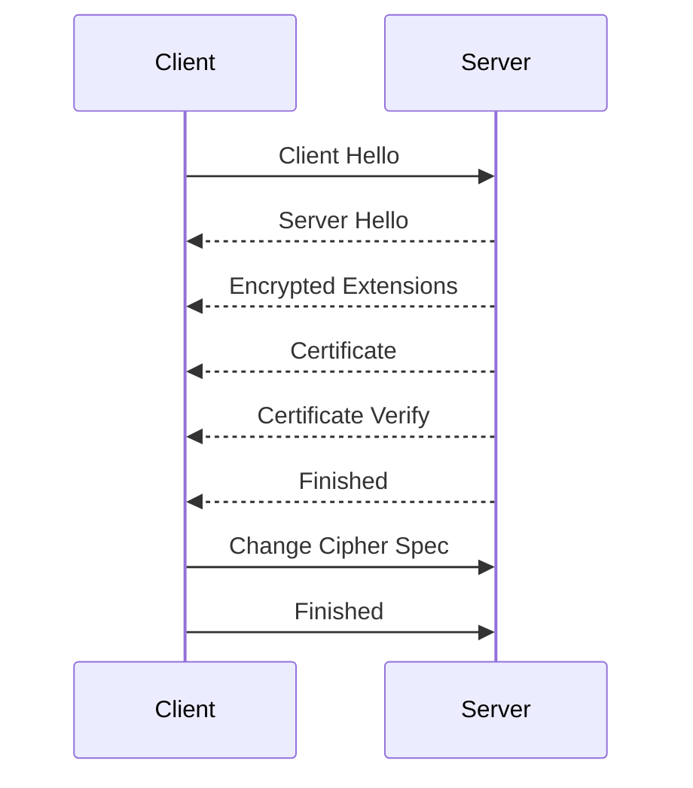

你這段流程是 **TLS 1.3 的 handshake 流程封包紀錄**，我幫你解釋每個步驟，然後用 Mermaid 產生一個順序圖來幫助理解。

---

## 流程解析

1. **Client Hello (OUT)**

   * Client 向 Server 發起握手，傳送支援的密碼套件、TLS 版本、隨機數 (random)、Session ID、擴充參數 (如 SNI)。

2. **Server Hello (IN)**

   * Server 回應選定的密碼套件、TLS 版本、隨機數，並開始建立密鑰協商。

3. **Encrypted Extensions (IN)**

   * Server 傳送額外的協商參數 (例如 ALPN、SNI 驗證)，已經是加密狀態下的封包。

4. **Certificate (IN)**

   * Server 傳送憑證鏈 (包含伺服器憑證)，用來讓 Client 驗證伺服器身份。

5. **Certificate Verify (IN)**

   * Server 使用憑證私鑰對握手訊息做簽名，證明自己擁有該憑證的私鑰。

6. **Finished (IN)**

   * Server 完成握手，送出 **Finished** 訊息，這表示伺服器端握手完成。

7. **Change Cipher Spec (OUT)**

   * Client 送出「切換到加密通道」的訊號，之後的通訊會進入加密狀態。

8. **Finished (OUT)**

   * Client 傳送 **Finished** 訊息，表示握手完成，接下來進入安全資料傳輸階段。

---

## Mermaid 順序圖



---

👉 這樣的順序圖就是 TLS 1.3 的握手流程（簡化版，實際上還有 KeyShare、早期數據等可能的細節）。

要不要我幫你把 **KeyShare (DH/ECDH 金鑰交換)** 也補上？因為在 TLS 1.3，ClientHello 與 ServerHello 裡面最重要的就是 KeyShare 才能導出 session key。


```bash
#!/bin/bash
HOST="example.com"
PORT=443

echo "===== TLS VERSION TEST ====="
for v in --tlsv1 --tlsv1.1 --tlsv1.2 --tlsv1.3; do
  echo -e "\nTesting $v ..."
  curl -vk $v https://$HOST:$PORT/ -o /dev/null 2>&1 | grep "SSL_connect"
done

echo -e "\n===== ALPN TEST ====="
for alpn in "" "h2" "http/1.1"; do
  if [ -z "$alpn" ]; then
    echo -e "\nTesting without ALPN ..."
    openssl s_client -connect $HOST:$PORT -servername $HOST </dev/null 2>&1 | grep "Protocol\|Cipher\|ALPN"
  else
    echo -e "\nTesting ALPN=$alpn ..."
    openssl s_client -connect $HOST:$PORT -servername $HOST -alpn $alpn </dev/null 2>&1 | grep "Protocol\|Cipher\|ALPN"
  fi
done

echo -e "\n===== CIPHER SUITE TEST (TLS 1.2) ====="
for cipher in $(openssl ciphers 'ALL:eNULL' | tr ':' ' '); do
  echo -n "Testing cipher: $cipher ... "
  echo | openssl s_client -connect $HOST:$PORT -servername $HOST -cipher $cipher -tls1_2 2>/dev/null | grep "Cipher is" || echo "FAILED"
done

```
