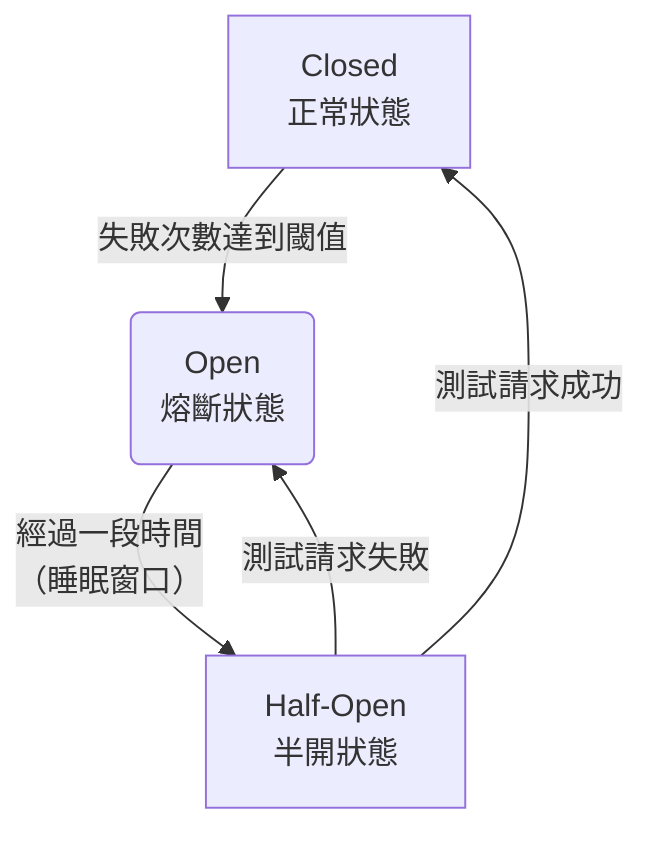

I'll help you implement circuit breaker best practices for Rust applications running on Kubernetes. This involves both application-level patterns and Kubernetes configuration.Here's a comprehensive guide to implementing circuit breaker best practices in Rust applications running on Kubernetes:

## Key Best Practices

### 1. **Application-Level Circuit Breaker**
The Rust implementation I provided includes:
- **State Management**: Closed → Open → Half-Open transitions
- **Configurable Thresholds**: Failure counts, timeouts, and recovery periods
- **Async/Await Support**: Works with Tokio runtime
- **Thread Safety**: Uses `Arc<RwLock>` for concurrent access
- **Timeout Handling**: Built-in request timeouts

### 2. **Kubernetes Integration**
The K8s configuration provides:
- **Health Checks**: Readiness and liveness probes that respect circuit breaker state
- **Auto Scaling**: HPA configuration to handle traffic spikes during failures
- **Resource Limits**: Proper CPU/memory limits to prevent cascade failures
- **Pod Disruption Budgets**: Maintains minimum availability during updates

### 3. **Monitoring and Observability**
The metrics implementation includes:
- **Prometheus Integration**: Custom metrics for circuit breaker states
- **Health Endpoints**: `/health/ready` and `/health/live` for K8s probes
- **Service Discovery**: ServiceMonitor for Prometheus scraping

## Implementation Tips

### Configuration Best Practices:
```rust
// Different services need different thresholds
let db_config = CircuitBreakerConfig {
    failure_threshold: 5,        // Database can handle more failures
    recovery_timeout: Duration::from_secs(30),
    timeout: Duration::from_secs(10),
    success_threshold: 3,
};

let external_api_config = CircuitBreakerConfig {
    failure_threshold: 3,        // External APIs fail faster
    recovery_timeout: Duration
```


```rust
use std::sync::Arc;
use std::time::{Duration, Instant};
use tokio::sync::RwLock;
use thiserror::Error;

#[derive(Debug, Clone)]
pub enum CircuitState {
    Closed,
    Open,
    HalfOpen,
}

#[derive(Debug, Error)]
pub enum CircuitBreakerError {
    #[error("Circuit breaker is open")]
    Open,
    #[error("Service error: {0}")]
    ServiceError(String),
    #[error("Timeout")]
    Timeout,
}

#[derive(Debug, Clone)]
pub struct CircuitBreakerConfig {
    pub failure_threshold: u32,
    pub recovery_timeout: Duration,
    pub timeout: Duration,
    pub success_threshold: u32, // for half-open state
}

impl Default for CircuitBreakerConfig {
    fn default() -> Self {
        Self {
            failure_threshold: 5,
            recovery_timeout: Duration::from_secs(30),
            timeout: Duration::from_secs(10),
            success_threshold: 3,
        }
    }
}

#[derive(Debug)]
struct CircuitBreakerState {
    state: CircuitState,
    failure_count: u32,
    success_count: u32,
    last_failure_time: Option<Instant>,
    next_attempt_time: Option<Instant>,
}

impl Default for CircuitBreakerState {
    fn default() -> Self {
        Self {
            state: CircuitState::Closed,
            failure_count: 0,
            success_count: 0,
            last_failure_time: None,
            next_attempt_time: None,
        }
    }
}

pub struct CircuitBreaker {
    config: CircuitBreakerConfig,
    state: Arc<RwLock<CircuitBreakerState>>,
}

impl CircuitBreaker {
    pub fn new(config: CircuitBreakerConfig) -> Self {
        Self {
            config,
            state: Arc::new(RwLock::new(CircuitBreakerState::default())),
        }
    }

    pub async fn call<F, T, E>(&self, f: F) -> Result<T, CircuitBreakerError>
    where
        F: std::future::Future<Output = Result<T, E>>,
        E: std::fmt::Display,
    {
        // Check if we can make the call
        {
            let state = self.state.read().await;
            match state.state {
                CircuitState::Open => {
                    if let Some(next_attempt) = state.next_attempt_time {
                        if Instant::now() < next_attempt {
                            return Err(CircuitBreakerError::Open);
                        }
                    }
                }
                CircuitState::Closed | CircuitState::HalfOpen => {}
            }
        }

        // Transition to half-open if needed
        {
            let mut state = self.state.write().await;
            if matches!(state.state, CircuitState::Open) {
                if let Some(next_attempt) = state.next_attempt_time {
                    if Instant::now() >= next_attempt {
                        state.state = CircuitState::HalfOpen;
                        state.success_count = 0;
                    }
                }
            }
        }

        // Execute the call with timeout
        let result = tokio::time::timeout(self.config.timeout, f).await;

        match result {
            Ok(Ok(value)) => {
                self.on_success().await;
                Ok(value)
            }
            Ok(Err(e)) => {
                self.on_failure().await;
                Err(CircuitBreakerError::ServiceError(e.to_string()))
            }
            Err(_) => {
                self.on_failure().await;
                Err(CircuitBreakerError::Timeout)
            }
        }
    }

    async fn on_success(&self) {
        let mut state = self.state.write().await;
        
        match state.state {
            CircuitState::Closed => {
                // Reset failure count on success
                state.failure_count = 0;
            }
            CircuitState::HalfOpen => {
                state.success_count += 1;
                if state.success_count >= self.config.success_threshold {
                    // Transition back to closed
                    state.state = CircuitState::Closed;
                    state.failure_count = 0;
                    state.success_count = 0;
                    state.next_attempt_time = None;
                }
            }
            CircuitState::Open => {
                // Should not happen, but reset to closed if it does
                state.state = CircuitState::Closed;
                state.failure_count = 0;
                state.success_count = 0;
                state.next_attempt_time = None;
            }
        }
    }

    async fn on_failure(&self) {
        let mut state = self.state.write().await;
        
        state.failure_count += 1;
        state.last_failure_time = Some(Instant::now());

        match state.state {
            CircuitState::Closed => {
                if state.failure_count >= self.config.failure_threshold {
                    state.state = CircuitState::Open;
                    state.next_attempt_time = Some(Instant::now() + self.config.recovery_timeout);
                }
            }
            CircuitState::HalfOpen => {
                // Any failure in half-open state should open the circuit
                state.state = CircuitState::Open;
                state.next_attempt_time = Some(Instant::now() + self.config.recovery_timeout);
                state.success_count = 0;
            }
            CircuitState::Open => {
                // Update next attempt time
                state.next_attempt_time = Some(Instant::now() + self.config.recovery_timeout);
            }
        }
    }

    pub async fn get_state(&self) -> CircuitState {
        self.state.read().await.state.clone()
    }

    pub async fn get_metrics(&self) -> CircuitBreakerMetrics {
        let state = self.state.read().await;
        CircuitBreakerMetrics {
            state: state.state.clone(),
            failure_count: state.failure_count,
            success_count: state.success_count,
            last_failure_time: state.last_failure_time,
        }
    }
}

#[derive(Debug, Clone)]
pub struct CircuitBreakerMetrics {
    pub state: CircuitState,
    pub failure_count: u32,
    pub success_count: u32,
    pub last_failure_time: Option<Instant>,
}

// Example usage with HTTP client
pub struct HttpService {
    client: reqwest::Client,
    circuit_breaker: CircuitBreaker,
}

impl HttpService {
    pub fn new() -> Self {
        let config = CircuitBreakerConfig {
            failure_threshold: 3,
            recovery_timeout: Duration::from_secs(60),
            timeout: Duration::from_secs(5),
            success_threshold: 2,
        };

        Self {
            client: reqwest::Client::new(),
            circuit_breaker: CircuitBreaker::new(config),
        }
    }

    pub async fn get(&self, url: &str) -> Result<String, CircuitBreakerError> {
        self.circuit_breaker
            .call(async {
                self.client
                    .get(url)
                    .send()
                    .await
                    .map_err(|e| format!("HTTP error: {}", e))?
                    .text()
                    .await
                    .map_err(|e| format!("Response error: {}", e))
            })
            .await
    }
}

#[cfg(test)]
mod tests {
    use super::*;
    use tokio::time::sleep;

    #[tokio::test]
    async fn test_circuit_breaker_closed_state() {
        let config = CircuitBreakerConfig {
            failure_threshold: 2,
            recovery_timeout: Duration::from_millis(100),
            timeout: Duration::from_millis(50),
            success_threshold: 1,
        };
        
        let cb = CircuitBreaker::new(config);
        
        // Successful call should keep circuit closed
        let result = cb.call(async { Ok::<(), &str>(()) }).await;
        assert!(result.is_ok());
        assert!(matches!(cb.get_state().await, CircuitState::Closed));
    }

    #[tokio::test]
    async fn test_circuit_breaker_opens_on_failures() {
        let config = CircuitBreakerConfig {
            failure_threshold: 2,
            recovery_timeout: Duration::from_millis(100),
            timeout: Duration::from_millis(50),
            success_threshold: 1,
        };
        
        let cb = CircuitBreaker::new(config);
        
        // First failure
        let _ = cb.call(async { Err::<(), _>("error") }).await;
        assert!(matches!(cb.get_state().await, CircuitState::Closed));
        
        // Second failure should open circuit
        let _ = cb.call(async { Err::<(), _>("error") }).await;
        assert!(matches!(cb.get_state().await, CircuitState::Open));
        
        // Third call should be rejected
        let result = cb.call(async { Ok::<(), &str>(()) }).await;
        assert!(matches!(result, Err(CircuitBreakerError::Open)));
    }

    #[tokio::test]
    async fn test_circuit_breaker_half_open_transition() {
        let config = CircuitBreakerConfig {
            failure_threshold: 1,
            recovery_timeout: Duration::from_millis(50),
            timeout: Duration::from_millis(100),
            success_threshold: 1,
        };
        
        let cb = CircuitBreaker::new(config);
        
        // Fail to open circuit
        let _ = cb.call(async { Err::<(), _>("error") }).await;
        assert!(matches!(cb.get_state().await, CircuitState::Open));
        
        // Wait for recovery timeout
        sleep(Duration::from_millis(60)).await;
        
        // Next call should transition to half-open and succeed
        let result = cb.call(async { Ok::<(), &str>(()) }).await;
        assert!(result.is_ok());
        assert!(matches!(cb.get_state().await, CircuitState::Closed));
    }
}
```

```rust
# Deployment with circuit breaker configuration
apiVersion: apps/v1
kind: Deployment
metadata:
  name: rust-app-with-circuit-breaker
  namespace: default
spec:
  replicas: 3
  selector:
    matchLabels:
      app: rust-app
  template:
    metadata:
      labels:
        app: rust-app
      annotations:
        prometheus.io/scrape: "true"
        prometheus.io/path: "/metrics"
        prometheus.io/port: "8080"
    spec:
      containers:
      - name: rust-app
        image: rust-app:latest
        ports:
        - containerPort: 8080
          name: http
        - containerPort: 8081
          name: metrics
        env:
        # Circuit breaker configuration via environment variables
        - name: CIRCUIT_BREAKER_FAILURE_THRESHOLD
          value: "5"
        - name: CIRCUIT_BREAKER_RECOVERY_TIMEOUT_SECONDS
          value: "30"
        - name: CIRCUIT_BREAKER_TIMEOUT_SECONDS
          value: "10"
        - name: CIRCUIT_BREAKER_SUCCESS_THRESHOLD
          value: "3"
        # Database connection settings
        - name: DB_HOST
          value: "postgres-service"
        - name: DB_PORT
          value: "5432"
        - name: DB_MAX_CONNECTIONS
          value: "10"
        resources:
          requests:
            memory: "128Mi"
            cpu: "100m"
          limits:
            memory: "256Mi"
            cpu: "200m"
        readinessProbe:
          httpGet:
            path: /health/ready
            port: 8080
          initialDelaySeconds: 10
          periodSeconds: 5
          timeoutSeconds: 3
          failureThreshold: 3
        livenessProbe:
          httpGet:
            path: /health/live
            port: 8080
          initialDelaySeconds: 15
          periodSeconds: 10
          timeoutSeconds: 3
          failureThreshold: 3

---
# Service
apiVersion: v1
kind: Service
metadata:
  name: rust-app-service
spec:
  selector:
    app: rust-app
  ports:
  - name: http
    port: 80
    targetPort: 8080
  - name: metrics
    port: 8081
    targetPort: 8081

---
# ConfigMap for circuit breaker policies
apiVersion: v1
kind: ConfigMap
metadata:
  name: circuit-breaker-config
data:
  circuit-breaker.yaml: |
    services:
      database:
        failure_threshold: 5
        recovery_timeout_seconds: 30
        timeout_seconds: 10
        success_threshold: 3
      external_api:
        failure_threshold: 3
        recovery_timeout_seconds: 60
        timeout_seconds: 5
        success_threshold: 2
      redis:
        failure_threshold: 10
        recovery_timeout_seconds: 15
        timeout_seconds: 2
        success_threshold: 5

---
# HorizontalPodAutoscaler for handling circuit breaker scenarios
apiVersion: autoscaling/v2
kind: HorizontalPodAutoscaler
metadata:
  name: rust-app-hpa
spec:
  scaleTargetRef:
    apiVersion: apps/v1
    kind: Deployment
    name: rust-app-with-circuit-breaker
  minReplicas: 3
  maxReplicas: 10
  metrics:
  - type: Resource
    resource:
      name: cpu
      target:
        type: Utilization
        averageUtilization: 70
  - type: Resource
    resource:
      name: memory
      target:
        type: Utilization
        averageUtilization: 80

---
# PodDisruptionBudget to maintain availability during circuit breaker events
apiVersion: policy/v1
kind: PodDisruptionBudget
metadata:
  name: rust-app-pdb
spec:
  minAvailable: 2
  selector:
    matchLabels:
      app: rust-app

---
# NetworkPolicy for controlled access
apiVersion: networking.k8s.io/v1
kind: NetworkPolicy
metadata:
  name: rust-app-netpol
spec:
  podSelector:
    matchLabels:
      app: rust-app
  policyTypes:
  - Ingress
  - Egress
  ingress:
  - from:
    - namespaceSelector:
        matchLabels:
          name: ingress-nginx
    ports:
    - protocol: TCP
      port: 8080
  egress:
  - to:
    - podSelector:
        matchLabels:
          app: postgres
    ports:
    - protocol: TCP
      port: 5432
  - to:
    - podSelector:
        matchLabels:
          app: redis
    ports:
    - protocol: TCP
      port: 6379
  # Allow external API calls
  - to: []
    ports:
    - protocol: TCP
      port: 443
    - protocol: TCP
      port: 80

---
# ServiceMonitor for Prometheus monitoring
apiVersion: monitoring.coreos.com/v1
kind: ServiceMonitor
metadata:
  name: rust-app-circuit-breaker-metrics
spec:
  selector:
    matchLabels:
      app: rust-app
  endpoints:
  - port: metrics
    path: /metrics
    interval: 30s
```


```rust
use prometheus::{Counter, Gauge, Histogram, Registry, Encoder, TextEncoder};
use std::collections::HashMap;
use std::sync::Arc;
use tokio::sync::RwLock;
use axum::{
    extract::State,
    http::StatusCode,
    response::Json,
    routing::get,
    Router,
};
use serde_json::json;

// Metrics collection for circuit breakers
#[derive(Clone)]
pub struct CircuitBreakerMetrics {
    pub state_gauge: Gauge,
    pub requests_total: Counter,
    pub failures_total: Counter,
    pub successes_total: Counter,
    pub timeouts_total: Counter,
    pub open_duration: Histogram,
    pub response_time: Histogram,
}

impl CircuitBreakerMetrics {
    pub fn new(service_name: &str, registry: &Registry) -> prometheus::Result<Self> {
        let state_gauge = Gauge::new(
            format!("circuit_breaker_state_{}", service_name),
            format!("Current state of circuit breaker for {}", service_name),
        )?;
        registry.register(Box::new(state_gauge.clone()))?;

        let requests_total = Counter::new(
            format!("circuit_breaker_requests_total_{}", service_name),
            format!("Total requests through circuit breaker for {}", service_name),
        )?;
        registry.register(Box::new(requests_total.clone()))?;

        let failures_total = Counter::new(
            format!("circuit_breaker_failures_total_{}", service_name),
            format!("Total failures through circuit breaker for {}", service_name),
        )?;
        registry.register(Box::new(failures_total.clone()))?;

        let successes_total = Counter::new(
            format!("circuit_breaker_successes_total_{}", service_name),
            format!("Total successes through circuit breaker for {}", service_name),
        )?;
        registry.register(Box::new(successes_total.clone()))?;

        let timeouts_total = Counter::new(
            format!("circuit_breaker_timeouts_total_{}", service_name),
            format!("Total timeouts through circuit breaker for {}", service_name),
        )?;
        registry.register(Box::new(timeouts_total.clone()))?;

        let open_duration = Histogram::with_opts(
            prometheus::HistogramOpts::new(
                format!("circuit_breaker_open_duration_seconds_{}", service_name),
                format!("Duration circuit breaker was open for {}", service_name),
            ).buckets(vec![1.0, 5.0, 15.0, 30.0, 60.0, 300.0, 600.0]),
        )?;
        registry.register(Box::new(open_duration.clone()))?;

        let response_time = Histogram::with_opts(
            prometheus::HistogramOpts::new(
                format!("circuit_breaker_response_duration_seconds_{}", service_name),
                format!("Response time through circuit breaker for {}", service_name),
            ).buckets(prometheus::DEFAULT_BUCKETS.to_vec()),
        )?;
        registry.register(Box::new(response_time.clone()))?;

        Ok(Self {
            state_gauge,
            requests_total,
            failures_total,
            successes_total,
            timeouts_total,
            open_duration,
            response_time,
        })
    }

    pub fn record_request(&self) {
        self.requests_total.inc();
    }

    pub fn record_success(&self, duration: f64) {
        self.successes_total.inc();
        self.response_time.observe(duration);
    }

    pub fn record_failure(&self, duration: f64) {
        self.failures_total.inc();
        self.response_time.observe(duration);
    }

    pub fn record_timeout(&self) {
        self.timeouts_total.inc();
    }

    pub fn update_state(&self, state: &crate::CircuitState) {
        let state_value = match state {
            crate::CircuitState::Closed => 0.0,
            crate::CircuitState::HalfOpen => 1.0,
            crate::CircuitState::Open => 2.0,
        };
        self.state_gauge.set(state_value);
    }
}

// Health check implementation
#[derive(Clone)]
pub struct HealthChecker {
    circuit_breakers: Arc<RwLock<HashMap<String, Arc<crate::CircuitBreaker>>>>,
    metrics_registry: Arc<Registry>,
}

#[derive(serde::Serialize)]
pub struct HealthResponse {
    status: String,
    timestamp: i64,
    services: HashMap<String, ServiceHealth>,
}

#[derive(serde::Serialize)]
pub struct ServiceHealth {
    status: String,
    circuit_state: String,
    failure_count: u32,
    last_failure: Option<i64>,
}

impl HealthChecker {
    pub fn new() -> Self {
        Self {
            circuit_breakers: Arc::new(RwLock::new(HashMap::new())),
            metrics_registry: Arc::new(Registry::new()),
        }
    }

    pub async fn add_circuit_breaker(&self, name: String, circuit_breaker: Arc<crate::CircuitBreaker>) {
        let mut breakers = self.circuit_breakers.write().await;
        breakers.insert(name, circuit_breaker);
    }

    pub async fn health_check(&self) -> (StatusCode, Json<HealthResponse>) {
        let breakers = self.circuit_breakers.read().await;
        let mut services = HashMap::new();
        let mut overall_healthy = true;

        for (name, breaker) in breakers.iter() {
            let metrics = breaker.get_metrics().await;
            let status = match metrics.state {
                crate::CircuitState::Closed => "healthy",
                crate::CircuitState::HalfOpen => "degraded",
                crate::CircuitState::Open => {
                    overall_healthy = false;
                    "unhealthy"
                }
            };

            services.insert(name.clone(), ServiceHealth {
                status: status.to_string(),
                circuit_state: format!("{:?}", metrics.state),
                failure_count: metrics.failure_count,
                last_failure: metrics.last_failure_time.map(|t| {
                    t.elapsed().as_secs() as i64
                }),
            });
        }

        let status_code = if overall_healthy {
            StatusCode::OK
        } else {
            StatusCode::SERVICE_UNAVAILABLE
        };

        let response = HealthResponse {
            status: if overall_healthy { "healthy" } else { "unhealthy" }.to_string(),
            timestamp: std::time::SystemTime::now()
                .duration_since(std::time::UNIX_EPOCH)
                .unwrap()
                .as_secs() as i64,
            services,
        };

        (status_code, Json(response))
    }

    pub async fn readiness_check(&self) -> (StatusCode, Json<serde_json::Value>) {
        let breakers = self.circuit_breakers.read().await;
        let mut ready = true;

        // Consider the service ready if not all circuit breakers are open
        let mut open_count = 0;
        let total_count = breakers.len();

        for breaker in breakers.values() {
            let state = breaker.get_state().await;
            if matches!(state, crate::CircuitState::Open) {
                open_count += 1;
            }
        }

        // Service is ready if less than 50% of circuit breakers are open
        ready = total_count == 0 || (open_count as f64 / total_count as f64) < 0.5;

        let status_code = if ready {
            StatusCode::OK
        } else {
            StatusCode::SERVICE_UNAVAILABLE
        };

        (status_code, Json(json!({
            "ready": ready,
            "circuit_breakers": {
                "total": total_count,
                "open": open_count,
                "open_percentage": if total_count > 0 { 
                    (open_count as f64 / total_count as f64) * 100.0 
                } else { 
                    0.0 
                }
            }
        })))
    }

    pub async fn metrics(&self) -> String {
        let encoder = TextEncoder::new();
        let metric_families = self.metrics_registry.gather();
        encoder.encode_to_string(&metric_families).unwrap()
    }
}

// Axum router setup for health endpoints
pub fn create_health_router(health_checker: Arc<HealthChecker>) -> Router {
    Router::new()
        .route("/health/live", get(liveness_handler))
        .route("/health/ready", get(readiness_handler))
        .route("/metrics", get(metrics_handler))
        .with_state(health_checker)
}

async fn liveness_handler(State(health_checker): State<Arc<HealthChecker>>) -> impl axum::response::IntoResponse {
    health_checker.health_check().await
}

async fn readiness_handler(State(health_checker): State<Arc<HealthChecker>>) -> impl axum::response::IntoResponse {
    health_checker.readiness_check().await
}

async fn metrics_handler(State(health_checker): State<Arc<HealthChecker>>) -> impl axum::response::IntoResponse {
    (
        StatusCode::OK,
        [("Content-Type", "text/plain; charset=utf-8")],
        health_checker.metrics().await,
    )
}

// Example integration with the circuit breaker
pub struct MonitoredCircuitBreaker {
    circuit_breaker: Arc<crate::CircuitBreaker>,
    metrics: CircuitBreakerMetrics,
}

impl MonitoredCircuitBreaker {
    pub fn new(
        service_name: &str,
        config: crate::CircuitBreakerConfig,
        registry: &Registry,
    ) -> prometheus::Result<Self> {
        let circuit_breaker = Arc::new(crate::CircuitBreaker::new(config));
        let metrics = CircuitBreakerMetrics::new(service_name, registry)?;

        Ok(Self {
            circuit_breaker,
            metrics,
        })
    }

    pub async fn call<F, T, E>(&self, f: F) -> Result<T, crate::CircuitBreakerError>
    where
        F: std::future::Future<Output = Result<T, E>>,
        E: std::fmt::Display,
    {
        use std::time::Instant;
        
        self.metrics.record_request();
        let start = Instant::now();

        // Update state metric before call
        let state = self.circuit_breaker.get_state().await;
        self.metrics.update_state(&state);

        let result = self.circuit_breaker.call(f).await;
        let duration = start.elapsed().as_secs_f64();

        match &result {
            Ok(_) => self.metrics.record_success(duration),
            Err(crate::CircuitBreakerError::ServiceError(_)) => {
                self.metrics.record_failure(duration);
            }
            Err(crate::CircuitBreakerError::Timeout) => {
                self.metrics.record_timeout();
            }
            Err(crate::CircuitBreakerError::Open) => {
                // No additional metrics for open circuit
            }
        }

        // Update state metric after call
        let new_state = self.circuit_breaker.get_state().await;
        self.metrics.update_state(&new_state);

        result
    }

    pub fn get_circuit_breaker(&self) -> Arc<crate::CircuitBreaker> {
        Arc::clone(&self.circuit_breaker)
    }
}

#[cfg(test)]
mod tests {
    use super::*;

    #[tokio::test]
    async fn test_health_checker() {
        let health_checker = HealthChecker::new();
        let config = crate::CircuitBreakerConfig::default();
        let cb = Arc::new(crate::CircuitBreaker::new(config));
        
        health_checker.add_circuit_breaker("test_service".to_string(), cb).await;
        
        let (status, response) = health_checker.health_check().await;
        assert_eq!(status, StatusCode::OK);
        assert!(response.services.contains_key("test_service"));
    }
}
```


Continuing with the implementation tips:

## Implementation Tips (continued)

### Configuration Best Practices:
```rust
let external_api_config = CircuitBreakerConfig {
    failure_threshold: 3,        // External APIs fail faster
    recovery_timeout: Duration::from_secs(60), // Longer recovery for external deps
    timeout: Duration::from_secs(5),           // Shorter timeout for APIs
    success_threshold: 2,                      // Quicker recovery verification
};
```

### 4. **Service Integration Patterns**## Additional Best Practices

### 5. **Graceful Degradation Strategies**

1. **Cache-First Pattern**: Always check cache before hitting primary services
2. **Fallback Logic**: Provide alternative responses when services are unavailable
3. **Critical vs Non-Critical**: Distinguish between must-have and nice-to-have features
4. **Bulkhead Pattern**: Isolate different service calls with separate circuit breakers

### 6. **Kubernetes Deployment Best Practices**

```bash
# Apply circuit breaker configuration
kubectl apply -f circuit-breaker-config.yaml

# Monitor circuit breaker metrics
kubectl port-forward svc/rust-app-service 8080:80
curl http://localhost:8080/metrics | grep circuit_breaker

# Check health status
curl http://localhost:8080/health/ready
curl http://localhost:8080/health/live
```

### 7. **Configuration Management**

Use environment variables or ConfigMaps for different environments:

```rust
// Load configuration from environment
pub fn load_circuit_breaker_config() -> CircuitBreakerConfig {
    CircuitBreakerConfig {
        failure_threshold: std::env::var("CIRCUIT_BREAKER_FAILURE_THRESHOLD")
            .unwrap_or_else(|_| "5".to_string())
            .parse()
            .unwrap_or(5),
        recovery_timeout: Duration::from_secs(
            std::env::var("CIRCUIT_BREAKER_RECOVERY_TIMEOUT_SECONDS")
                .unwrap_or_else(|_| "30".to_string())
                .parse()
                .unwrap_or(30)
        ),
        // ... other fields
    }
}
```

### 8. **Monitoring and Alerting**

Set up Prometheus alerts for circuit breaker state changes:

```yaml
groups:
- name: circuit_breaker_alerts
  rules:
  - alert: CircuitBreakerOpen
    expr: circuit_breaker_state > 1.5  # State = 2 (Open)
    for: 1m
    labels:
      severity: warning
    annotations:
      summary: "Circuit breaker is open for {{ $labels.service }}"

  - alert: HighFailureRate
    expr: rate(circuit_breaker_failures_total[5m]) > 0.1
    for: 2m
    labels:
      severity: critical
    annotations:
      summary: "High failure rate detected for {{ $labels.service }}"
```

### Key Benefits of This Implementation:

1. **Resilience**: Prevents cascade failures across your microservices
2. **Observability**: Comprehensive metrics and health checks for monitoring
3. **Kubernetes Native**: Integrates seamlessly with K8s health checks and scaling
4. **Graceful Degradation**: Services can continue operating with reduced functionality
5. **Production Ready**: Includes proper error handling, timeouts, and resource management

This setup provides a robust foundation for building resilient Rust applications in Kubernetes with proper circuit breaker patterns.


```rust
use std::sync::Arc;
use std::time::Duration;
use tokio::sync::RwLock;
use serde::{Deserialize, Serialize};
use std::collections::HashMap;

// Service registry pattern for managing multiple circuit breakers
#[derive(Clone)]
pub struct ServiceRegistry {
    circuit_breakers: Arc<RwLock<HashMap<String, Arc<MonitoredCircuitBreaker>>>>,
    registry: Arc<prometheus::Registry>,
}

impl ServiceRegistry {
    pub fn new() -> Self {
        Self {
            circuit_breakers: Arc::new(RwLock::new(HashMap::new())),
            registry: Arc::new(prometheus::Registry::new()),
        }
    }

    pub async fn register_service(
        &self,
        name: &str,
        config: crate::CircuitBreakerConfig,
    ) -> Result<(), prometheus::Error> {
        let monitored_cb = crate::MonitoredCircuitBreaker::new(name, config, &self.registry)?;
        let mut breakers = self.circuit_breakers.write().await;
        breakers.insert(name.to_string(), Arc::new(monitored_cb));
        Ok(())
    }

    pub async fn get_service(&self, name: &str) -> Option<Arc<MonitoredCircuitBreaker>> {
        let breakers = self.circuit_breakers.read().await;
        breakers.get(name).cloned()
    }

    pub fn get_registry(&self) -> Arc<prometheus::Registry> {
        Arc::clone(&self.registry)
    }
}

// Database service with connection pooling and circuit breaker
pub struct DatabaseService {
    pool: sqlx::PgPool,
    circuit_breaker: Arc<MonitoredCircuitBreaker>,
}

impl DatabaseService {
    pub async fn new(database_url: &str, registry: &prometheus::Registry) -> Result<Self, Box<dyn std::error::Error>> {
        let pool = sqlx::PgPool::connect(database_url).await?;
        
        let config = crate::CircuitBreakerConfig {
            failure_threshold: 5,
            recovery_timeout: Duration::from_secs(30),
            timeout: Duration::from_secs(10),
            success_threshold: 3,
        };

        let circuit_breaker = Arc::new(
            crate::MonitoredCircuitBreaker::new("database", config, registry)?
        );

        Ok(Self {
            pool,
            circuit_breaker,
        })
    }

    pub async fn get_user(&self, user_id: i32) -> Result<Option<User>, DatabaseError> {
        self.circuit_breaker
            .call(async {
                sqlx::query_as!(
                    User,
                    "SELECT id, name, email FROM users WHERE id = $1",
                    user_id
                )
                .fetch_optional(&self.pool)
                .await
                .map_err(|e| DatabaseError::QueryError(e.to_string()))
            })
            .await
            .map_err(|e| match e {
                crate::CircuitBreakerError::Open => DatabaseError::ServiceUnavailable,
                crate::CircuitBreakerError::Timeout => DatabaseError::Timeout,
                crate::CircuitBreakerError::ServiceError(msg) => DatabaseError::QueryError(msg),
            })
    }

    pub async fn create_user(&self, user: CreateUser) -> Result<User, DatabaseError> {
        self.circuit_breaker
            .call(async {
                sqlx::query_as!(
                    User,
                    "INSERT INTO users (name, email) VALUES ($1, $2) RETURNING id, name, email",
                    user.name,
                    user.email
                )
                .fetch_one(&self.pool)
                .await
                .map_err(|e| DatabaseError::QueryError(e.to_string()))
            })
            .await
            .map_err(|e| match e {
                crate::CircuitBreakerError::Open => DatabaseError::ServiceUnavailable,
                crate::CircuitBreakerError::Timeout => DatabaseError::Timeout,
                crate::CircuitBreakerError::ServiceError(msg) => DatabaseError::QueryError(msg),
            })
    }
}

#[derive(Debug, Serialize, Deserialize)]
pub struct User {
    pub id: i32,
    pub name: String,
    pub email: String,
}

#[derive(Debug, Serialize, Deserialize)]
pub struct CreateUser {
    pub name: String,
    pub email: String,
}

#[derive(Debug, thiserror::Error)]
pub enum DatabaseError {
    #[error("Database service unavailable")]
    ServiceUnavailable,
    #[error("Query timeout")]
    Timeout,
    #[error("Query error: {0}")]
    QueryError(String),
}

// External API service with retry logic
pub struct ExternalApiService {
    client: reqwest::Client,
    circuit_breaker: Arc<MonitoredCircuitBreaker>,
    base_url: String,
}

impl ExternalApiService {
    pub fn new(base_url: String, registry: &prometheus::Registry) -> Result<Self, prometheus::Error> {
        let config = crate::CircuitBreakerConfig {
            failure_threshold: 3,
            recovery_timeout: Duration::from_secs(60),
            timeout: Duration::from_secs(5),
            success_threshold: 2,
        };

        let circuit_breaker = Arc::new(
            crate::MonitoredCircuitBreaker::new("external_api", config, registry)?
        );

        Ok(Self {
            client: reqwest::Client::builder()
                .timeout(Duration::from_secs(5))
                .build()
                .unwrap(),
            circuit_breaker,
            base_url,
        })
    }

    pub async fn fetch_data(&self, endpoint: &str) -> Result<serde_json::Value, ApiError> {
        self.circuit_breaker
            .call(async {
                let url = format!("{}/{}", self.base_url, endpoint);
                self.client
                    .get(&url)
                    .send()
                    .await
                    .map_err(|e| ApiError::RequestError(e.to_string()))?
                    .json::<serde_json::Value>()
                    .await
                    .map_err(|e| ApiError::ParseError(e.to_string()))
            })
            .await
            .map_err(|e| match e {
                crate::CircuitBreakerError::Open => ApiError::ServiceUnavailable,
                crate::CircuitBreakerError::Timeout => ApiError::Timeout,
                crate::CircuitBreakerError::ServiceError(msg) => ApiError::RequestError(msg),
            })
    }
}

#[derive(Debug, thiserror::Error)]
pub enum ApiError {
    #[error("External API service unavailable")]
    ServiceUnavailable,
    #[error("Request timeout")]
    Timeout,
    #[error("Request error: {0}")]
    RequestError(String),
    #[error("Parse error: {0}")]
    ParseError(String),
}

// Cache service with fallback logic
pub struct CacheService {
    redis: redis::aio::ConnectionManager,
    circuit_breaker: Arc<MonitoredCircuitBreaker>,
}

impl CacheService {
    pub async fn new(redis_url: &str, registry: &prometheus::Registry) -> Result<Self, Box<dyn std::error::Error>> {
        let client = redis::Client::open(redis_url)?;
        let redis = redis::aio::ConnectionManager::new(client).await?;
        
        let config = crate::CircuitBreakerConfig {
            failure_threshold: 10, // Redis can handle more failures
            recovery_timeout: Duration::from_secs(15),
            timeout: Duration::from_secs(2),
            success_threshold: 5,
        };

        let circuit_breaker = Arc::new(
            crate::MonitoredCircuitBreaker::new("redis", config, registry)?
        );

        Ok(Self {
            redis,
            circuit_breaker,
        })
    }

    pub async fn get<T>(&self, key: &str) -> Result<Option<T>, CacheError>
    where
        T: serde::de::DeserializeOwned,
    {
        use redis::AsyncCommands;
        
        self.circuit_breaker
            .call(async {
                let mut conn = self.redis.clone();
                let result: Option<String> = conn.get(key).await
                    .map_err(|e| CacheError::RedisError(e.to_string()))?;
                
                match result {
                    Some(data) => {
                        let parsed = serde_json::from_str(&data)
                            .map_err(|e| CacheError::SerializationError(e.to_string()))?;
                        Ok(Some(parsed))
                    }
                    None => Ok(None),
                }
            })
            .await
            .map_err(|e| match e {
                crate::CircuitBreakerError::Open => CacheError::ServiceUnavailable,
                crate::CircuitBreakerError::Timeout => CacheError::Timeout,
                crate::CircuitBreakerError::ServiceError(msg) => CacheError::RedisError(msg),
            })
    }

    pub async fn set<T>(&self, key: &str, value: &T, ttl: u64) -> Result<(), CacheError>
    where
        T: serde::Serialize,
    {
        use redis::AsyncCommands;
        
        self.circuit_breaker
            .call(async {
                let data = serde_json::to_string(value)
                    .map_err(|e| CacheError::SerializationError(e.to_string()))?;
                
                let mut conn = self.redis.clone();
                conn.set_ex(key, data, ttl).await
                    .map_err(|e| CacheError::RedisError(e.to_string()))
            })
            .await
            .map_err(|e| match e {
                crate::CircuitBreakerError::Open => CacheError::ServiceUnavailable,
                crate::CircuitBreakerError::Timeout => CacheError::Timeout,
                crate::CircuitBreakerError::ServiceError(msg) => CacheError::RedisError(msg),
            })
    }
}

#[derive(Debug, thiserror::Error)]
pub enum CacheError {
    #[error("Cache service unavailable")]
    ServiceUnavailable,
    #[error("Cache timeout")]
    Timeout,
    #[error("Redis error: {0}")]
    RedisError(String),
    #[error("Serialization error: {0}")]
    SerializationError(String),
}

// Application service that combines all services with graceful degradation
pub struct ApplicationService {
    database: DatabaseService,
    external_api: ExternalApiService,
    cache: CacheService,
}

impl ApplicationService {
    pub fn new(
        database: DatabaseService,
        external_api: ExternalApiService,
        cache: CacheService,
    ) -> Self {
        Self {
            database,
            external_api,
            cache,
        }
    }

    // Example of graceful degradation with fallback logic
    pub async fn get_user_with_enrichment(&self, user_id: i32) -> Result<EnrichedUser, ApplicationError> {
        // Try to get from cache first
        let cache_key = format!("enriched_user:{}", user_id);
        if let Ok(Some(cached_user)) = self.cache.get::<EnrichedUser>(&cache_key).await {
            return Ok(cached_user);
        }

        // Get user from database (critical path - fail if not available)
        let user = self.database.get_user(user_id).await
            .map_err(ApplicationError::DatabaseError)?
            .ok_or(ApplicationError::UserNotFound)?;

        // Try to enrich with external data (non-critical - degrade gracefully)
        let external_data = match self.external_api.fetch_data(&format!("users/{}", user_id)).await {
            Ok(data) => Some(data),
            Err(ApiError::ServiceUnavailable) => {
                // Log degradation but continue
                tracing::warn!("External API unavailable, serving user without enrichment");
                None
            }
            Err(e) => {
                tracing::error!("External API error: {}", e);
                None
            }
        };

        let enriched_user = EnrichedUser {
            id: user.id,
            name: user.name,
            email: user.email,
            external_data,
        };

        // Try to cache the result (non-critical)
        if let Err(e) = self.cache.set(&cache_key, &enriched_user, 300).await {
            tracing::warn!("Failed to cache user data: {}", e);
        }

        Ok(enriched_user)
    }
}

#[derive(Debug, Serialize, Deserialize)]
pub struct EnrichedUser {
    pub id: i32,
    pub name: String,
    pub email: String,
    pub external_data: Option<serde_json::Value>,
}

#[derive(Debug, thiserror::Error)]
pub enum ApplicationError {
    #[error("User not found")]
    UserNotFound,
    #[error("Database error: {0}")]
    DatabaseError(#[from] DatabaseError),
}
```


當然！這是一個非常重要且現代的系統設計概念。我來為你詳細解釋「系統熔斷機制」，並按照從問題發生到恢復的整個生命週期來分解。

### 什麼是熔斷機制？ (What is Circuit Breaker?)

熔斷機制是一種**軟體設計模式**，用於防止軟體系統中的「連鎖故障」（Cascading Failure）。其靈感來自於電路中的保險絲（Circuit Breaker）。

*   **核心思想**：當一個服務呼叫另一個服務、資料庫或外部 API 失敗次數達到**閾值**時，熔斷器會「跳閘」（Trip），在接下來的一段時間內，**自動阻止**所有對該目標的呼叫。
*   **目的**：犧牲區域性的功能（例如：商品推薦、評論無法載入），保全系統的整體可用性（例如：整個電商網站仍可下單、瀏覽），並給故障服務時間來恢復，而不是持續地用請求轟炸一個已經有問題的服務。

---

### 熔斷器的三個核心狀態（生命周期階段）

熔斷器通常有三種狀態，它們之間的轉換構成了整個熔斷的生命週期。下圖清晰地展示了這一過程：



#### 1. **閉合狀態 (Closed State) - 正常運作**
*   **行為**：請求可以**正常通過**熔斷器，發送到目標服務。
*   **監控**：在此狀態下，系統會持續**監控呼叫的結果**（成功、失敗、超時）。
*   **觸發轉換**：當在**一段時間內**（例如 10 秒內），失敗的次數（或比例）**超過預設的閾值**時，熔斷器就會從 `Closed` 狀態轉變為 `Open` 狀態。

#### 2. **斷開狀態 (Open State) - 熔斷啟動**
*   **行為**：所有對目標服務的請求會**立即被熔斷器拒絕**，並不會真正發出去。這也稱為「快速失敗」（Fail Fast），通常會返回一個預設的 fallback 回應（例如：錯誤訊息、快取資料、預設值）。
*   **目的**：
    *   保護目標服務，讓它有時間從故障中恢復。
    *   避免系統資源（如執行緒、連接）被耗盡在無效的等待上。
*   **觸發轉換**：熔斷器會設定一個**睡眠窗口**（Sleep Window）或**重試超時**時間（例如 5 秒）。當這個時間到期後，熔斷器會進入 `Half-Open` 狀態。

#### 3. **半開狀態 (Half-Open State) - 試探性恢復**
*   **行為**：熔斷器會**允許有限數量**的請求（例如 1 個或幾個）通過，去嘗試呼叫目標服務。
*   **目的**：這是一個「試探」階段，用來偵測遠端的服務是否已經恢復正常。
*   **觸發轉換**：
    *   **如果試探請求成功**：熔斷器假設故障已恢復，狀態轉回 `Closed`，並重置所有計數器。
    *   **如果試探請求失敗**：熔斷器認為故障依然存在，狀態**跳回 `Open`**，並進入另一個睡眠窗口，等待下一次重試。

---

### 從發生問題到恢復的完整程序階段

讓我們將狀態串起來，用一個實際的場景來說明整個流程：

**場景**：電商網站的「下單服務 (Service A)」需要呼叫「庫存服務 (Service B)」來扣減庫存。

1.  **問題發生 (Failure Occurrence)**
    *   **階段**：`Closed` 狀態。
    *   **情境**：由於資料庫壓力過大，「庫存服務」開始變慢，對「下單服務」的請求回應超時。
    *   **行為**：熔斷器開始記錄這些超時（視為失敗）。

2.  **達到閾值，觸發熔斷 (Threshold Exceeded & Trip)**
    *   **階段**：`Closed` -> `Open`
    *   **情境**：在過去 10 秒內，超過 50% 的請求失敗，達到了預設的閾值（例如：50% 錯誤率，最少 10 個呼叫）。
    *   **行為**：熔斷器「跳閘」。所有新的「扣減庫存」請求**立即被熔斷器攔截**，「下單服務」會收到一個預設回應，例如：「系統繁忙，請稍後再試」。這避免了「下單服務」的執行緒全部卡在等待「庫存服務」上，從而保護了「下單服務」本身不崩潰。

3.  **熔斷期間 (During Outage)**
    *   **階段**：`Open` 狀態。
    *   **情境**：熔斷器進入為期 5 秒的睡眠窗口。
    *   **行為**：
        *   對使用者來說，他們可以正常下單，但可能會看到庫存資訊暫時無法更新的提示。
        *   對「庫存服務」來說，它不再接收任何流量，有了寶貴的 **5 秒時間**來自動恢復（例如：垃圾回收、資料庫連接池清空後重建）或讓運維人員介入處理。

4.  **嘗試恢復 (Attempt Recovery)**
    *   **階段**：`Open` -> `Half-Open`
    *   **情境**：5 秒鐘到了，熔斷器狀態變為 `Half-Open`。
    *   **行為**：熔斷器允許**下一個**「扣減庫存」的請求通過，發送到「庫存服務」。

5.  **恢復確認 (Recovery Verification)**
    *   **情境一：恢復成功**
        *   **階段**：`Half-Open` -> `Closed`
        *   **行為**：試探請求成功！熔斷器關閉，恢復正常運作。所有請求可以自由通過，計數器重置。
    *   **情境二：恢復失敗**
        *   **階段**：`Half-Open` -> `Open`
        *   **行為**：試探請求依然失敗或超時。熔斷器認為問題還在，**再次跳閘**，並進入一個新的睡眠窗口（例如：再等 5 秒），然後重複步驟 4。

---

### 關鍵參數與配置

在實現熔斷器時（例如使用 Netflix Hystrix, Resilience4j, Sentinel 等庫），通常需要配置以下關鍵參數：

*   **失敗閾值 (Failure Threshold)**：觸發熔斷的條件。例如：
    *   `slidingWindowSize`: 統計的時間窗口大小（例如 10 秒）。
    *   `minimumNumberOfCalls`: 最小呼叫次數，達到後才開始計算錯誤率。
    *   `failureRateThreshold`: 錯誤率閾值（例如 50%）。
*   **睡眠窗口 (Wait Duration / Sleep Window)**：在 `Open` 狀態下持續多長時間，然後才轉為 `Half-Open`（例如 5 秒）。
*   **半開狀態下的允許通過請求數 (Permitted Number of Calls in Half-Open State)**：通常設為 1 或一個很小的數字。

### 總結與好處

*   **故障隔離**：防止單一服務的故障擴散到整個系統。
*   **快速失敗**：提供優雅的降級（Graceful Degradation）體驗，而不是讓使用者長時間等待最後還是超時。
*   **自動恢復**：系統具備自我修復的能力，無需人工干預即可不斷嘗試重連。
*   **節省資源**：避免無意義的等待，釋放寶貴的執行緒和連接資源。

希望這個從發生到恢復的完整階段說明能幫助你徹底理解熔斷機制！這是在構建分散式、微服務架構系統時必須掌握的知識。
