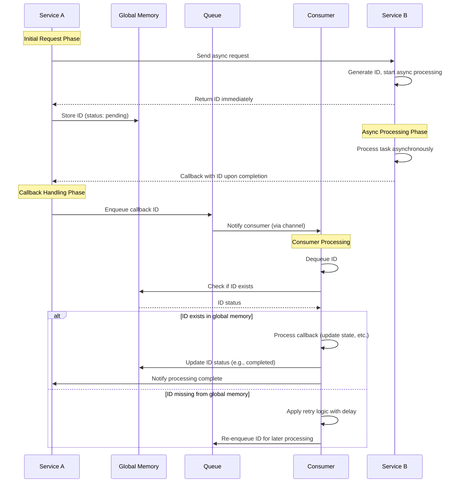
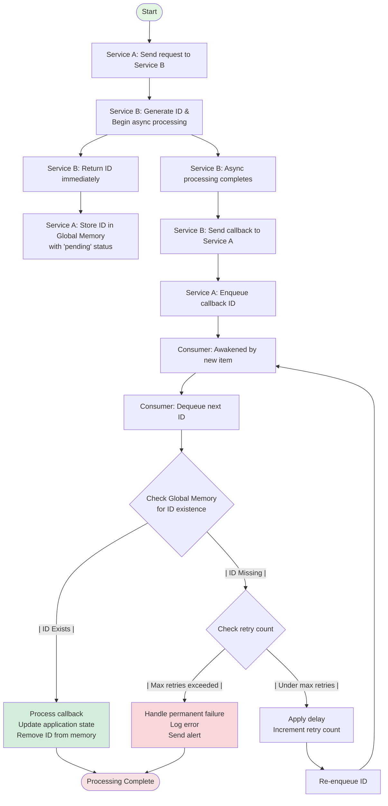

To handle this asynchronous callback scenario effectively, consider the following process flow design and solutions:

---

### **Process Flow**
1. **Service A → Service B Request**
   - Service A sends a request to Service B.
   - Service B generates a unique ID, starts an async task, and **immediately returns the ID** to Service A.
   - Service A stores the ID in a **global static memory** (e.g., a concurrent map or cache).

2. **Async Processing in Service B**
   - Service B processes the task asynchronously.
   - Upon completion, Service B sends a **callback to Service A** with the ID.

3. **Service A Handles Callback**
   - Service A checks the global static memory for the ID:
     - **Case 1: ID exists** → Proceed with processing the callback (e.g., update status, trigger next steps).
     - **Case 2: ID missing** → Handle the orphaned callback (see solutions below).

---

### **Solutions for Missing ID in Global Memory**
#### 1. **Implement a Retry Mechanism for Callbacks**
   - If the ID is missing, Service B retries the callback after a delay (e.g., exponential backoff).
   - **Why?** Service A might not have stored the ID yet due to race conditions (e.g., slow storage or network latency).

#### 2. **Add a Pending Request Buffer**
   - Service A stores the ID in the global memory **before** sending the request to Service B.
   - Mark the ID as `pending` until the callback arrives.
   - **Avoids race conditions** where the callback arrives before Service A stores the ID.

#### 3. **Use a Time-Based Expiry Cache**
   - Global memory uses a cache with TTL (e.g., Guava Cache or Caffeine).
   - IDs expire after a reasonable timeout (e.g., longer than Service B’s async process time).
   - **Handles stale callbacks** by ignoring IDs that expire before the callback arrives.

#### 4. **Persist IDs to a Database**
   - Store IDs in a database (e.g., Redis or SQL) instead of static memory.
   - **Benefits**: Survives service restarts and supports distributed environments.
   - Check the database during callbacks; if the ID is missing, log it for investigation.

#### 5. **Idempotent Callbacks**
   - Design Service B’s callback to be idempotent (e.g., include a status field like `completed`).
   - Service A processes duplicate/retried callbacks safely.

#### 6. **Logging and Alerts**
   - Log missing IDs for auditing and debugging.
   - Trigger alerts if missing IDs exceed a threshold (indicating systemic issues).

---

### **Example Code Skeleton (Java-like Pseudocode)**
```java
// Service A
class ServiceA {
    private static final Cache<String, RequestState> globalCache = 
        Caffeine.newBuilder().expireAfterWrite(1, TimeUnit.HOURS).build();

    void sendRequestToB() {
        String id = generateId();
        // Store ID in cache *before* sending to Service B
        globalCache.put(id, RequestState.PENDING);
        // Send request to Service B
        serviceBClient.asyncProcess(id);
    }

    void handleCallback(String id, CallbackResult result) {
        RequestState state = globalCache.getIfPresent(id);
        if (state != null) {
            // Process successful callback
            globalCache.put(id, RequestState.COMPLETED);
        } else {
            // ID missing: trigger retry or log
            log.warn("Missing ID in callback: {}", id);
        }
    }
}
```

---

### **Recommendations**
- **Priority Solutions**: 
  1. **Pending Buffer + TTL Cache** (prevents race conditions and memory leaks).
  2. **Persist to Redis** if Service A is distributed or requires durability.
  3. **Retry Mechanism** in Service B for resilience.
- **Anti-Patterns to Avoid**:
  - Using non-expiring static maps (causes memory leaks).
  - Assuming callbacks always arrive after ID storage (race conditions).

By combining these strategies, you ensure reliability, scalability, and easy debugging. Adjust based on your system’s constraints (e.g., latency requirements).


# Asynchronous Service Callback Process with Queue

Here's a Mermaid sequence diagram that visualizes the process flow we discussed, incorporating the queue and consumer approach:



## Key Elements Explained:

1. **Initial Request**: Service A sends a request to Service B, which immediately returns an ID while processing continues asynchronously.

2. **ID Storage**: Service A stores the ID in global memory with a "pending" status.

3. **Callback Handling**: When Service B completes processing, it sends a callback to Service A, which enqueues the ID rather than processing it immediately.

4. **Consumer Processing**: A dedicated consumer processes items from the queue:
   - Checks if the ID exists in global memory
   - Processes valid callbacks immediately
   - Re-enqueues missing IDs with a delay for retry

5. **Retry Mechanism**: Missing IDs are re-enqueued with increasing delays (exponential backoff) to handle race conditions.

This approach ensures reliable processing even when callbacks arrive before IDs are stored in memory, and provides a robust mechanism for handling temporary inconsistencies.


# Asynchronous Callback Processing with Queue Pattern

Here's a comprehensive Mermaid flowchart that visualizes the complete pattern we designed:



## Key Components of This Pattern:

1. **Service A Components**:
   - Request sender to Service B
   - Global memory storage for IDs
   - Queue for callback processing
   - Callback handler endpoint

2. **Service B Components**:
   - Async request processor
   - Callback sender

3. **Consumer System**:
   - Queue consumer with retry logic
   - Delay mechanism with backoff strategy
   - Retry counter management

4. **Decision Points**:
   - ID existence check in global memory
   - Retry count evaluation
   - Delay calculation for re-queuing

## Flow Characteristics:

- **Robust Handling**: The pattern gracefully handles race conditions where callbacks arrive before IDs are stored
- **Retry Mechanism**: Implements exponential backoff for efficient retries without overwhelming the system
- **Failure Management**: Includes proper handling of permanently missing IDs with logging and alerts
- **Memory Management**: Ensures clean removal of processed IDs to prevent memory leaks

This pattern provides a reliable, scalable solution for asynchronous callback processing with proper error handling and recovery mechanisms.


