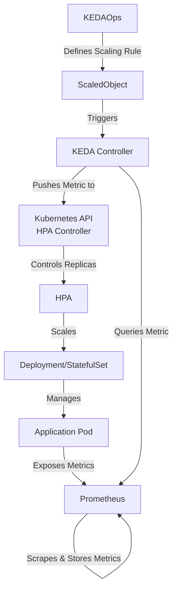
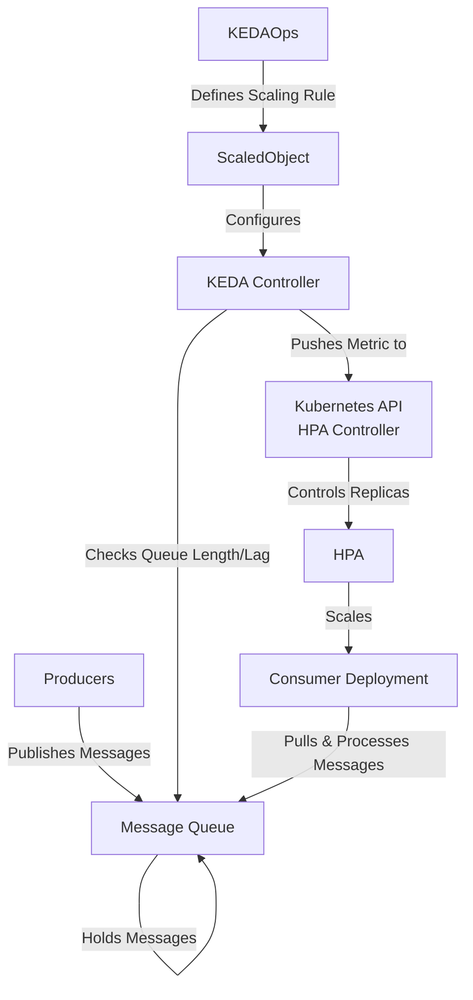

Of course. Scaling Kubernetes deployments based on Prometheus metrics is a very common and powerful pattern, often called "observability-driven scaling" or "custom metric scaling." The standard tool for this is **KEDA (Kubernetes-based Event Driven Autoscaler)**.

KEDA acts as a Kubernetes Metrics Server for external metrics, allowing the standard Horizontal Pod Autoscaler (HPA) to scale based on data from Prometheus (and many other sources).

Here is the hierarchical concept and a step-by-step guide.

### The Hierarchy & Architecture

The scaling process involves several components working together. Here’s the hierarchical data flow:

1.  **Application (Your Deployment):** The source of the metrics. It must expose application-specific metrics (e.g., `http_requests_total`, `messages_in_queue`, `custom_processed_records`).
2.  **Prometheus:** Scrapes the metrics from your application pods (and other sources) and stores them in its time-series database.
3.  **KEDA:**
    *   **Metrics Adapter:** Acts as a bridge. It queries Prometheus for the specific metric you define.
    *   **Controller:** Watches the KEDA `ScaledObject`/`ScaledJob` CRDs. It takes the metric value from the adapter and feeds it to the Kubernetes API.
4.  **Kubernetes API & HPA Controller:** The standard HPA controller, which is part of Kubernetes, sees the external metric provided by KEDA and makes the scaling decision (e.g., "current value is 100, target is 50, so I need 2 replicas").
5.  **Deployment/StatefulSet:** The HPA controller updates the `.spec.replicas` field of your deployment, causing the Kubernetes scheduler to create or delete pods.



---

### How to Implement It: A Step-by-Step Example

Let's imagine we want to scale a deployment based on the average number of HTTP requests per replica. This is a very common use case.

#### Prerequisites:
1.  A running Kubernetes cluster.
2.  Prometheus installed (e.g., via Prometheus Operator, kube-prometheus-stack, or manually).
3.  Your application is instrumented and exposing metrics (e.g., via a `/metrics` endpoint). Prometheus must be scraping it.

#### Step 1: Install KEDA
The easiest way is via Helm:
```bash
helm repo add kedacore https://kedacore.github.io/charts
helm repo update
helm install keda kedacore/keda --namespace keda --create-namespace
```
This creates the `keda` namespace and deploys the KEDA controller and metrics adapter.

#### Step 2: Verify Your Metric in Prometheus
First, find the correct metric name and query in the Prometheus UI. For our example, let's use the `http_requests_total` metric. A good scaling query might be the rate of requests per second averaged across all pods.

A potential PromQL query could be:
```promql
sum(rate(http_requests_total{app="my-web-app"}[1m])) / count({app="my-web-app"})
```
This query calculates the average RPS per pod. **Test this query first** to ensure it returns a sensible value.

#### Step 3: Create the KEDA `ScaledObject`
This is the Custom Resource Definition (CRD) that tells KEDA *what* to scale, *how* to scale it, and *which metric* to use.

Create a file `scaled-object.yaml`:

```yaml
apiVersion: keda.sh/v1alpha1
kind: ScaledObject
metadata:
  name: http-requests-scaler
  namespace: your-app-namespace # Same as your deployment
spec:
  scaleTargetRef:
    name: your-deployment # Name of your Deployment to scale
    kind: Deployment
    # apiVersion: apps/v1 (optional)
  minReplicaCount: 1   # Minimum number of pods
  maxReplicaCount: 20  # Maximum number of pods
  cooldownPeriod: 300  # Seconds to wait after last scaling action before scaling down again (optional)
  pollingInterval: 30  # How often KEDA checks Prometheus for metrics (optional, default 30s)
  triggers:
  - type: prometheus
    metadata:
      serverAddress: http://prometheus-server.monitoring.svc.cluster.local:9090 # Prometheus service URL
      metricName: http_requests_per_pod_average # A name for the metric inside KEDA/HPA
      query: |
        sum(rate(http_requests_total{app="my-web-app"}[1m])) / count({app="my-web-app"})
      threshold: "50" # The target value. We aim for an average of 50 RPS per pod.
      activationThreshold: "5" # Minimum metric value to start scaling from 0 (optional)
```
**Key Parameters:**
*   `scaleTargetRef`: Precisely identifies the resource you want to scale.
*   `minReplicaCount`/`maxReplicaCount`: Hard limits for scaling.
*   `query`: The critical PromQL query that returns a single scalar value.
*   `threshold`: The target value. The HPA will aim to have the current metric value equal this value. `(current metric value) / threshold = number of desired replicas`.
*   `activationThreshold`: Very useful for scaling from zero. A pod won't be created unless the metric value exceeds this number.

#### Step 4: Apply the ScaledObject
```bash
kubectl apply -f scaled-object.yaml -n your-app-namespace
```

#### Step 5: Verify and Monitor
1.  **Check the ScaledObject:**
    ```bash
    kubectl get scaledobject -n your-app-namespace
    kubectl describe scaledobject http-requests-scaler -n your-app-namespace
    ```
2.  **Check the underlying HPA that KEDA created:**
    ```bash
    kubectl get hpa -n your-app-namespace
    # The name will be like keda-hpa-http-requests-scaler
    kubectl describe hpa keda-hpa-http-requests-scaler -n your-app-namespace
    ```
    In the HPA description, look for the `Metrics` section. You should see your Prometheus metric listed as an `External` metric.
3.  **Generate load** against your application and watch the HPA events and pod count change:
    ```bash
    kubectl get pods -n your-app-namespace -w
    kubectl describe hpa keda-hpa-http-requests-scaler -n your-app-namespace
    ```

### Important Considerations & Best Practices

*   **Metric Choice:** Choose metrics that directly correlate with load. Queue length, request rate, and latency are excellent candidates. Avoid metrics that are too volatile.
*   **Query Efficiency:** Complex PromQL queries can put load on your Prometheus server. Keep them as simple and efficient as possible. Avoid very short range selectors (`[5s]`) or high cardinality labels.
*   **Cool Down Periods:** Set appropriate `cooldownPeriod` and `pollingInterval` values to prevent "flapping" (rapid scaling up and down).
*   **Scaling to Zero:** KEDA is famous for allowing scaling to zero replicas. If `minReplicaCount` is 0, KEDA can completely stop your deployment when no events are occurring, saving resources.
*   **Alternative to `ScaledObject`:** For job-based workloads, look into KEDA's `ScaledJob` which creates a Kubernetes Job for each event/message.

By using **KEDA**, you move beyond simple CPU/Memory scaling and can create a truly reactive, efficient, and cost-effective Kubernetes system based on any observable metric.


Excellent question! Scaling based on Message Queue (MQ) metrics is one of the most classic and powerful use cases for event-driven autoscaling. The hierarchy and tooling (KEDA) remain largely the same, but the metric source and its configuration change.

The core idea is to scale the number of consumer pods based on the backlog of messages in a queue. This ensures messages are processed efficiently without delay while minimizing resource usage during low traffic.

### The Hierarchy & Architecture for MQ Scaling

The flow is very similar to the Prometheus example, with the message queue becoming the central source of truth for the scaling metric.

1.  **Producer(s):** External services or applications that publish messages to the queue.
2.  **Message Queue (e.g., RabbitMQ, Azure Service Bus, AWS SQS, Kafka):** The central broker that holds the messages. Its state (queue length, consumer lag) is the metric for scaling.
3.  **KEDA:**
    *   **Metrics Adapter:** Has specific "scalers" for different message systems. It connects to the MQ (e.g., using its API) to check the queue length or lag.
    *   **Controller:** Watches the KEDA `ScaledObject`. It takes the queue length value from the adapter and feeds it to the Kubernetes API.
4.  **Kubernetes API & HPA Controller:** The standard HPA controller uses the external metric provided by KEDA (`queue_length` or `lag`) to calculate the desired replicas.
5.  **Consumer Deployment:** The HPA controller scales the number of consumer pods up or down. These pods pull messages from the queue and process them.



---

### How to Implement It: A Step-by-Step Example (Using RabbitMQ)

This example assumes you have a RabbitMQ queue named `orders` and a deployment that consumes messages from it.

#### Prerequisites:
1.  A running Kubernetes cluster.
2.  KEDA installed (see previous instructions).
3.  A RabbitMQ instance (could be inside or outside the cluster).
4.  A deployment that knows how to connect to RabbitMQ and process messages from the `orders` queue. The deployment should be configured to work with the number of replicas KEDA sets (e.g., using a unique `consumer_tag` or being stateless).

#### Step 1: Create a Kubernetes Secret for RabbitMQ Credentials
It's crucial not to put credentials in plain text. KEDA can read secrets.

```bash
kubectl create secret generic rabbitmq-credentials -n your-app-namespace \
  --from-literal=username=myuser \
  --from-literal=password=supersecretpassword
```

#### Step 2: Create the KEDA `ScaledObject` for RabbitMQ
Create a file `rabbitmq-scaled-object.yaml`:

```yaml
apiVersion: keda.sh/v1alpha1
kind: ScaledObject
metadata:
  name: order-processor-scaler
  namespace: your-app-namespace
spec:
  scaleTargetRef:
    name: order-processor # Name of your consumer Deployment
    kind: Deployment
  minReplicaCount: 0 # Classic use case: scale from zero!
  maxReplicaCount: 15
  cooldownPeriod: 30 # Wait 30 seconds before scaling down again
  pollingInterval: 10 # Check the queue every 10 seconds
  triggers:
  - type: rabbitmq
    metadata:
      # How to connect to RabbitMQ
      host: rabbitmq.default.svc.cluster.local:5672 # RabbitMQ service URL
      queueName: orders
      # Tell KEDA to get the username and password from the Secret we created
      usernameFromEnv: RABBIT_USERNAME
      passwordFromEnv: RABBIT_PASSWORD
      # Advanced: How to parse the queue length
      queueLength: "100" # THE KEY PARAMETER: This is the target value.
      activationQueueLength: "5" # Wait until there are 5 messages before activating from zero
    authenticationRef:
      name: rabbitmq-credentials-trigger # Reference to the TriggerAuthentication object
---
# This object defines how to get the auth details from the Secret
apiVersion: keda.sh/v1alpha1
kind: TriggerAuthentication
metadata:
  name: rabbitmq-credentials-trigger
  namespace: your-app-namespace
spec:
  secretTargetRef:
    - parameter: username
      name: rabbitmq-credentials # Name of the secret
      key: username
    - parameter: password
      name: rabbitmq-credentials # Name of the secret
      key: password
```

**Key Parameters for MQ:**
*   `type`: This changes to the specific MQ system, e.g., `rabbitmq`, `azure-servicebus`, `aws-sqs-queue`, `kafka`.
*   `queueLength`: This is the **`threshold`**. It's the target number of messages *per pod*. KEDA will aim to have each pod process `queueLength` messages.
    *   **Example:** If `queueLength: "20"` and there are 100 messages in the queue, KEDA will scale to `100 / 20 = 5` pods.
*   `activationQueueLength`: The number of messages required before KEDA will create the *first* pod (scaling from zero). This prevents a pod from running if there's no work to do.

#### Step 3: Apply the ScaledObject
```bash
kubectl apply -f rabbitmq-scaled-object.yaml -n your-app-namespace
```

#### Step 4: Verify and Monitor
1.  **Check the ScaledObject and HPA:**
    ```bash
    kubectl get scaledobject -n your-app-namespace
    kubectl get hpa -n your-app-namespace
    ```
    You should see an HPA managed by KEDA.
2.  **Test it:**
    *   **Scale from Zero:** With the queue empty, your replica count should drop to 0. Check with `kubectl get pods -n your-app-namespace`.
    *   **Generate Load:** Publish a few messages (e.g., 10) to the `orders` queue. Within ~30 seconds, you should see a pod become created and go into a `Running` state.
    *   **Scale Up:** Publish a large number of messages (e.g., 500). Watch as KEDA scales out your deployment. The target number of pods will be `500 / 100 = 5` pods (based on our `queueLength` of 100).
3.  **Watch the HPA events to see the metric value:**
    ```bash
    kubectl describe hpa keda-hpa-order-processor-scaler -n your-app-namespace
    ```
    The output will show the external metric it's using:
    ```
    Metrics:                               ( current / target )
    "rabbitmq-orders" (target average value):  500 / 100
    ```

### Important Considerations for MQ Scaling

*   **Choosing `queueLength`:** This value is crucial. Set it based on your pod's performance. How many messages can a single pod process per second? If a pod processes 10 msg/sec, and you want a ~10-second processing cycle, set `queueLength: "100"`.
*   **Concurrency Control:** Your consumer application *must* be able to handle multiple instances running concurrently. The queue should be designed for multiple consumers (e.g., a *queue* in RabbitMQ, not a *stream* with competing consumers).
*   **Message Batching:** Some KEDA scalers (like GCP Pub/Sub) support batching messages (e.g., `maxBatchSize: 100`), allowing a single pod to process multiple messages per activation, which can increase efficiency.
*   **Different Queues, Different ScaledObjects:** You can easily manage multiple consumer deployments for different queues with separate `ScaledObject` manifests.

By using KEDA with message queues, you create a highly efficient and cost-effective system that directly ties your resource consumption to your actual workload, responding instantly to changes in demand.
