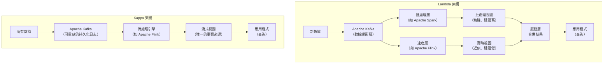
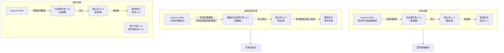

当然知道。Kappa 架构是一种大数据处理架构，它被设计用来处理大量的流式数据。其核心思想是**简化Lambda架构**，**只使用一套流处理系统**来完成所有的数据处理任务，而不是像Lambda架构那样同时维护批处理和流处理两套系统。

简单来说，Kappa 架构可以被看作是一个“**全流式**”的架构。

---

### 1. Kappa 架构诞生的背景：为了改进 Lambda 架构

要理解 Kappa 架构，最好先了解它的前身——Lambda 架构。

*   **Lambda 架构**：为了解决批处理（高延迟但准确）和流处理（低延迟但可能不精确）的矛盾，Lambda 架构同时运行两条数据流水线：
    *   **批处理层 (Batch Layer)**：处理所有历史数据，生成准确但延迟高的“批处理视图”。
    *   **速度层 (Speed Layer)**：处理实时的新数据，生成快速但可能不精确的“实时视图”来弥补批处理层的高延迟。
    *   **服务层 (Serving Layer)**：将批处理视图和实时视图的结果合并，提供给用户查询。

*   **Lambda 架构的问题**：
    *   **复杂性高**：需要开发和维护两套独立的代码（例如，用 Spark 写批处理作业，用 Flink 写流处理作业），逻辑相同但运行在不同的框架上。
    *   **调试困难**：两套系统可能产生不一致的结果，排查问题非常麻烦。

Kappa 架构的提出者 Jay Kreps（也是 Apache Kafka 的联合创建者）认为，这种复杂性是可以避免的。

---

### 2. Kappa 架构的核心思想与工作原理

Kappa 架构的核心原则是：**一切都通过流处理来完成**。它摒弃了独立的批处理层。

其工作原理可以概括为以下几个步骤：

1.  **将所有数据作为流输入 (Everything is a Stream)**：
    *   所有数据，无论是历史数据还是实时数据，都被视为一个无尽的流（Stream）。
    *   数据被持久化到一个**高吞吐、可重放的日志型消息系统**中，例如 **Apache Kafka**。这是架构的关键，因为Kafka可以长时间（例如几天、几个月甚至永久）存储数据，并允许应用程序随时从头重新读取数据。

2.  **单一的流处理引擎 (Single Streaming Engine)**：
    *   只使用一个流处理框架（如 Apache Flink, Apache Spark Streaming, Kafka Streams）来消费消息系统中的数据。
    *   这个流处理引擎负责所有数据的计算任务，无论是实时数据处理还是历史数据的重新计算。

3.  **重新处理能力 (Reprocessing is the Trick)**：
    *   当需要重新计算历史数据（例如业务逻辑变更、代码有bug）时，Kappa 架构的解决方案非常巧妙：
        *   a. 启动一个新的流处理作业实例。
        *   b. 这个新实例从消息系统（如Kafka）的**最开始**（或者从某个指定的偏移量/时间点）重新消费全部数据。
        *   c. 新实例使用新的处理逻辑进行计算，并将新的结果输出到一个新的输出表中。
        *   d. 当新的作业实例追上实时数据后，将应用程序的查询流量从旧的输出表切换到新的输出表，然后关停旧的作业实例。

    *   这个过程就像“倒带并重新播放”所有数据，因此得名“可重放”。
  
    *   好的，當然可以。視覺化的圖表能幫助更好地理解 Kappa 架構及其與 Lambda 架構的區別。

我將為您製作兩個主要的架構圖：

1.  **Lambda 架構 vs. Kappa 架構 的對比圖**
2.  **Kappa 架構的「重新處理」流程圖**

---

### 1. Lambda 架構 vs. Kappa 架構

這張對比圖清晰地展示了兩種架構的核心區別：Lambda 的雙路徑與 Kappa 的單一路徑。

**圖解說明：**
*   **Lambda (左)**：數據同時進入批處理和速度層，產生兩個不同的視圖，最終在服務層合併，提供查詢結果。路徑複雜，需要維護兩套系統。
*   **Kappa (右)**：所有數據優先進入 Kafka。唯一的流處理引擎消費 Kafka 的數據，計算後直接生成一個最終的「流式視圖」。架構非常簡潔。

---

### 2. Kappa 架構的「重新處理」流程

這是 Kappa 架構最核心的機制，下圖展示了當業務邏輯改變時，如何重新處理數據。

**圖解說明：**
1.  **初始狀態**：應用程式使用 v1.0 的作業邏輯和輸出結果。
2.  **重新處理**：當邏輯需要更新時，啟動一個新的 v2.0 作業。它從 Kafka **從頭開始**消費數據，並將結果寫入一個**新的**輸出表。
3.  **切換與退役**：當 v2.0 作業處理完歷史數據並追上實時數據進度後，將應用程式的查詢指向新的 v2.0 輸出表。確認無誤後，即可關停舊的 v1.0 作業並刪除其輸出表。

希望這些圖能幫助您更直觀地理解 Kappa 架構的設計精髓！
