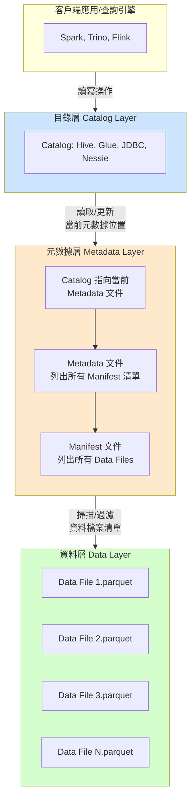
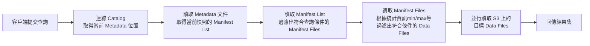
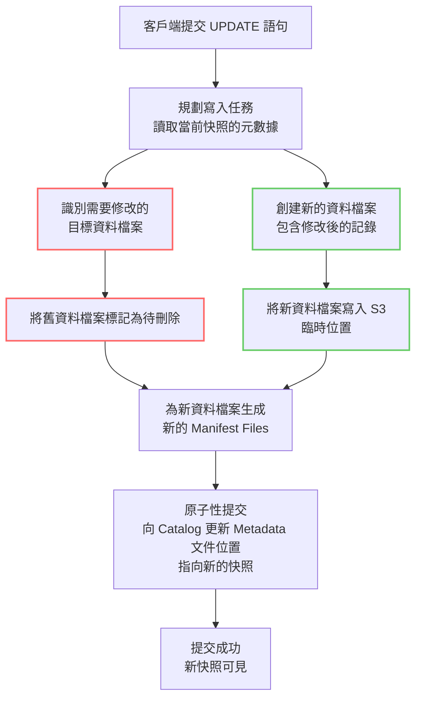

好的，我們來深入探討 Apache Iceberg 與 Amazon S3 進行 CRUD 操作時的底層運作機制，並輔以 Mermaid 架構圖與流程圖來說明。

### 核心概念：Iceberg 的設計哲學

首先要理解 Iceberg 的關鍵設計，它為了解決傳統 Hive 表格式在雲端物件儲存（如 S3）上的痛點：
1.  **將元數據與資料分離**：豐富的、多層級的元數據（Metadata）是 Iceberg 的大腦。
2.  **將「物理資料佈局」與「邏輯檢視」分離**：使用者查詢的是穩定的「快照」（Snapshot），而底層的資料檔案可以透過 `expire_snapshots` 或 `VACUUM` 來管理。
3.  **原子性提交（Atomic Commits）**：所有變更都是先寫入新檔案，最後透過一次原子性操作更新元數據來「提交」，這使得所有操作都是 **ACID** 合規的。

---

### Mermaid 架構圖

下圖描繪了 Iceberg 與 S3 互動時的主要組件及其關係：

**架構圖解說：**
1.  **客戶端/查詢引擎**：如 Spark、Trino 等，是發起 CRUD 操作的驅動程式。
2.  **目錄層**：是 Iceberg 表的「入口點」。它儲存了**當前最新元數據文件的位置**。常用的目錄有 AWS Glue、Hive Metastore 等。
3.  **元數據層**：
    *   **Metadata 文件**：表的綱要（Schema）、分割槽設定、當前快照ID等。每次變更都會產生一個新的 Metadata 文件。
    *   **Manifest List**：屬於某個快照，列出所有構成該快照的 Manifest 文件。
    *   **Manifest File**：記錄了組成該快照的**每一個資料檔案**的詳細資訊（路徑、統計資訊、分割槽資料等）。
4.  **資料層**：實際儲存資料的 Parquet/AVRO 檔案，存放在 S3 上。**Iceberg 本身從不修改或刪除這些檔案**，所有操作都是透過新增和重新指向來完成。

---

### CRUD 操作底層流程

#### 1. Read (SELECT) 操作

**流程解說：**
*   Iceberg 的「元數據篩選」能力使得讀取效率極高。查詢引擎可以在不需要讀取任何實際資料檔案的情況下，利用 Manifest File 中的**分割槽資料**、**每欄的 min/max 值**、**row count** 等統計資訊，快速過濾掉絕不相關的資料檔案，大幅減少需要掃描的資料量。
*   這個過程完全避免了 S3 上昂貴的 `LIST` 操作。

#### 2. Create/Update/Delete 操作

所有寫入操作（INSERT, UPDATE, DELETE, MERGE）都遵循 **「寫時複製」（Copy-on-Write）** 模式。下圖以一個 `UPDATE` 操作為例：

**流程解說：**
1.  **讀取與規劃**：引擎讀取當前快照的元數據，找出所有包含需要更新記錄的資料檔案（`File A`）。
2.  **寫入新資料**：**不會**直接修改 `File A`，而是將 `File A` 中**未被修改的記錄**和**更新後的記錄**一起寫入一個**全新的資料檔案** `File A'` 到 S3。
3.  **標記舊資料**：原始的 `File A` 將在新的元數據中被標記為「已刪除」，但**實體檔案仍存在於 S3 上**。
4.  **生成新元數據**：建立新的 Manifest File 來記錄 `File A'`，並標記 `File A` 已不再屬於新快照。
5.  **原子性提交**：這是**最關鍵的一步**。將新的 Metadata 文件寫入 S3，然後透過**單次原子操作**更新 Catalog 中的指標，使其指向這個新 Metadata 文件。此操作成功後，新快照對所有後續查詢可見。如果提交失敗，所有新寫入的資料檔案將成為孤兒檔案，後續會被清理程序移除。

**S3 的注意點**：S3 不支援原子性的重新命名或覆寫，但 Iceberg 的提交機制是透過「只寫一次」Metadata 文件和「只更新一次」Catalog 中的指標來實現原子性，完美避開了 S3 的限制。

#### 刪除與清理
*   `DELETE` 操作與 `UPDATE` 流程幾乎完全相同，只是新產生的資料檔案中不包含被刪除的記錄。
*   被替換掉的舊資料檔案不會立即從 S3 刪除。需要使用 Iceberg 的 `expire_snapshots` 程序來根據保留策略**安全地刪除**不再被任何快照引用的資料檔案和元數據文件。這使得「時間旅行」和「回滾」成為可能。

---

### 總結

| 操作 | 底層運作核心 |
| :--- | :--- |
| **Create (INSERT)** | 寫入新資料檔案，並在元數據中新增對它們的參考。原子提交更新表狀態。 |
| **Read (SELECT)** | 透過多層元數據（Manifests）進行高效篩選，精確定位所需資料檔案後讀取。 |
| **Update** | **寫時複製**：讀取舊檔案、創建包含更新資料的新檔案、更新元數據以交換參考、原子提交。 |
| **Delete** | **寫時複製**：讀取舊檔案、創建不包含刪除資料的新檔案、更新元數據以移除舊檔案的參考、原子提交。 |

**Iceberg + S3 的優勢：**
*   **ACID 保證**：在多並發讀寫作業下保證資料一致性。
*   **效能**：透過元數據篩選大幅減少 S3 的 API 呼叫和資料掃描量。
*   **可靠性**：所有寫入操作都是不可變的（Immutable）和原子性的，不會破壞現有資料。
*   **時間旅行**：舊的快照和資料檔案都被保留，直到被明確清理。

這種設計使得 Iceberg 成為在 S3 這類最終一致性、不支援原子覆寫的物件儲存上管理大型資料集的理想選擇。
