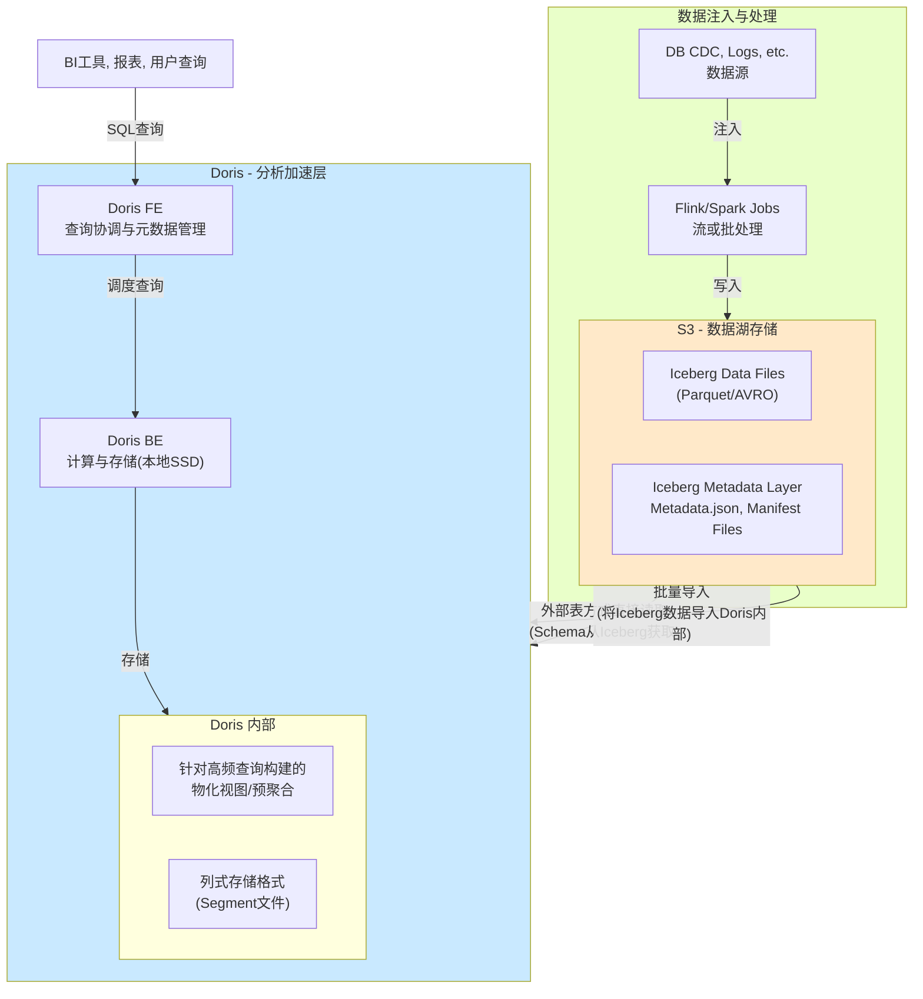

好的，我們來深入探討 Apache Iceberg 與 Amazon S3 進行 CRUD 操作時的底層運作機制，並輔以 Mermaid 架構圖與流程圖來說明。

### 核心概念：Iceberg 的設計哲學

首先要理解 Iceberg 的關鍵設計，它為了解決傳統 Hive 表格式在雲端物件儲存（如 S3）上的痛點：
1.  **將元數據與資料分離**：豐富的、多層級的元數據（Metadata）是 Iceberg 的大腦。
2.  **將「物理資料佈局」與「邏輯檢視」分離**：使用者查詢的是穩定的「快照」（Snapshot），而底層的資料檔案可以透過 `expire_snapshots` 或 `VACUUM` 來管理。
3.  **原子性提交（Atomic Commits）**：所有變更都是先寫入新檔案，最後透過一次原子性操作更新元數據來「提交」，這使得所有操作都是 **ACID** 合規的。

---

### Mermaid 架構圖

下圖描繪了 Iceberg 與 S3 互動時的主要組件及其關係：

**架構圖解說：**
1.  **客戶端/查詢引擎**：如 Spark、Trino 等，是發起 CRUD 操作的驅動程式。
2.  **目錄層**：是 Iceberg 表的「入口點」。它儲存了**當前最新元數據文件的位置**。常用的目錄有 AWS Glue、Hive Metastore 等。
3.  **元數據層**：
    *   **Metadata 文件**：表的綱要（Schema）、分割槽設定、當前快照ID等。每次變更都會產生一個新的 Metadata 文件。
    *   **Manifest List**：屬於某個快照，列出所有構成該快照的 Manifest 文件。
    *   **Manifest File**：記錄了組成該快照的**每一個資料檔案**的詳細資訊（路徑、統計資訊、分割槽資料等）。
4.  **資料層**：實際儲存資料的 Parquet/AVRO 檔案，存放在 S3 上。**Iceberg 本身從不修改或刪除這些檔案**，所有操作都是透過新增和重新指向來完成。

---

### CRUD 操作底層流程

#### 1. Read (SELECT) 操作

**流程解說：**
*   Iceberg 的「元數據篩選」能力使得讀取效率極高。查詢引擎可以在不需要讀取任何實際資料檔案的情況下，利用 Manifest File 中的**分割槽資料**、**每欄的 min/max 值**、**row count** 等統計資訊，快速過濾掉絕不相關的資料檔案，大幅減少需要掃描的資料量。
*   這個過程完全避免了 S3 上昂貴的 `LIST` 操作。

#### 2. Create/Update/Delete 操作

所有寫入操作（INSERT, UPDATE, DELETE, MERGE）都遵循 **「寫時複製」（Copy-on-Write）** 模式。下圖以一個 `UPDATE` 操作為例：

**流程解說：**
1.  **讀取與規劃**：引擎讀取當前快照的元數據，找出所有包含需要更新記錄的資料檔案（`File A`）。
2.  **寫入新資料**：**不會**直接修改 `File A`，而是將 `File A` 中**未被修改的記錄**和**更新後的記錄**一起寫入一個**全新的資料檔案** `File A'` 到 S3。
3.  **標記舊資料**：原始的 `File A` 將在新的元數據中被標記為「已刪除」，但**實體檔案仍存在於 S3 上**。
4.  **生成新元數據**：建立新的 Manifest File 來記錄 `File A'`，並標記 `File A` 已不再屬於新快照。
5.  **原子性提交**：這是**最關鍵的一步**。將新的 Metadata 文件寫入 S3，然後透過**單次原子操作**更新 Catalog 中的指標，使其指向這個新 Metadata 文件。此操作成功後，新快照對所有後續查詢可見。如果提交失敗，所有新寫入的資料檔案將成為孤兒檔案，後續會被清理程序移除。

**S3 的注意點**：S3 不支援原子性的重新命名或覆寫，但 Iceberg 的提交機制是透過「只寫一次」Metadata 文件和「只更新一次」Catalog 中的指標來實現原子性，完美避開了 S3 的限制。

#### 刪除與清理
*   `DELETE` 操作與 `UPDATE` 流程幾乎完全相同，只是新產生的資料檔案中不包含被刪除的記錄。
*   被替換掉的舊資料檔案不會立即從 S3 刪除。需要使用 Iceberg 的 `expire_snapshots` 程序來根據保留策略**安全地刪除**不再被任何快照引用的資料檔案和元數據文件。這使得「時間旅行」和「回滾」成為可能。

---

### 總結

| 操作 | 底層運作核心 |
| :--- | :--- |
| **Create (INSERT)** | 寫入新資料檔案，並在元數據中新增對它們的參考。原子提交更新表狀態。 |
| **Read (SELECT)** | 透過多層元數據（Manifests）進行高效篩選，精確定位所需資料檔案後讀取。 |
| **Update** | **寫時複製**：讀取舊檔案、創建包含更新資料的新檔案、更新元數據以交換參考、原子提交。 |
| **Delete** | **寫時複製**：讀取舊檔案、創建不包含刪除資料的新檔案、更新元數據以移除舊檔案的參考、原子提交。 |

**Iceberg + S3 的優勢：**
*   **ACID 保證**：在多並發讀寫作業下保證資料一致性。
*   **效能**：透過元數據篩選大幅減少 S3 的 API 呼叫和資料掃描量。
*   **可靠性**：所有寫入操作都是不可變的（Immutable）和原子性的，不會破壞現有資料。
*   **時間旅行**：舊的快照和資料檔案都被保留，直到被明確清理。

這種設計使得 Iceberg 成為在 S3 這類最終一致性、不支援原子覆寫的物件儲存上管理大型資料集的理想選擇。

这是一个非常好的问题，但它包含一个需要先澄清的细微差别。

**Iceberg 本身不是一个数据库，它是一个“表格式”（Table Format）**。它不直接与 Oracle、MySQL、PostgreSQL 这类传统的“一般数据库”（OLTP 关系型数据库）竞争。它们的设计目标和适用场景有根本性的不同。

更准确的比较是：**Iceberg 在“大规模数据分析”这类场景的查询效能上，远优于直接在对象存储（如 S3）上查询原始文件（如 JSON, CSV）或使用旧的 Hive 表格式**。

让我们先通过一个架构图来直观感受这种差异，然后再深入解释。

### Mermaid 架构对比：Iceberg vs. 直接查询文件

从上图可以清晰地看到，Iceberg 通过其丰富的元数据层，在查询真正接触到 S3 上的数据文件之前，就完成了大量的过滤工作。

---

### Iceberg 在分析查询上性能卓越的核心原因

Iceberg 的查询性能优势并非来自单条记录的快速检索（那是 OLTP 数据库的强项），而是来自于**对海量数据集（TB/PB 级）进行复杂分析查询时，能极大地减少需要读取的数据量**。这主要通过以下机制实现：

#### 1. 高级元数据与统计信息修剪（Metadata & Statistics Pruning）

这是最核心的性能优势。如流程图所示，Iceberg 的元数据是分层的（Manifest List -> Manifest File -> Data File）。

*   **每个数据文件（Data File）** 的元数据中都记录了**该文件的详细统计信息**，包括：
    *   行数（row count）
    *   每个列的**最小值**和**最大值**（min/max）
    *   空值计数（null count）
    *   等等...
*   当执行一个带 `WHERE` 条件的查询时（例如 `WHERE date = '2023-10-01' AND price > 100`），查询引擎（如 Spark、Trino）会先读取这些元数据文件。
*   引擎可以立即根据 `date` 和 `price` 的 min/max 值判断出：“这个文件里根本不可能有 `date='2023-10-01'` 且 `price>100` 的记录”，从而在**完全不读取这个数据文件**的情况下就跳过它。
*   **效果**：这避免了昂贵的 `LIST` 操作和大量不必要的数据扫描，将 I/O 和计算量降到最低。

#### 2. 高效的分区修剪（Partition Pruning）

虽然 Hive 也有分区，但 Iceberg 的分区更高级、更安全。

*   **隐藏分区（Hidden Partitioning）**：用户不需要在查询中关心数据是如何物理分区的。例如，表可以按 `days(event_timestamp)` 分区，但用户只需要查询 `WHERE event_timestamp BETWEEN ...`即可。Iceberg 会自动将逻辑谓词转换为分区过滤条件，避免了 Hive 中必须写 `WHERE partition_date = ...` 的麻烦和错误。
*   **进化分区（Partition Evolution）**：你可以改变分区策略而不需要重写现有数据。新的数据会以新的分区方式写入，而旧的查询依然能正常工作。这保证了性能优化可以持续进行。

#### 3. 文件裁剪（File Skipping）

与统计信息修剪类似，但更进一层。利用元数据中的信息，不仅可以跳过整个文件，甚至可以规划更优的执行计划。

#### 4. 面向分析的性能优化

*   **列式存储格式支持**：Iceberg 完美支持 Parquet、ORC 等列式存储格式。对于分析查询（通常只访问少数列），列式存储可以只读取需要的列，极大减少 I/O 数据量。
*   **向量化读取（Vectorized Reading）**：现代查询引擎支持向量化执行，可以一次处理一批记录，而不是一次一行。Parquet 等格式非常适合向量化读取，Iceberg 与之结合能充分发挥硬件性能。

### 与传统 OLTP 数据库的对比

| 特性 | Apache Iceberg (用于数据分析) | 传统 OLTP 数据库 (如 MySQL, PostgreSQL) |
| :--- | :--- | :--- |
| **设计目标** | 大规模、**批处理**、复杂分析、全表扫描 | **高并发**、短时、**点查询**、事务处理 |
| **数据量** | **TB 到 PB 级** | GB 到 TB 级 |
| **查询模式** | 读取大量数据行，但可能只聚合少数几列 | 通过索引快速读取或更新**少数几行** |
| **索引** | 依赖**元数据统计**（min/max）和**分区**进行“粗粒度”跳过 | 使用 **B+树**、**哈希**等索引进行“细粒度”精确定位 |
| **并发** | **写并发**通过“乐观锁”和“原子交换”管理 | 使用**行级锁**和 MVCC 来管理高并发读写 |
| **成本** | 数据存储在廉价的 **S3** 上，计算与存储分离 | 数据存储在昂贵的 **SSD/本地硬盘**上，通常计算存储一体 |

### 总结

**Iceberg 并非在“所有场景”下都比“一般数据库”快**。它的优势领域非常明确：

*   **快在哪儿？** 快在对海量历史数据进行**聚合、过滤、扫描和分析**的场景（OLAP）。
*   **为什么快？** 因为它通过**精心设计的元数据层**，在查询执行前就最大限度地**跳过了不相关的数据**，显著减少了需要从廉价但高延迟的对象存储（如 S3）中读取的数据量，并将计算资源集中在真正需要的数据上。

*   **慢在哪儿？** 如果你需要根据主键快速查询单条用户记录（`SELECT * FROM users WHERE user_id = 123`），传统的 OLTP 数据库凭借其高效的 B+树索引，会比扫描 Iceberg 表快几个数量级。

因此，结论是：**在现代数据架构中，Iceberg 和 OLTP 数据库是互补的。OLTP 数据库处理高频交易，数据通过 CDC 工具同步到 Iceberg 数据湖中，供大规模、低成本、高性能的分析查询使用。**

非常好的问题！Doris 和 Apache Iceberg 的结合是现代数据架构中一个非常经典的“湖仓一体”（Lakehouse）实践，它们各自扮演不同的角色，协同工作，发挥各自的优势。

### 核心概念分工

简单来说，它们的核心分工可以用一句话概括：

*   **Apache Iceberg**：是**数据的存储和管理层**。它负责在廉价的对象存储（如 S3/HDFS）上以高性能、ACID 的方式**“管”数据**，定义数据的组织结构、元数据、快照、演化等。
*   **Apache Doris**：是**数据的计算和消费层**。它作为一个高性能的MPP分析型数据库，负责**“算”数据**，即高速执行复杂的分析查询，提供亚秒级到秒级的查询响应，服务于报表、BI、即席查询等场景。

它们的关系就像是 **“仓库”** 和 **“精品店”** 的关系：
*   **Iceberg** 是一个规划良好、管理规范的大型**中央仓库**，所有原始货物都存放在这里，成本低廉，管理能力强大。
*   **Doris** 是一个面向顾客的**精品店**，它会从中央仓库中精选出当前最热门的商品，以最佳的陈列方式（物化视图、预聚合等）摆放，提供极致的购物（查询）体验。

下面我们通过一个架构图来直观理解它们是如何协同工作的。

### Mermaid 架构图：Doris 与 Iceberg 分工协作

---

### 详细分工与协作模式

#### 1. Apache Iceberg 的角色与职责

*   **统一的湖存储格式**：
    *   **作用**：作为所有数据的单一可信来源。数据工程师使用 Flink/Spark 将各种数据源（日志、CDC、业务库）以流或批的方式**写入** Iceberg 表。
    *   **优势**：提供 ACID 事务、模式演化、分区演化、隐藏分区、时间旅行等企业级特性，保证数据湖中的数据质量和可靠性。

*   **低成本的历史数据存储**：
    *   **作用**：存储全量的历史数据，包括不常访问的冷数据。数据存储在 S3 上，成本极低。
    *   **优势**：Iceberg 的元数据优化使得即使查询历史数据，性能也远优于直接查询原始文件。

*   **大规模数据批处理**：
    *   **作用**：是 Spark、Flink、Presto/Trino 等处理引擎进行**大规模 ETL/ELT 作业**的主要场地。这些作业扫描数据量大，运行时间长，对绝对存储成本敏感。

#### 2. Apache Doris 的角色与职责

*   **高性能分析查询**：
    *   **作用**：承接对查询延迟要求高的**在线分析**需求。服务于 BI 报表、即席查询、实时看板等场景。
    *   **优势**：Doris 采用 MPP 架构，列式存储，向量化执行引擎，并可通过**物化视图**和**智能预聚合**等技术，将查询速度优化到极致。它的点查询性能远胜于直接查询 Iceberg。

*   **服务高并发请求**：
    *   **作用**：直接面对终端用户和应用程序的高并发查询请求。Doris 可以轻松处理每秒数千次的查询。
    *   **优势**：Doris 的架构是为高并发设计的，而直接让大量用户查询 Iceberg 表会给 S3 的元数据压力（LIST操作）和数据扫描带来巨大成本和性能压力。

*   **简化数据模型**：
    *   **作用**：Doris 中可以创建面向不同业务场景的**宽表**或**星型模型**，将 Iceberg 中规范化或复杂的多表模型进行扁平化处理，极大简化了业务用户的查询难度。

#### 3. 两者如何协作（数据流动）

协作方式主要有两种，对应图中两条数据流：

1.  **联邦查询（外部表方式）**：
    *   **方式**：在 Doris 中创建 **Iceberg 外部表**，该表的元数据（schema）映射自 Iceberg，但数据实际仍在 S3 上。
    *   **查询流程**：用户查询 Doris 的外部表 -> Doris 向 Iceberg 的元数据（如 Hive Metastore）获取文件列表 -> Doris 的 BE 节点直接从 S3 读取数据并计算。
    *   **适用场景**：**低频、临时的数据探索**，或查询不常访问的冷数据。优点是无需数据冗余，节省 Doris 存储空间。缺点是**查询延迟较高**（仍需远程读取 S3）。

2.  **数据导入（批量同步方式）**：
    *   **方式**：使用 Doris 的 `INSERT INTO SELECT * FROM iceberg_table` 或通过 `Spark-Doris-Connector` 等工具，将 Iceberg 表中的数据**批量导入**到 Doris 的**内部表**中。
    *   **查询流程**：用户查询 Doris 的内部表 -> 数据已在 Doris 本地 SSD 上，直接高速计算。
    *   **适用场景**：**高频、对性能要求高的核心业务查询**。这是**最主要的协作模式**。优点是查询性能极佳，支持高并发。缺点是产生了数据冗余，需要维护数据同步任务（通常近实时）。

### 总结对比表格

| 特性 | Apache Iceberg (数据湖) | Apache Doris (数据仓库) | 分工建议 |
| :--- | :--- | :--- | :--- |
| **主要角色** | **存储与管理** | **计算与消费** | Iceberg 管数据，Doris 算数据。 |
| **数据位置** | 对象存储（S3/HDFS） | 本地SSD或云端磁盘 | Iceberg 成本低，Doris 性能高。 |
| **查询延迟** | 秒级到分钟级 | **亚秒级到秒级** | 高频交互查询用 Doris，低频分析/ETL 用 Iceberg。 |
| **并发能力** | 低（适合批处理） | **非常高** | 面向用户的高并发查询走 Doris。 |
| **数据新鲜度** | **实时/准实时** | 近实时（依赖同步频率） | 最新数据在 Iceberg，Doris 需定期同步。 |
| **成本** | **存储成本极低** | 计算和存储成本较高 | 全量冷数据存 Iceberg，热数据和高性能查询用 Doris。 |
| **适用场景** | 大规模ELT、数据湖管理、时间旅行、数据归档 | BI报表、实时看板、即席查询、高并发点查 | ETL 在 Iceberg 完成，BI 在 Doris 开展。 |

### 典型工作流

一个典型的数据流是这样的：
1.  **数据注入**：Flink CDC 实时将业务数据库的变更写入 Iceberg 表。
2.  **数据清洗与整合**：Spark 定时调度作业，对 Iceberg 中的原始表进行清洗、连接、转换，生成新的聚合 Iceberg 表（依然是湖存储）。
3.  **数据同步**：将步骤2中生成的结果表，通过定时任务（如每5分钟）**同步到 Doris 的内部表**中。
4.  **数据应用**：BI 工具、报表系统、用户门户直接查询 **Doris 表**，获得极快的查询体验。

这种分工协作模式，既利用了数据湖的灵活性和低成本，又发挥了分析型数据库的高性能和高并发优势，是构建“湖仓一体”架构的最佳实践之一。
