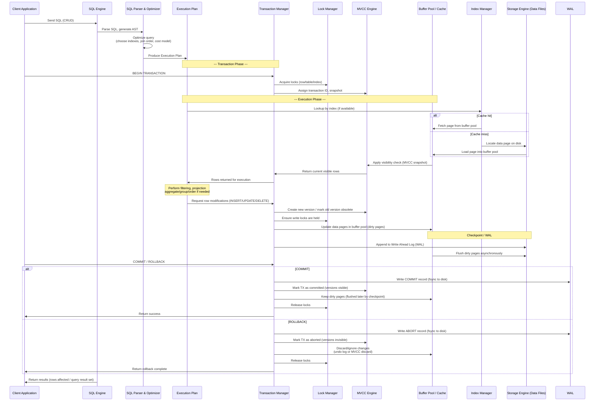

```mermaid
sequenceDiagram
    participant Client as Client Application
    participant DB as SQL Engine
    participant Parser as SQL Parser & Optimizer
    participant Plan as Execution Plan
    participant Tx as Transaction Manager
    participant Lock as Lock Manager
    participant MVCC as MVCC Engine
    participant Cache as Buffer Pool / Cache
    participant Index as Index Manager
    participant File as Storage Engine (Data Files)

    Client->>DB: Send SQL (CRUD)
    DB->>Parser: Parse SQL, generate AST
    Parser->>Parser: Optimize query<br/> (choose indexes, join order, cost model)
    Parser->>Plan: Produce Execution Plan

    Note over Plan,Tx: --- Transaction Phase ---
    Client->>Tx: BEGIN TRANSACTION
    Tx->>Lock: Acquire locks (row/table/index)
    Tx->>MVCC: Assign transaction ID, snapshot

    Note over Plan,Cache: --- Execution Phase ---
    Plan->>Index: Lookup by index (if available)
    alt Cache hit
        Index->>Cache: Fetch page from buffer pool
    else Cache miss
        Index->>File: Locate data page on disk
        File->>Cache: Load page into buffer pool
    end

    Cache->>MVCC: Apply visibility check (MVCC snapshot)
    MVCC->>Tx: Return current visible rows
    Tx->>Plan: Rows returned for execution

    Note over Plan: Perform filtering, projection<br/> aggregate/group/order if needed

    Plan->>Tx: Request row modifications (INSERT/UPDATE/DELETE)
    Tx->>MVCC: Create new version / mark old version obsolete
    Tx->>Lock: Ensure write locks are held
    Tx->>Cache: Update data pages in buffer pool (dirty pages)

    Note over Cache,File: Checkpoint / WAL
    Tx->>File: Append to Write Ahead Log (WAL)
    Cache->>File: Flush dirty pages asynchronously

    Client->>Tx: COMMIT / ROLLBACK

    alt COMMIT
        Tx->>WAL: Write COMMIT record (fsync to disk)
        Tx->>MVCC: Mark TX as committed (versions visible)
        Tx->>Cache: Keep dirty pages (flushed later by checkpoint)
        Tx->>Lock: Release locks
        Tx->>Client: Return success
    else ROLLBACK
        Tx->>WAL: Write ABORT record (fsync to disk)
        Tx->>MVCC: Mark TX as aborted (versions invisible)
        Tx->>Cache: Discard/ignore changes<br/>(undo log or MVCC discard)
        Tx->>Lock: Release locks
        Tx->>Client: Return rollback complete
    end
    DB->>Client: Return results (rows affected / query result set)


```
