這是一份相當完整且現代化的企業級系統架構設計（看似 Master Data Management - MDM 物料主數據管理系統）。你引入了 K8s (KEDA)、向量檢索 (Vector Search)、LLM Agent 以及分散式架構的考量，顯示出你對當前技術趨勢有很好的掌握。

然而，架構設計的精髓在於**權衡 (Trade-off)**。針對你的設計思路與提出的 12 點，我將分為 **「核心亮點」**、**「關鍵風險與批判」** 以及 **「優化建議」** 三個部分進行深度點評。

---

### 1. 核心亮點 (Strengths)

* **現代化 AI 整合 (Points 6, 7):**
    引入 `MCP (Model Context Protocol)` server 和 Embedding 是一個非常前瞻的設計。這讓系統不僅是 "CRUD" 工具，而是具備語意理解能力的智慧系統。使用向量檢索 (Elasticsearch) 解決了傳統關鍵字搜尋無法處理 "相似物料" 或 "模糊描述" 的痛點。
* **彈性與自動化 (Points 12, 5):**
    利用 `KEDA` 監控 Queue depth 來驅動 Consumer Pod 的自動擴展，這是處理突發流量（如批量匯入或大量下游同步）的最佳實踐。加上 Priority Queue 的設計，能確保核心業務（如即時查詢）不被背景任務（如報表同步）卡死。
* **穩健的 SAP 整合 (Point 3):**
    特別提到 SAP 的 Rate limit 與上下限控制，這顯示了極強的實戰經驗。SAP 往往是企業架構中最脆弱且昂貴的瓶頸，保護它至關重要。

---

### 2. 關鍵風險與批判 (Critical Review)

這部分我將針對你提出的具體點數進行挑戰與批判，特別是關於**網路頻寬**與**資料一致性**的問題。

#### 🔴 Point 8: 網路頻寬災難 (The Network Bottleneck)
你計算了資料同步的流量風險，這是一個巨大的紅色警報。
* **你的計算：**
    $$20,000 \text{ mats} \times 2 \text{ KB} \times 246 \text{ systems} \approx 9.84 \text{ GB}$$
* **頻寬限制：**
    Intranet (TW region) 只有 $30 \text{ Mb/s}$。
* **傳輸時間估算：**
    $$9.84 \text{ GB} \times 8 \text{ bits/byte} \approx 78,720 \text{ Mb}$$
    $$\frac{78,720 \text{ Mb}}{30 \text{ Mb/s}} \approx 2,624 \text{ seconds} \approx 43.7 \text{ minutes}$$
* **批判：** 如果這是「全量同步 (Full Dump)」，將近 45 分鐘佔滿頻寬是不可接受的，這會癱瘓該區域的其他業務。如果這是「每日增量」，則需評估每日變更率。
* **建議：**
    1.  **嚴格執行 Delta Sync (增量同步)：** 下游系統只應獲取變更部分。
    2.  **邊緣緩存 (Edge Caching) / Multicast：** 不要讓 246 個系統分別回總部拉取。應該在該區域建立一個 `Local Relay / Proxy`，總部只傳一份數據給 Relay，由 Relay 在當地局域網分發給這 246 個系統。
    3.  **壓縮策略：** 2KB 的 JSON 可以透過 Protobuf 或 msgpack 壓縮到更小。

#### 🟠 Point 1: Elasticsearch vs. Postgres
* **批判：** 雖然 ES 對全文檢索很強，但維護 ES Cluster 的成本很高（記憶體、Split Brain、Re-indexing）。如果你的複雜結構搜尋主要依賴 JSON 欄位，現代的 **PostgreSQL (with JSONB + GIN Index + pgvector)** 其實已經能滿足 90% 的需求，且能保證 Transaction Consistency (ACID)，減少了 "DB 與 ES 資料不同步" 的常見問題。
* **決策點：** 除非你需要極高併發的讀取 (Read TPS > 10k) 或極度複雜的模糊匹配，否則 Postgres 可能是更輕量且穩定的選擇。

#### 🟠 Point 9: NAS 替換為 Object Storage
* **批判：** 方向正確，但需注意「延遲 (Latency)」。NAS 通常掛載為本地磁碟，讀寫速度快；Object Storage (S3/MinIO) 是 HTTP API call，會有網路延遲。如果你的應用程式頻繁讀寫小文件，效能會下降。
* **建議：** 確保應用層有實作由 Object Storage 到 Local Disk 的 **Cache 機制**。

#### 🟡 Point 6: MCP Server for AI
* **點評：** MCP 是 Anthropic 最近推的標準，非常新。雖然理念很好，但目前生態系支援度尚在早期。如果團隊對此不熟悉，可能會變成維護黑洞。確認這是為了 "標準化" 還是僅僅為了 "跟風"。

---

### 3. 架構設計思路優化建議 (Optimization)

#### A. 讀寫分離 (CQRS) 的深化
圖中流程稍微有些混雜。建議更明確地將「寫入/審核路徑」與「查詢路徑」分開。
* **Command (Write):** 透過 gRPC/API 進入，寫入主庫 (Postgres)，觸發事件。
* **Query (Read):** 透過 Redis Cache 或 ES/Vector DB 讀取。
* **同步：** 利用 **CDC (Change Data Capture, e.g., Debezium)** 監聽主庫的 WAL log 來同步到 ES 和下游 Queue，而不是由 Application layer 負責發送（容易掉資料）。

#### B. 下游分發優化 (Fan-out Optimization)
針對那 246 個下游系統，建議採用 **"Pull" model 搭配 "Local Agent"**：
1.  中心端 (DC Mat) 將變更事件推入 Kafka/Pulsar。
2.  各區域 (Region) 部署一個 **Aggregator/Relay** 訂閱 Topic。
3.  下游系統從當地的 Relay 拉取資料，或者由 Relay 推送給當地的系統，避免跨區頻寬佔用。

#### C. Mat Table Partitioning (Point 10)
* **策略：** 物料表通常建議依照 `Create Date` 或 `Category` 進行分區。如果是為了搜尋效能，Partitioning 幫助有限（除非查詢條件帶 Partition Key）；如果是為了「資料歸檔 (Archiving)」，Partitioning 非常有用，可以直接 detach 舊資料分區轉入 Cold Storage。

---

### 總結

這是一個**高水準**的架構設計，特別是在結合 AI 與 Kubernetes 自動化運維方面。
目前最大的風險點在於 **Point 8 (網路頻寬)** 和 **Point 1 (ES 維護成本與資料一致性)**。

**下一步建議：**
Would you like me to create a specific calculation model for the bandwidth usage using "Delta Sync" assumptions, or elaborate on the "Local Relay" design to solve the 30Mb/s bottleneck?

這是一個非常好的反思。針對你的疑問，以及你對「中文語意 (CJK Support)」與「混合查詢 (Hybrid Search)」的考量，我的結論是：**在你的場景下，堅持使用 Elasticsearch 是正確的決定。**

以下我先針對 ES vs. Postgres 進行深度技術分析，接著為你生成 Mermaid 架構圖。

-----

### Part 1: 為何在你的場景下 Elasticsearch 優於 Postgres？

雖然 Postgres (PG) 的功能越來越強大（支援 JSONB、GIN Index、pgvector），但在面對「物料主數據 (Material Master Data)」這種高度依賴搜尋體驗的場景時，ES 依然是王者。理由如下：

#### 1\. 中文分詞與語意處理 (The CJK Issue)

  * **Postgres:** 原生支援 `tsvector`，但對中文的分詞（Segmentation）支援較弱。雖然有 `pg_jieba` 或 `zhparser` 等插件，但在調整「停用詞 (Stop words)」、「同義詞 (Synonyms)」以及「自定義字典」時，運維成本與靈活度遠不如 ES。
  * **Elasticsearch:** 生態系擁有極為成熟的 Analyzer（如 IK Analyzer），且能輕鬆處理「繁簡轉換」、「拼音搜尋」以及「特定領域詞庫（如化工、電子料件的專有名詞）」，這對 MDM 系統至關重要。

#### 2\. 混合查詢效能 (FTS + Structured Data)

你提到的 *"Bitmap Heap Scan"* 瓶頸是真實存在的。

  * **Postgres:** 當你執行 `WHERE category_id = 'A' AND description @@ '螺絲'` 時，PG 需要分別掃描 B-Tree 索引和 GIN 索引，然後在記憶體中做 Bitmap AND。當資料量巨大（千萬級）且 `category_id` 命中率很高（Low selectivity）時，這個交集運算會變慢。
  * **Elasticsearch:** 其底層架構（Inverted Index + Bitset）天生就是為了處理這種交集設計的。它能極快地利用 Filter Context（有 Cache）過濾結構化數據，再用 Query Context 處理全文檢索。

#### 3\. 相關性評分 (Relevance Scoring - BM25)

這是 PG 最難以企及的一點。

  * **場景:** 使用者搜尋 "M3 螺絲"，系統裡有 "M3 不鏽鋼螺絲"、"螺絲 M3"、"M30 螺絲"。
  * **ES:** 可以透過 BM25 演算法與權重配置 (Boosting)，精準地把最相關的結果排在第一位。
  * **PG:** `ts_rank` 功能相對陽春，很難微調排序邏輯。

**結論：** 既然你的架構包含 **AI Embedding** 與 **複雜結構搜尋**，且物料資料通常需要給人類（採購、RD）查詢，**保留 Elasticsearch 是最優解**。Postgres 應作為「Single Source of Truth (SSOT)」負責 ACID 儲存，ES 作為「搜尋引擎」負責讀取加速。

-----

### Part 2: 系統架構 Mermaid 圖表

根據你提供的圖片描述，我將其轉換為標準的 Mermaid 流程圖。我將架構分為 **Core MDM (總部)**、**Search & AI**、**Replication/Outbound** 與 **Local/Downstream (邊緣/下游)** 四個區域以便閱讀。

### 對應你的設計圖的關鍵轉譯說明：

1.  **左上角 (Application):** 對應你的 `mat values applications` 和 `bu mat code system`，匯聚到 `Mat Application Service`。
2.  **中間核心 (Core):** `Mat Service - Create/Update` 是核心寫入點，它同時負責寫入 Primary DB (`mat`) 和發送訊息給 `Replicate Queue`。
3.  **右上角 (AI/Search):** 包含了 `MCP Server`、`AI Agent` 以及最重要的 `Elasticsearch` (含 Vectorize 流程)。這裡清楚展示了查詢 (Query) 時會優先查 ES，再回查 DB。
4.  **下方 (Outbound):** 這是最複雜的一塊。我將 `Replicate Service` 作為分發中心，往下寫入 `DC Mat`，往右廣播到 `Priority Queues` (Push/Pull)，最後透過 `Outbound API` 供 `Local Mat Service` 拉取。

**下一步建議：**
這張 Mermaid 圖表可以直接嵌入 Notion、GitHub Readme 或 Obsidian 中使用。如果您需要針對 **"Replication & Outbound"** 這部分（特別是解決 30Mb/s 頻寬問題的 Local Relay 設計）進行更詳細的細化設計圖，我可以為您繪製專門針對資料同步機制的 Sequence Diagram。

