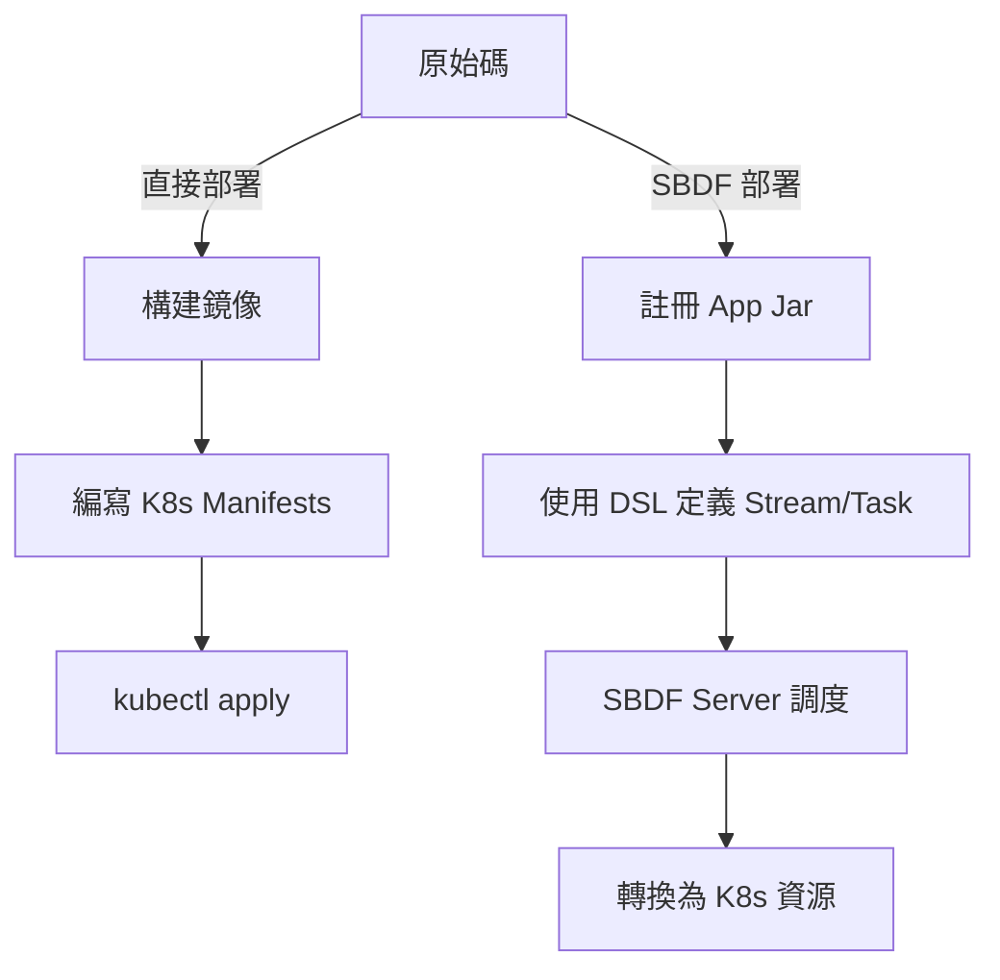

以下是兩種部署方案的詳細對比分析，從 7 個關鍵維度進行專業技術評測：

---
### **1. 架構複雜度對比**
| 維度                | 直接部署到 Kubernetes                                                                 | 基於 Spring Boot Data Flow (SBDF) 的部署                                                                 |
|---------------------|-------------------------------------------------------------------------------------|--------------------------------------------------------------------------------------------------------|
| **抽象層級**         | 直接操作 K8s 底層資源（Pod/Service/Ingress）                                           | 透過 SBDF 抽象層進行任務調度（DSL/UI 操作）                                                                |
| **組件耦合度**       | 服務完全獨立，需自行實現服務發現/配置管理                                                 | 深度整合 Spring Cloud 生態系（Spring Cloud Stream/Config）                                                |
| **學習曲線**         | 需精通 K8s 原生 API 與 CRD                                                           | 需掌握 SBDF 特定 DSL 與部署模型                                                                           |
| **典型架構圖**       |    |                               |

---
### **2. 部署流程差異**


---
### **3. 核心技術指標對比**
| 指標                | 直接部署方案                          | SBDF 方案                                | 勝出條件                             |
|---------------------|-------------------------------------|-----------------------------------------|------------------------------------|
| **部署速度**         | ⭐⭐⭐⭐ (裸資源快速部署)                | ⭐⭐ (需經過抽象層轉譯)                    | 簡單單體服務                       |
| **擴展靈活性**       | ⭐⭐⭐⭐⭐ (完全控制擴展策略)              | ⭐⭐⭐ (受限於 SBDF 擴展機制)               | 需要自定義 HPA/VPA                |
| **批處理效能**       | ⭐⭐⭐ (需自行優化)                     | ⭐⭐⭐⭐⭐ (內建分區/重試機制)                 | 數據管道/ETL 場景                  |
| **資源利用率**       | ⭐⭐⭐⭐ (精細化資源控制)                | ⭐⭐ (抽象層 overhead 約 10-15%)           | 資源敏感型應用                     |
| **生態整合**         | ⭐⭐⭐ (通用但需自整合)                  | ⭐⭐⭐⭐⭐ (Spring 全家桶無縫集成)             | Spring 技術棧團隊                  |

---
### **4. 監控體系統合差異**
**直接部署方案**：
```bash
# 典型監控組合
Prometheus + Grafana (指標)
Fluentd + ELK (日誌)
Kiali (服務拓撲)
```

**SBDF 方案**：
```bash
# 專用監控組件
Spring Cloud Data Flow Metrics
Prometheus 適配器
Task Execution 審計日誌
Stream 級別健康檢查
```

---
### **5. 適用場景對照表**
| 場景類型             | 直接部署優勢案例                                                                 | SBDF 優勢案例                                                                 |
|---------------------|------------------------------------------------------------------------------|-----------------------------------------------------------------------------|
| **實時流處理**       | 需要自定義 Kafka 連接器                                                         | 快速構建 Spring Cloud Stream 管道 (如: source -> processor -> sink)            |
| **定時批處理**       | 簡單 CronJob 可滿足                                                           | 複雜任務依賴管理 (使用 Composed Task)                                          |
| **CI/CD 整合**       | 適合 GitOps 模式 (ArgoCD/Flux)                                                | 需定製 SBDF REST API 對接                                                     |
| **多環境管理**       | 透過 Kustomize/Helm 靈活配置                                                   | 內建平台級環境隔離 (開發/測試/生產)                                             |

---
### **6. 成本模型分析**
```python
# 成本估算公式（單位：核心小時/月）
def total_cost(resources, sbdf_overhead=0.15):
    if sbdf_platform:
        return resources * (1 + sbdf_overhead) * k8s_cost_rate
    else:
        return resources * k8s_cost_rate

# 典型成本對比（假設 100 核基準）
直接部署成本 = 100 * $0.1 = $10/hr
SBDF 成本 = 100 * 1.15 * $0.1 = $11.5/hr (+15%)
```

---
### **7. 維運風險矩陣**
| 風險類型             | 直接部署方案                             | SBDF 方案                                  |
|---------------------|--------------------------------------|-------------------------------------------|
| **版本升級風險**     | 可逐步滾動更新                          | 需同步升級 Data Flow Server/Skipper         |
| **平台依賴風險**     | 僅依賴 K8s API                        | 額外依賴 RabbitMQ/Kafka 等中間件             |
| **調試複雜度**       | 直接查看 Pod 日誌                      | 需穿透 Data Flow 執行上下文                  |
| **廠商鎖定風險**     | 雲原生標準方案                          | 部分綁定 Spring 生態技術                     |

---
### **結論建議**
1. **選擇直接部署當**：
   - 需要精細控制基礎設施
   - 使用非 Spring 技術棧的混合環境
   - 已建立成熟的 GitOps 流程

2. **選擇 SBDF 方案當**：
   - 團隊深度使用 Spring 生態系
   - 需快速構建數據管道(ETL/Streaming)
   - 需要內建任務監控/審計功能
   - 有大量批處理作業需統一調度

3. **混合部署策略**：
   ```bash
   # 將核心業務服務直接部署
   kubectl apply -f core-services/
   
   # 數據處理層使用 SBDF
   dataflow:>app register --name processor --type task --uri docker:my-registry/processor
   ```

建議先進行技術驗證（PoC），使用 **Kubernetes 壓力測試工具**（如 K6）與 **Spring Cloud Data Flow 的審計日誌**進行混合驗證，具體配比可參考公式：`SBDF 適用比例 = (任務數量 * 平均複雜度) / (團隊 Spring 熟悉度 * 2)`
