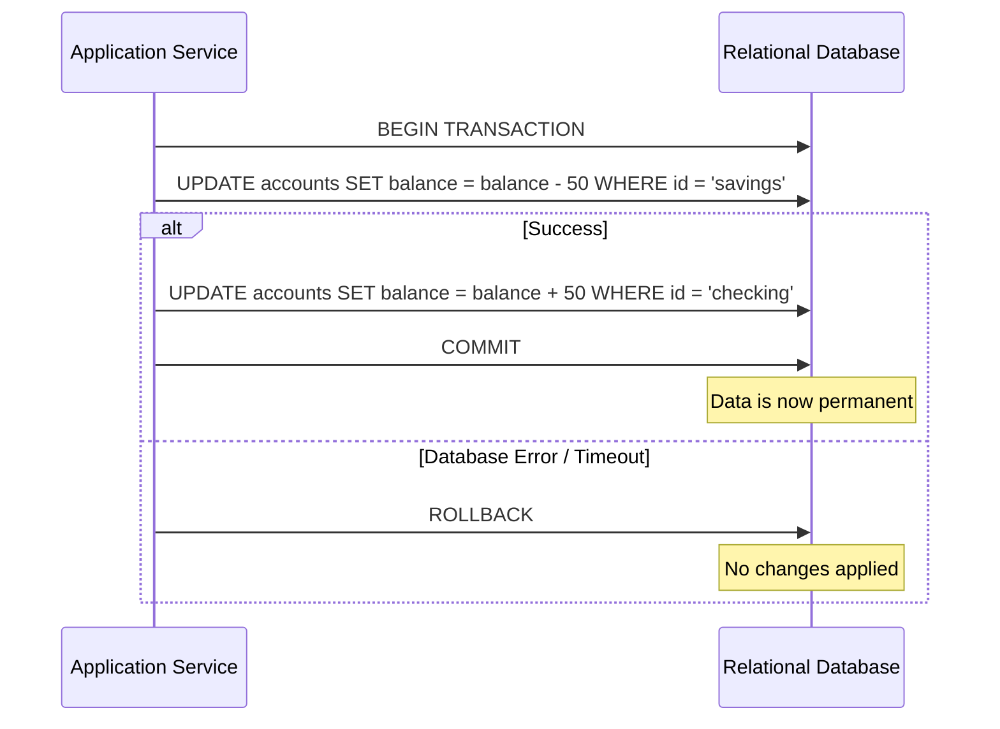
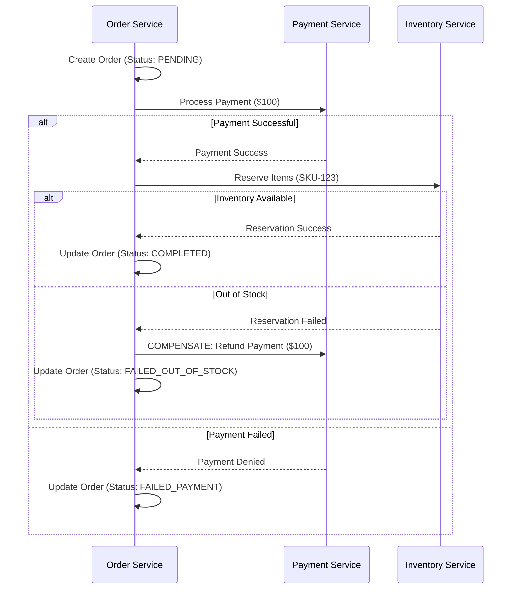

Describing how your system handles data transactions isn't just a "check the box" exercise; it’s the difference between a reliable platform and a midnight call about corrupted database records.

When writing a System Design Specification (SDS), your goal is to bridge the gap between high-level business logic and low-level database behavior. Here is a breakdown of best practices for documenting transaction control.

---

## 1. Define the Transaction Scope and Boundaries

Start by identifying which operations must be atomic. If a user buys a product, you aren't just updating an "Orders" table; you're likely decrementing inventory and updating a ledger.

* **Atomicity Units:** Clearly list which API calls or background jobs represent a single "unit of work."
* **Success/Failure Criteria:** Explicitly state what constitutes a successful commit versus what triggers a mandatory rollback.

## 2. Specify ACID Guarantees

Don't just say "we use ACID." Be specific about how your chosen architecture supports it, especially if you are using NoSQL or distributed systems where ACID isn't always a given.

| Property | Documentation Focus |
| --- | --- |
| **Atomicity** | How do we ensure "all or nothing" across multiple services? |
| **Consistency** | What constraints or triggers ensure the data moves from one valid state to another? |
| **Isolation** | Which isolation level are we using (e.g., Read Committed, Repeatable Read)? |
| **Durability** | How do we handle write-ahead logs or replication to ensure data survives a crash? |

## 3. Detail the Concurrency Control Strategy

This is where most designs get fuzzy. You need to explain how the system handles two users trying to update the same row at the exact same time.

* **Optimistic Locking:** Document the use of version numbers or timestamps (e.g., `WHERE version = 5`). Best for low-contention environments.
* **Pessimistic Locking:** Document where you are using `SELECT FOR UPDATE`. Use this sparingly and explain the timeout/deadlock prevention strategy.

## 4. Addressing Distributed Transactions

If your system uses microservices, a single database transaction often isn't enough. You need to document how you maintain consistency across boundaries.

* **Two-Phase Commit (2PC):** If you require strong consistency, describe the coordinator and participant roles.
* **Saga Pattern:** For high-scale systems, document the sequence of local transactions and the **compensating transactions** (the "undo" logic) if a step fails.

---

## 5. Error Handling and Recovery

A transaction description is incomplete without a "What If" section.

* **Rollback Logic:** Describe if rollbacks are handled automatically by the RDBMS or if manual intervention/compensatory logic is required at the application layer.
* **Idempotency:** Crucial for distributed systems. Document how the system ensures that retrying a failed transaction doesn't result in duplicate data (e.g., using idempotency keys).
* **Deadlock Handling:** Define the retry policy (exponential backoff) and how deadlocks are logged for monitoring.

---

### Pro-Tip: Use Sequence Diagrams

Nothing explains a complex transaction flow better than a sequence diagram. Use them to show the interaction between the Application Server, the Database, and any external APIs (like a Payment Gateway) during a transaction lifecycle.

**Would you like me to draft a template for a "Transaction Control" section that you can copy-paste into your document?**

Here are two examples ranging from a "bread-and-butter" database transaction to a complex distributed flow. Using **Mermaid** diagrams in your documentation is a great way to make these abstract concepts concrete for developers and stakeholders.

---

## 1. The Simple Case: Single DB Transaction

**Scenario:** A user transfers $50 from their Savings account to their Checking account within the same database.

### The Logic

This relies on standard **ACID** properties. We use a single database connection to wrap both updates in a `BEGIN` and `COMMIT` block.

### Spec Document Breakdown:

* **Isolation Level:** `Read Committed` (to prevent dirty reads).
* **Error Handling:** Any SQL exception triggers an immediate `ROLLBACK`.
* **Timeout:** Transaction times out after 5 seconds to prevent locking the `accounts` table.

---

## 2. The Complex Case: Distributed Saga Pattern

**Scenario:** An E-commerce "Place Order" flow. This involves three separate services: **Order**, **Payment**, and **Inventory**. Since they have different databases, a standard `BEGIN/COMMIT` won't work.

### The Logic (Orchestration-based Saga)

We use a "happy path" flow, but we must document the **Compensating Transactions** (the "undo" logic) if a downstream service fails.

### Spec Document Breakdown:

* **Consistency Model:** Eventual Consistency.
* **Idempotency:** The Payment Service must use an `order_id` as an idempotency key to prevent double-charging if the network retries.
* **Compensating Logic:** * If Inventory fails, the `Refund` command is triggered.
* This must be **retried indefinitely** until it succeeds or is flagged for manual audit.

* **Observability:** Every state change (Pending -> Completed/Failed) must be logged in a centralized trace (e.g., Jaeger or ELK).

---

## Best Practices for the "Diagram Section"

When you put these in your document, always include a **Data State Table** next to the diagram:

| Step | Data Changed | Failure Action |
| --- | --- | --- |
| **1. Order Create** | `orders` row inserted | None (Transaction hasn't started) |
| **2. Payment** | External Gateway Call | Mark Order as "Failed" |
| **3. Inventory** | `inventory` count decremented | **Refund Payment** & Mark Order "Failed" |

**Would you like me to generate a specific "Compensating Transaction" table for your current project?**
