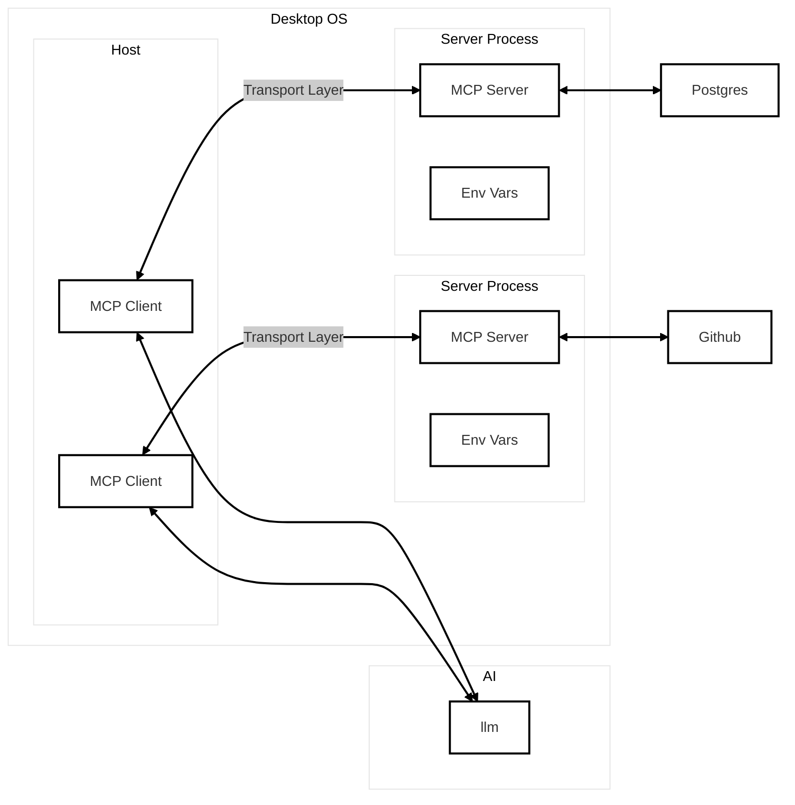
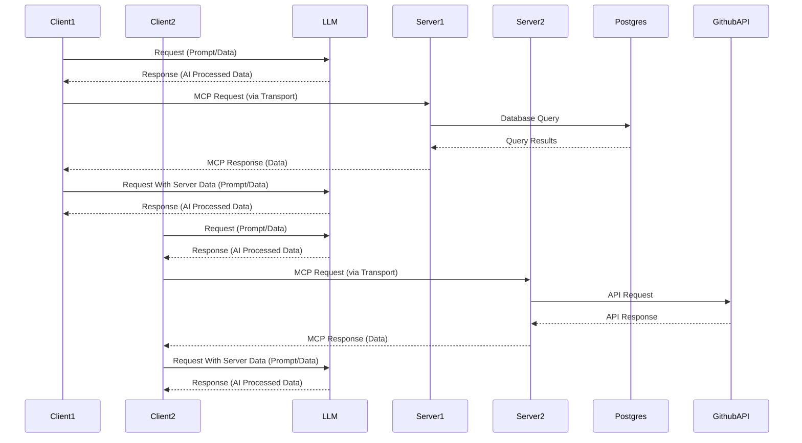
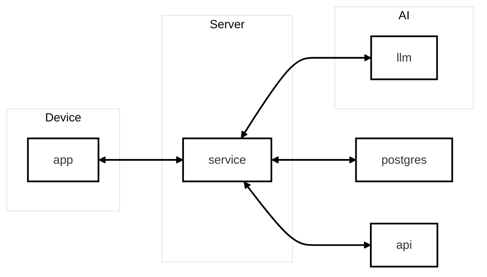
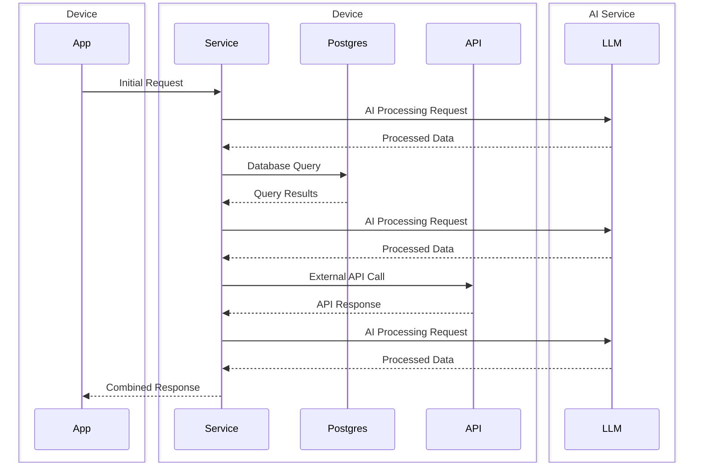

```mermaid
---
config:
  theme: neo
---
flowchart LR
    subgraph "AI"
        llm
    end
    subgraph "Desktop OS"
        subgraph "Host"
            client1[MCP Client]
            client2[MCP Client]
        end
        subgraph "Server Process"
            server1[MCP Server]
            env1[Env Vars]
        end
        subgraph "Server Process"
            server2[MCP Server]
            env2[Env Vars]
        end
    end
    client1 <--> llm
    client2 <--> llm
    client1 <-->|Transport Layer| server1
    client2 <-->|Transport Layer| server2
    server1 <--> postgres[Postgres]
    server2 <--> api[Github]


```

```mermaid
sequenceDiagram
    participant Client1
    participant Client2
    participant LLM
    participant Server1
    participant Server2
    participant Postgres
    participant GithubAPI

    Client1->>LLM: Request (Prompt/Data)
    LLM-->>Client1: Response (AI Processed Data)
    Client1->>Server1: MCP Request (via Transport)
    Server1->>Postgres: Database Query
    Postgres-->>Server1: Query Results
    Server1-->>Client1: MCP Response (Data)
    Client1->>LLM: Request With Server Data (Prompt/Data)
    LLM-->>Client1: Response (AI Processed Data)

    Client2->>LLM: Request (Prompt/Data)
    LLM-->>Client2: Response (AI Processed Data)
    Client2->>Server2: MCP Request (via Transport)
    Server2->>GithubAPI: API Request
    GithubAPI-->>Server2: API Response
    Server2-->>Client2: MCP Response (Data)
    Client2->>LLM: Request With Server Data (Prompt/Data)
    LLM-->>Client2: Response (AI Processed Data)
```

```mermaid
---
config:
  theme: neo
---
flowchart LR
    subgraph "AI"
        llm
    end
    subgraph "Device"
        app
    end
    subgraph "Server"
        service
    end
    app <--> service
    service <--> postgres
    service <--> api
    service <--> llm


```

```mermaid

sequenceDiagram
    box Device
        participant App
    end
    box Device
        participant Service
        participant Postgres
        participant API
    end
    box AI Service
        participant LLM
    end

    App->>Service: Initial Request
    Service->>LLM: AI Processing Request
    LLM-->>Service: Processed Data
    Service->>Postgres: Database Query
    Postgres-->>Service: Query Results
    Service->>LLM: AI Processing Request
    LLM-->>Service: Processed Data
    Service->>API: External API Call
    API-->>Service: API Response
    Service->>LLM: AI Processing Request
    LLM-->>Service: Processed Data
    Service-->>App: Combined Response
```
