To design a robust notification system, consider the following structured approach based on design patterns and implementation best practices:

### **1. Design Patterns**
#### **a. Strategy Pattern**
- **Purpose**: Encapsulate each notification method (Email, FCM, SMS) as interchangeable strategies.
- **Implementation**:
  - Define an interface (e.g., `INotificationSender`) with a method like `send(notification: Notification): Result`.
  - Create concrete classes (e.g., `EmailSender`, `FCMSender`, `SMSSender`) implementing this interface.
  - Use dependency injection or a factory to select the appropriate strategy at runtime.

#### **b. Factory Pattern**
- **Purpose**: Decouple object creation logic from the sender.
- **Implementation**:
  - Create a `NotificationSenderFactory` that returns the correct sender based on input (e.g., `type: "EMAIL"`).
  - Example: `factory.createSender("EMAIL")` returns an `EmailSender` instance.

#### **c. Decorator Pattern**
- **Purpose**: Add cross-cutting concerns (logging, retries, encryption) to senders.
- **Implementation**:
  - Wrap senders with decorators (e.g., `RetryDecorator` adds retry logic: `new RetryDecorator(new EmailSender())`).

#### **d. Chain of Responsibility**
- **Purpose**: Process notifications through pre-send steps (validation, logging, rate limiting).
- **Implementation**:
  - Create handlers like `ValidateHandler`, `LogHandler`, and `SendHandler` linked in a chain.

#### **e. Observer Pattern**
- **Purpose**: Track notification status (e.g., success/failure) for analytics.
- **Implementation**:
  - Attach observers (e.g., `AuditLogger`, `MetricsTracker`) to notify on status changes.

---

### **2. Implementation Tools & Practices**
#### **a. Notification Channels**
- **Email**: Use libraries like Nodemailer (Node.js) or SMTP services (SendGrid, AWS SES).
- **FCM/APNs**: Leverage Firebase Cloud Messaging SDKs for mobile/web push.
- **SMS**: Integrate APIs like Twilio or Vonage.
- **Webhooks**: HTTP clients (Axios, Retrofit) for third-party integrations.

#### **b. Asynchronous Processing**
- **Message Queues**: Use RabbitMQ, Kafka, or cloud services (SQS) to decouple senders from producers.
- **Workers**: Deploy background workers (Celery, Sidekiq) to process queued notifications.

#### **c. Templating**
- **Engines**: Use Handlebars, Jinja, or Mustache to generate dynamic content from templates stored in a database or filesystem.

#### **d. Error Handling**
- **Retries**: Implement exponential backoff for transient failures (e.g., network issues).
- **Dead-Letter Queues (DLQ)**: Route failed notifications to a DLQ for manual review.
- **Circuit Breakers**: Use libraries like Hystrix to avoid overwhelming failing services.

#### **e. Security**
- **Encryption**: Encrypt sensitive data (e.g., API keys) using tools like Vault or AWS KMS.
- **Rate Limiting**: Enforce limits (e.g., 100 SMS/hour) using Redis or cloud-native rate limiters.

#### **f. Monitoring**
- **Logging**: Centralize logs with tools like ELK Stack or Datadog.
- **Metrics**: Track success/failure rates with Prometheus or CloudWatch.
- **Alerting**: Set up alerts (e.g., PagerDuty) for critical failures.

---

### **3. Common Opinions & Best Practices**
1. **Start Simple**: Begin with core channels (Email/SMS) and expand incrementally.
2. **Use Existing Services**: Leverage tools like SendGrid (email), Twilio (SMS), or Pusher (push) to reduce maintenance.
3. **Decouple Components**: Isolate notification logic from business logic using queues and interfaces.
4. **Scalability**: Design for horizontal scaling (e.g., stateless workers, cloud-native infrastructure).
5. **Testing**:
   - **Unit Tests**: Mock external services to test sender logic.
   - **Integration Tests**: Validate end-to-end flows with staging environments.
   - **Chaos Testing**: Simulate failures (e.g., FCM downtime) using tools like Chaos Monkey.
6. **Documentation**: Maintain clear docs for adding new channels or modifying templates.

---

### **Example Architecture**
```plaintext
[Client App] → [API Gateway] → [Notification Service] → [Message Queue]
               (REST/Webhook)   (Validates request)      (RabbitMQ/Kafka)
                                                         |
                                                         v
                                       [Worker] → [Sender Factory] → [FCMSender (Strategy)]
                                       (Celery)    (Selects sender)    [EmailSender]
                                                                       [SMSSender]
```

This approach balances flexibility, scalability, and maintainability while adhering to industry best practices.


Here's a **decision tree/flow** to help you choose between Email, FCM, SMS, or other notification channels based on common use cases and constraints:

---

### **Step 1: Determine the Use Case**
**What type of notification are you sending?**
1. **Transactional** (e.g., password reset, order confirmation)
   - Proceed to **Step 2**.
2. **Promotional** (e.g., marketing offers, newsletters)
   - Proceed to **Step 2**, but prioritize user preferences (opt-in/opt-out).
3. **Critical/Alert** (e.g., security breach, outage)
   - Skip to **Step 4** (urgency first).

---

### **Step 2: Assess Message Content**
**What’s the message format?**
- **Long text, rich content, or attachments** → **Email** (ideal for receipts, newsletters).
- **Short text (< 160 chars)** → **SMS** or **FCM**.
- **Interactive actions** (e.g., buttons, deep links) → **FCM** or **In-App Notifications**.
- **No text** (e.g., alerts, reminders) → **Push Notifications (FCM/APNs)** or **SMS**.

---

### **Step 3: Check User Context**
**Does the recipient have…**
- **A mobile app installed?** → Use **FCM** (for real-time, app-specific alerts).
- **Internet access?**
  - Yes → **Email**, **FCM**, or **Web Push**.
  - No → **SMS** (works offline, universal reach).
- **Opted into specific channels?** → Respect user preferences (e.g., GDPR compliance).

---

### **Step 4: Evaluate Urgency**
**Does the message require immediate action?**
- **Yes** → Use **SMS** (high open rates) or **FCM** (instant delivery).
  - If both are options, combine them for redundancy (e.g., critical alerts).
- **No** → Use **Email** or **In-App Notifications**.

---

### **Step 5: Consider Cost & Scalability**
- **Low budget?** → **Email** or **FCM** (cheaper at scale).
- **High volume?** → Use **Email** for non-urgent or **SMS** with bulk pricing (e.g., Twilio).
- **Global audience?** → **FCM** (free) or **Email** (avoid SMS due to regional costs).

---

### **Step 6: Compliance & Reliability**
- **Legally sensitive?** (e.g., financial alerts) → **SMS** (regulated, high trust) or **Email + 2FA**.
- **Need guaranteed delivery?** → Use **SMS** (carrier networks) or combine channels (e.g., FCM + Email fallback).

---

### **Decision Tree Summary**
```plaintext
                            Start
                             │
                             ▼
                    [Transactional/Promotional/Critical?]
                             │
             ┌──────────────┼──────────────┐
             ▼              ▼              ▼
      Transactional   Promotional     Critical/Alert
             │              │              │
             ▼              ▼              ▼
      [Message Content] [User Opt-In] [Urgency First]
             │              │              │
             ▼              ▼              ▼
       Email/FCM/SMS   Email/In-App   SMS/FCM (Combine)
             │              │              │
             ▼              ▼              ▼
    [User Context]    [Cost Check]    [Compliance]
             │              │              │
             ▼              ▼              ▼
      Final Channel     Final Channel  Final Channel
```

---

### **Examples**
1. **Password Reset** → **Email** (rich content, non-urgent).
2. **Order Delivery Alert** → **SMS** (urgent, works offline).
3. **App-Specific Sale** → **FCM** (user has the app, interactive).
4. **Security Breach** → **SMS + Email + FCM** (critical redundancy).

---

### **Hybrid Approach**
For critical systems, use a **fallback strategy** (e.g., try FCM first, then SMS/Email). Tools like **Twilio**, **SendGrid**, or **AWS SNS** simplify multi-channel delivery.

---

### **Key Takeaways**
- **Email**: Best for non-urgent, detailed, or low-cost needs.
- **SMS**: Ideal for urgent, offline, or high-impact alerts.
- **FCM/Push**: Perfect for app-specific, interactive, or real-time updates.
- **Always prioritize user preferences and legal compliance**.

Let me know if you need help implementing a specific combination! 🚀


Here’s the decision tree visualized in **Mermaid.js syntax** for easy integration into docs or diagrams:

```mermaid
%% Mermaid Decision Tree for Notification Channel Selection
graph TD
    A[Start: What type of notification?] --> B{Transactional/Promotional/Critical?}
    
    %% Transactional Branch
    B -->|Transactional| C[Message Content?]
    C -->|Long text/attachments| D[Email]
    C -->|Short text| E{User has app?}
    E -->|Yes| F[FCM]
    E -->|No| G[SMS]
    C -->|Interactive buttons| F

    %% Promotional Branch
    B -->|Promotional| H[Respect Opt-In?]
    H -->|Yes| I{User prefers Email/In-App?}
    I -->|Email| D
    I -->|In-App| F
    H -->|No| J[Use Email lowest friction]

    %% Critical/Alert Branch
    B -->|Critical/Alert| K[Urgent?]
    K -->|Yes| L{User has internet?}
    L -->|Yes| M[FCM + Email/SMS fallback]
    L -->|No| G
    K -->|No| D

    %% Shared Nodes
    D --> N[Cost OK?]
    G --> N
    F --> N
    N -->|Yes| O[Send]
    N -->|No| P[Switch to cheaper channel?]
    P -->|Email| D
    P -->|SMS| G

    %% Compliance Check
    O --> Q[Compliance OK?]
    Q -->|Yes| R[✔️ Deliver]
    Q -->|No| S[❌ Block]
```



---

### **How to Use**:
1. Copy this code into any Mermaid-compatible editor (e.g., GitHub Markdown, Mermaid Live Editor).
2. The flowchart will guide you through:
   - **Use Case** → **Content/User Context** → **Urgency** → **Cost** → **Compliance**.
3. Critical paths include **fallbacks** (e.g., FCM + SMS) for reliability.

---

### **Key Rules**:
- **Email**: Long content, non-urgent, cost-sensitive.
- **SMS**: Offline users, urgent alerts.
- **FCM**: App users, interactive, real-time.
- **Compliance**: Always validate legal/opt-in requirements.

---

### **Example Output**:


For multi-channel systems, consider tools like **AWS SNS** or **Twilio** to automate this logic! 🔄
