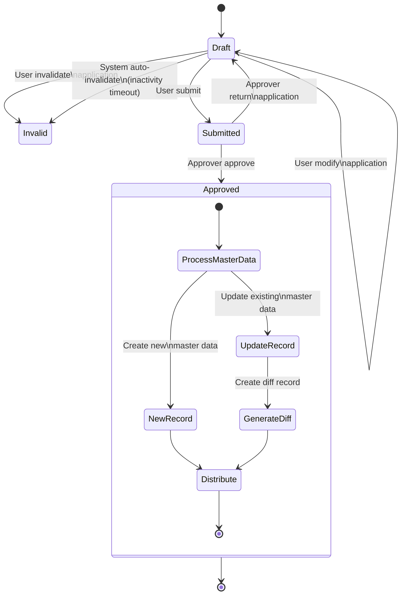
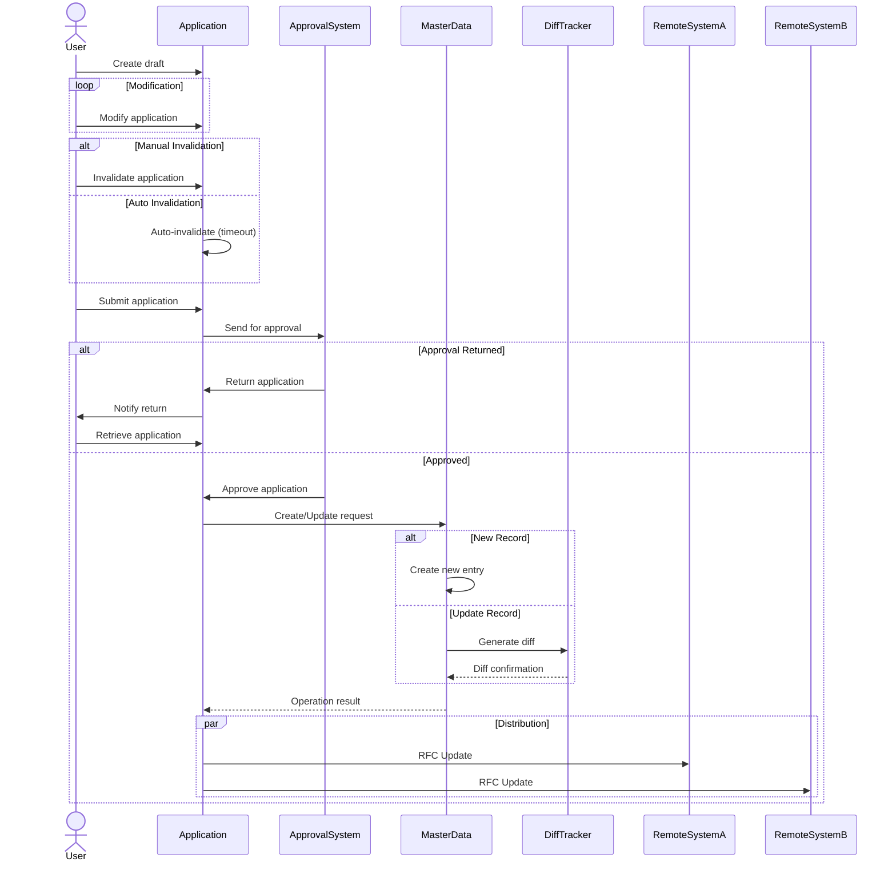
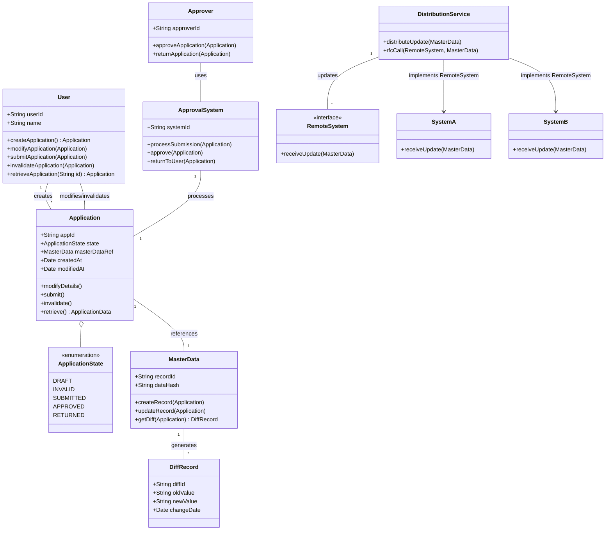
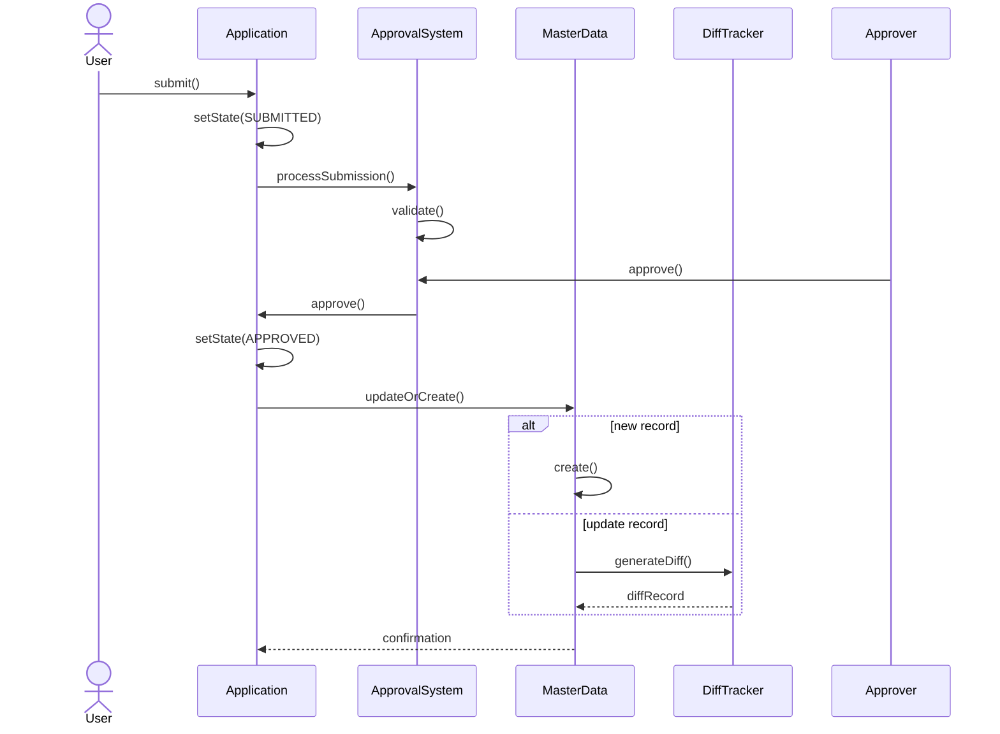
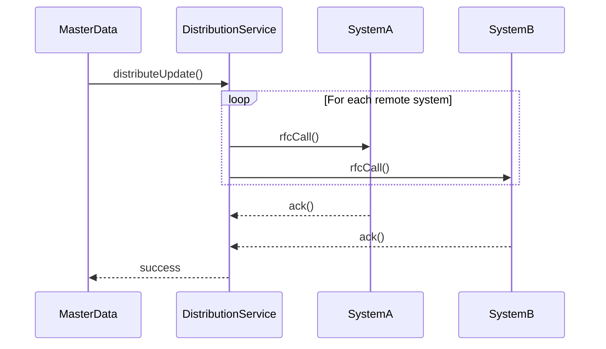
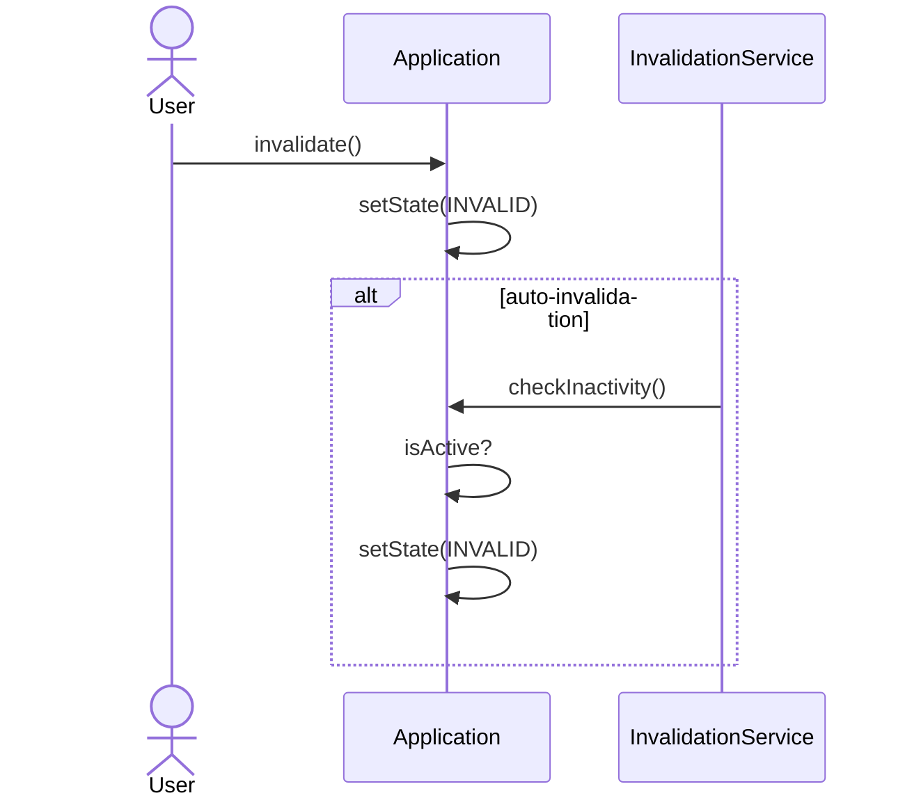

help me design a system prototype with mermaid UML.

- User start with a application
- User modify application before submit
- User invalid application before submit
- System will invalid application after application not active a while
- User submit application
- User can retrieve application after submit
- Approver can return application
- Approver approve submit application
- After application approved,it generate a new or update master data
- If application update master data, should generate diff record
- After master data new or update, it will distribute data to multiple remote systems with remote function call

Based on your requirements, here's a comprehensive system prototype using Mermaid UML with state and sequence diagrams:

### 1. Application Lifecycle State Diagram


### 2. System Interaction Sequence Diagram


### Key Components Explained:
1. **Application States**:
   - `Draft`: Initial state with editing capabilities
   - `Invalid`: Manual/system-triggered invalidation
   - `Submitted`: Awaiting approval
   - `Approved`: Triggers master data operations

2. **Master Data Operations**:
   - New records created directly
   - Updates require diff records
   - Diff records stored separately for auditability

3. **Distribution**:
   - Parallel RFC calls to remote systems
   - Supports multiple heterogeneous systems
   - Async/Sync implementation possible

4. **Validation Rules**:
   - System auto-invalidation uses TTL (time-to-live) timer
   - Diff generation only for update operations
   - Approval required before master data changes

### Prototype Features:
1. **State Recovery**:
   - Returned applications revert to Draft state
   - Users can retrieve submitted applications
   
2. **Data Integrity**:
   - Diff records for all updates
   - Atomic create/update operations
   
3. **Distribution Mechanism**:
   - Remote Function Call (RFC) pattern
   - Parallel execution for performance
   - Failure handling (not shown - recommend add retry queue)

This design supports all your requirements while maintaining clear state transitions and system interactions. For implementation, consider adding:
1. Approval workflow engine
2. Diff storage subsystem
3. RFC failure recovery mechanism
4. Activity logging at each state transition

Here's the class diagram representation of the system prototype using Mermaid UML, followed by sequence diagrams for key operations:

### Class Diagram


### Key Class Relationships:
1. **User-Application**: Composition (1-to-many)
2. **Approver-ApprovalSystem**: Association
3. **Application-MasterData**: Association with navigation
4. **MasterData-DiffRecord**: Composition (1-to-many)
5. **Distribution-RemoteSystems**: Dependency via interface

### Sequence Diagrams for Core Operations:

#### 1. Application Submission & Approval


#### 2. Data Distribution


#### 3. Application Invalidation


### Implementation Notes:
1. **State Management**:
```python
class ApplicationState(Enum):
    DRAFT = auto()
    INVALID = auto()
    SUBMITTED = auto()
    APPROVED = auto()
    RETURNED = auto()
```

2. **Diff Generation**:
```python
class DiffTracker:
    def generate_diff(self, old: MasterData, new: MasterData) -> DiffRecord:
        return DiffRecord(
            old_value=old.serialize(),
            new_value=new.serialize(),
            changed_fields=list(diff(old.dict(), new.dict()))
        )
```

3. **Distribution Service**:
```python
class DistributionService:
    def distribute_update(self, data: MasterData):
        for system in [SystemA(), SystemB()]:
            try:
                system.rfc_call(data)
            except RFCError as e:
                self.retry_queue.push(data, system)
```

4. **Auto-invalidation Mechanism**:
```python
class InvalidationService:
    def __init__(self, timeout: int = 3600):  # 1 hour timeout
        self.timeout = timeout
        
    def check_application(self, app: Application):
        if app.state == State.DRAFT and (time.now() - app.modified_at > self.timeout):
            app.invalidate()
```

This design provides:
1. Clear separation of concerns through specialized classes
2. Auditability via diff tracking
3. Extensible distribution through interface pattern
4. State management with explicit transitions
5. Support for both user-initiated and system-triggered operations

Would you like me to elaborate on any specific component or add more implementation details?
