Let's practice three essential design patterns with Mermaid UML diagrams and Rust implementations. I'll cover Singleton, Strategy, and Observer patterns with concrete examples.

### 1. Singleton Pattern
Ensures a class has only one instance and provides global access.

**Mermaid UML:**
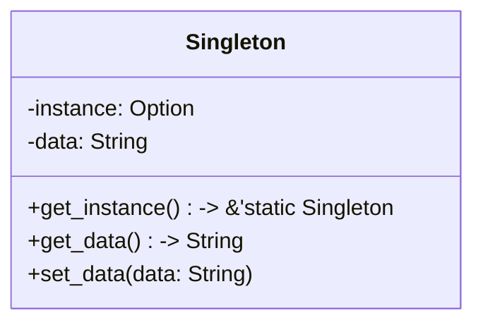
```mermaid
classDiagram
    class Singleton {
        -instance: Option<Singleton>
        -data: String
        +get_instance() -> &'static Singleton
        +get_data() -> String
        +set_data(data: String)
    }
```

**Rust Implementation:**
```rust
use std::sync::{Once, Mutex};

pub struct Singleton {
    data: String,
}

static INIT: Once = Once::new();
static mut INSTANCE: Option<Mutex<Singleton>> = None;

impl Singleton {
    pub fn get_instance() -> &'static Mutex<Singleton> {
        unsafe {
            INIT.call_once(|| {
                INSTANCE = Some(Mutex::new(Singleton {
                    data: "Initial".to_string(),
                }));
            });
            INSTANCE.as_ref().unwrap()
        }
    }

    pub fn get_data(&self) -> &str {
        &self.data
    }

    pub fn set_data(&mut self, data: String) {
        self.data = data;
    }
}

// Usage
fn main() {
    let instance = Singleton::get_instance();
    let mut guard = instance.lock().unwrap();
    guard.set_data("New Data".to_string());
    
    println!("Data: {}", guard.get_data());
}
```

### 2. Strategy Pattern
Defines interchangeable algorithms that can be selected at runtime.

**Mermaid UML:**
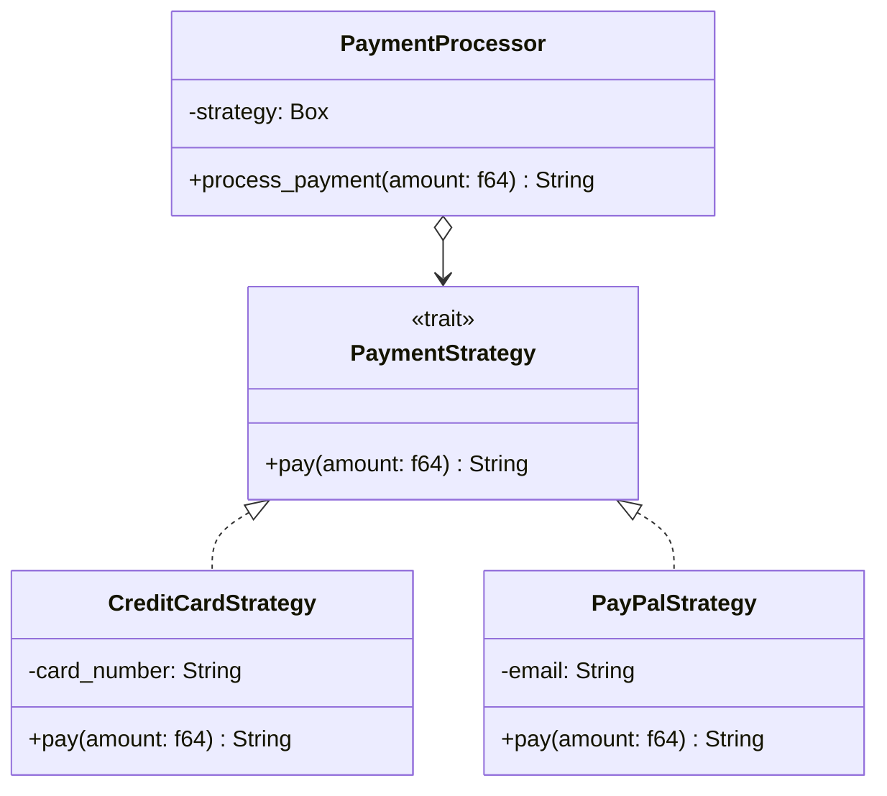
```mermaid
classDiagram
    class PaymentStrategy {
        <<trait>>
        +pay(amount: f64) String
    }
    class CreditCardStrategy {
        -card_number: String
        +pay(amount: f64) String
    }
    class PayPalStrategy {
        -email: String
        +pay(amount: f64) String
    }
    class PaymentProcessor {
        -strategy: Box<dyn PaymentStrategy>
        +process_payment(amount: f64) String
    }
    
    PaymentStrategy <|.. CreditCardStrategy
    PaymentStrategy <|.. PayPalStrategy
    PaymentProcessor o--> PaymentStrategy
```

**Rust Implementation:**
```rust
trait PaymentStrategy {
    fn pay(&self, amount: f64) -> String;
}

struct CreditCardStrategy {
    card_number: String,
}

impl PaymentStrategy for CreditCardStrategy {
    fn pay(&self, amount: f64) -> String {
        format!("Paid ${:.2} with credit card {}", amount, &self.card_number[..4])
    }
}

struct PayPalStrategy {
    email: String,
}

impl PaymentStrategy for PayPalStrategy {
    fn pay(&self, amount: f64) -> String {
        format!("Paid ${:.2} with PayPal {}", amount, self.email)
    }
}

struct PaymentProcessor {
    strategy: Box<dyn PaymentStrategy>,
}

impl PaymentProcessor {
    fn process_payment(&self, amount: f64) -> String {
        self.strategy.pay(amount)
    }
}

// Usage
fn main() {
    let credit_card = CreditCardStrategy { card_number: "1234567812345678".to_string() };
    let processor = PaymentProcessor {
        strategy: Box::new(credit_card),
    };
    println!("{}", processor.process_payment(49.99));

    let paypal = PayPalStrategy { email: "user@example.com".to_string() };
    let processor = PaymentProcessor {
        strategy: Box::new(paypal),
    };
    println!("{}", processor.process_payment(29.99));
}
```

### 3. Observer Pattern
Defines a subscription mechanism to notify multiple objects about events.

**Mermaid UML:**
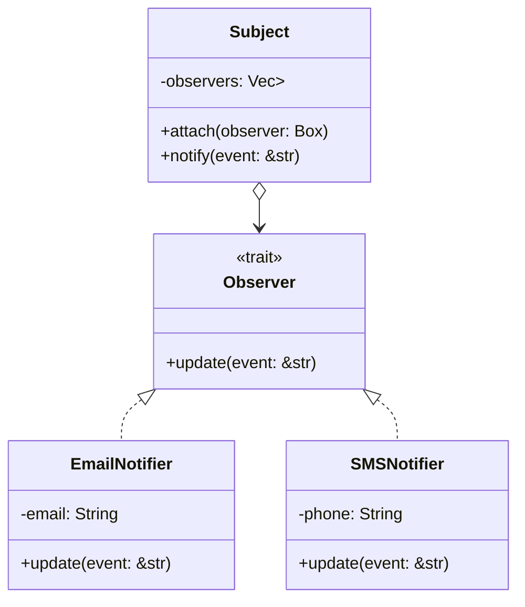
```mermaid
classDiagram
    class Subject {
        -observers: Vec<Box<dyn Observer>>
        +attach(observer: Box<dyn Observer>)
        +notify(event: &str)
    }
    class Observer {
        <<trait>>
        +update(event: &str)
    }
    class EmailNotifier {
        -email: String
        +update(event: &str)
    }
    class SMSNotifier {
        -phone: String
        +update(event: &str)
    }
    
    Subject o--> Observer
    Observer <|.. EmailNotifier
    Observer <|.. SMSNotifier
```

**Rust Implementation:**
```rust
trait Observer {
    fn update(&self, event: &str);
}

struct Subject {
    observers: Vec<Box<dyn Observer>>,
}

impl Subject {
    fn new() -> Self {
        Subject {
            observers: Vec::new(),
        }
    }

    fn attach(&mut self, observer: Box<dyn Observer>) {
        self.observers.push(observer);
    }

    fn notify(&self, event: &str) {
        for observer in &self.observers {
            observer.update(event);
        }
    }
}

struct EmailNotifier {
    email: String,
}

impl Observer for EmailNotifier {
    fn update(&self, event: &str) {
        println!("Email to {}: Event '{}' occurred", self.email, event);
    }
}

struct SMSNotifier {
    phone: String,
}

impl Observer for SMSNotifier {
    fn update(&self, event: &str) {
        println!("SMS to {}: Event '{}' occurred", self.phone, event);
    }
}

// Usage
fn main() {
    let mut subject = Subject::new();
    
    subject.attach(Box::new(EmailNotifier {
        email: "user@example.com".to_string(),
    }));
    
    subject.attach(Box::new(SMSNotifier {
        phone: "+1234567890".to_string(),
    }));

    subject.notify("System Startup");
    subject.notify("Data Updated");
}
```

### Key Rust Adaptations:
1. **Singleton:** Uses `Once` and `Mutex` for thread-safe initialization
2. **Strategy:** Leverages trait objects for runtime polymorphism
3. **Observer:** Uses `Box<dyn Trait>` for heterogeneous collections
4. **Ownership:** Carefully manages lifetimes without garbage collection
5. **Thread Safety:** Implements synchronization where needed

Would you like to:
1. See more patterns (e.g., Factory, Decorator, State)
2. Explore concurrency patterns
3. Dive deeper into any of these implementations
4. See how to test these patterns in Rust?

Let's continue with three more design patterns: Factory Method, Decorator, and State patterns. I'll include Mermaid UML diagrams and Rust implementations for each.

### 4. Factory Method Pattern
Creates objects without specifying the exact class, deferring instantiation to subclasses.

**Mermaid UML:**
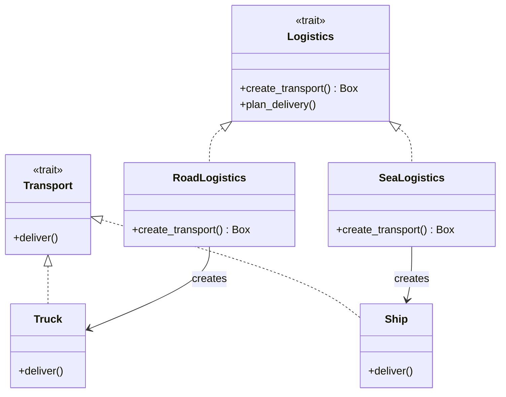
```mermaid
classDiagram
    class Transport {
        <<trait>>
        +deliver()
    }
    class Truck {
        +deliver()
    }
    class Ship {
        +deliver()
    }
    class Logistics {
        <<trait>>
        +create_transport() Box<dyn Transport>
        +plan_delivery()
    }
    class RoadLogistics {
        +create_transport() Box<dyn Transport>
    }
    class SeaLogistics {
        +create_transport() Box<dyn Transport>
    }

    Transport <|.. Truck
    Transport <|.. Ship
    Logistics <|.. RoadLogistics
    Logistics <|.. SeaLogistics
    RoadLogistics --> Truck : creates
    SeaLogistics --> Ship : creates
```

**Rust Implementation:**
```rust
trait Transport {
    fn deliver(&self);
}

struct Truck;
impl Transport for Truck {
    fn deliver(&self) {
        println!("Delivering by land in a box");
    }
}

struct Ship;
impl Transport for Ship {
    fn deliver(&self) {
        println!("Delivering by sea in a container");
    }
}

trait Logistics {
    fn create_transport(&self) -> Box<dyn Transport>;
    
    fn plan_delivery(&self) {
        let transport = self.create_transport();
        println!("Planning delivery...");
        transport.deliver();
    }
}

struct RoadLogistics;
impl Logistics for RoadLogistics {
    fn create_transport(&self) -> Box<dyn Transport> {
        Box::new(Truck)
    }
}

struct SeaLogistics;
impl Logistics for SeaLogistics {
    fn create_transport(&self) -> Box<dyn Transport> {
        Box::new(Ship)
    }
}

fn main() {
    let road_logistics = RoadLogistics;
    road_logistics.plan_delivery();

    let sea_logistics = SeaLogistics;
    sea_logistics.plan_delivery();
}
```

### 5. Decorator Pattern
Adds behavior to objects dynamically without affecting other objects.

**Mermaid UML:**
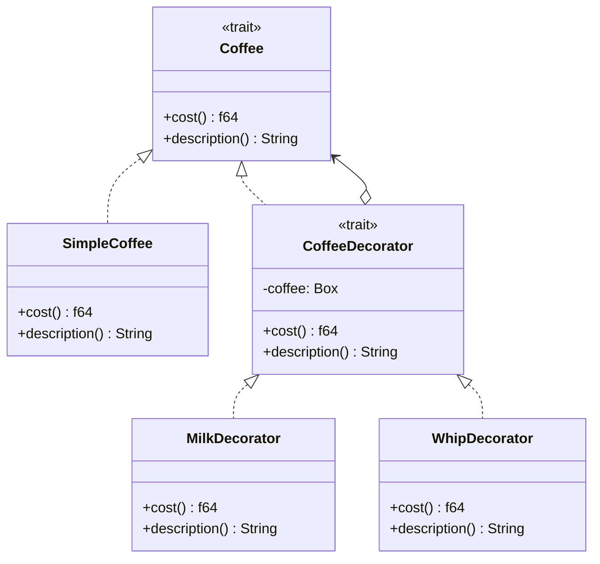
```mermaid
classDiagram
    class Coffee {
        <<trait>>
        +cost() f64
        +description() String
    }
    class SimpleCoffee {
        +cost() f64
        +description() String
    }
    class CoffeeDecorator {
        <<trait>>
        -coffee: Box<dyn Coffee>
        +cost() f64
        +description() String
    }
    class MilkDecorator {
        +cost() f64
        +description() String
    }
    class WhipDecorator {
        +cost() f64
        +description() String
    }

    Coffee <|.. SimpleCoffee
    Coffee <|.. CoffeeDecorator
    CoffeeDecorator <|.. MilkDecorator
    CoffeeDecorator <|.. WhipDecorator
    CoffeeDecorator o--> Coffee
```

**Rust Implementation:**
```rust
trait Coffee {
    fn cost(&self) -> f64;
    fn description(&self) -> String;
}

struct SimpleCoffee;
impl Coffee for SimpleCoffee {
    fn cost(&self) -> f64 {
        2.0
    }

    fn description(&self) -> String {
        "Simple Coffee".to_string()
    }
}

struct CoffeeDecorator {
    coffee: Box<dyn Coffee>,
}

impl Coffee for CoffeeDecorator {
    fn cost(&self) -> f64 {
        self.coffee.cost()
    }

    fn description(&self) -> String {
        self.coffee.description()
    }
}

struct MilkDecorator {
    decorator: Box<dyn Coffee>,
}

impl Coffee for MilkDecorator {
    fn cost(&self) -> f64 {
        self.decorator.cost() + 0.5
    }

    fn description(&self) -> String {
        format!("{}, Milk", self.decorator.description())
    }
}

struct WhipDecorator {
    decorator: Box<dyn Coffee>,
}

impl Coffee for WhipDecorator {
    fn cost(&self) -> f64 {
        self.decorator.cost() + 0.7
    }

    fn description(&self) -> String {
        format!("{}, Whip", self.decorator.description())
    }
}

fn main() {
    let coffee: Box<dyn Coffee> = Box::new(SimpleCoffee);
    println!("{}: ${:.2}", coffee.description(), coffee.cost());

    let milk_coffee = MilkDecorator { decorator: coffee };
    println!("{}: ${:.2}", milk_coffee.description(), milk_coffee.cost());

    let whip_milk_coffee = WhipDecorator { decorator: Box::new(milk_coffee) };
    println!("{}: ${:.2}", whip_milk_coffee.description(), whip_milk_coffee.cost());
}
```

### 6. State Pattern
Allows an object to change its behavior when its internal state changes.

**Mermaid UML:**
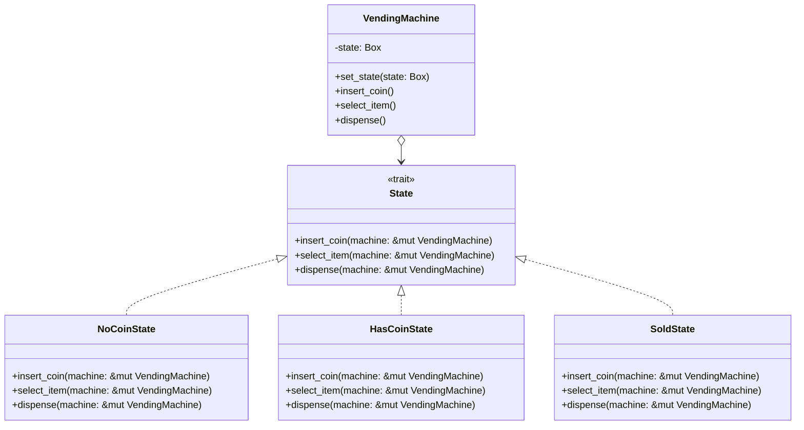
```mermaid
classDiagram
    class VendingMachine {
        -state: Box<dyn State>
        +set_state(state: Box<dyn State>)
        +insert_coin()
        +select_item()
        +dispense()
    }
    class State {
        <<trait>>
        +insert_coin(machine: &mut VendingMachine)
        +select_item(machine: &mut VendingMachine)
        +dispense(machine: &mut VendingMachine)
    }
    class NoCoinState {
        +insert_coin(machine: &mut VendingMachine)
        +select_item(machine: &mut VendingMachine)
        +dispense(machine: &mut VendingMachine)
    }
    class HasCoinState {
        +insert_coin(machine: &mut VendingMachine)
        +select_item(machine: &mut VendingMachine)
        +dispense(machine: &mut VendingMachine)
    }
    class SoldState {
        +insert_coin(machine: &mut VendingMachine)
        +select_item(machine: &mut VendingMachine)
        +dispense(machine: &mut VendingMachine)
    }

    VendingMachine o--> State
    State <|.. NoCoinState
    State <|.. HasCoinState
    State <|.. SoldState
```

**Rust Implementation:**
```rust
trait State {
    fn insert_coin(&self, machine: &mut VendingMachine);
    fn select_item(&self, machine: &mut VendingMachine);
    fn dispense(&self, machine: &mut VendingMachine);
}

struct VendingMachine {
    state: Box<dyn State>,
}

impl VendingMachine {
    fn new() -> Self {
        VendingMachine {
            state: Box::new(NoCoinState),
        }
    }

    fn set_state(&mut self, state: Box<dyn State>) {
        self.state = state;
    }

    fn insert_coin(&mut self) {
        self.state.insert_coin(self);
    }

    fn select_item(&mut self) {
        self.state.select_item(self);
    }

    fn dispense(&mut self) {
        self.state.dispense(self);
    }
}

struct NoCoinState;
impl State for NoCoinState {
    fn insert_coin(&self, machine: &mut VendingMachine) {
        println!("Coin inserted");
        machine.set_state(Box::new(HasCoinState));
    }

    fn select_item(&self, _machine: &mut VendingMachine) {
        println!("Please insert a coin first");
    }

    fn dispense(&self, _machine: &mut VendingMachine) {
        println!("Please insert a coin first");
    }
}

struct HasCoinState;
impl State for HasCoinState {
    fn insert_coin(&self, _machine: &mut VendingMachine) {
        println!("Coin already inserted");
    }

    fn select_item(&self, machine: &mut VendingMachine) {
        println!("Item selected");
        machine.set_state(Box::new(SoldState));
    }

    fn dispense(&self, _machine: &mut VendingMachine) {
        println!("Select item first");
    }
}

struct SoldState;
impl State for SoldState {
    fn insert_coin(&self, _machine: &mut VendingMachine) {
        println!("Please wait, item dispensing");
    }

    fn select_item(&self, _machine: &mut VendingMachine) {
        println!("Item already selected");
    }

    fn dispense(&self, machine: &mut VendingMachine) {
        println!("Item dispensed");
        machine.set_state(Box::new(NoCoinState));
    }
}

fn main() {
    let mut machine = VendingMachine::new();

    machine.select_item(); // No coin
    machine.insert_coin(); 
    machine.insert_coin(); // Already has coin
    machine.select_item(); 
    machine.dispense();
}
```

### Key Rust Features Used:
1. **Trait Objects:** For runtime polymorphism (`Box<dyn Trait>`)
2. **Composition:** Patterns implemented through struct composition
3. **Immutable/Mutable Borrows:** Careful state management with `&` and `&mut`
4. **Type Safety:** Compiler-enforced interface implementations
5. **Zero-cost Abstractions:** Efficient pattern implementations

### Next Patterns to Explore:
Would you like to see:
1. **Adapter/Wrapper Pattern** for interface compatibility
2. **Command Pattern** for encapsulating requests
3. **Visitor Pattern** for operations on object structures
4. **Concurrency Patterns** (e.g., Actor model with Tokio)
5. **Real-world Application** combining multiple patterns?

Let's explore three more design patterns: Adapter, Command, and Visitor patterns with Mermaid UML diagrams and Rust implementations.

### 7. Adapter Pattern
Converts the interface of a class into another interface clients expect.

**Mermaid UML:**
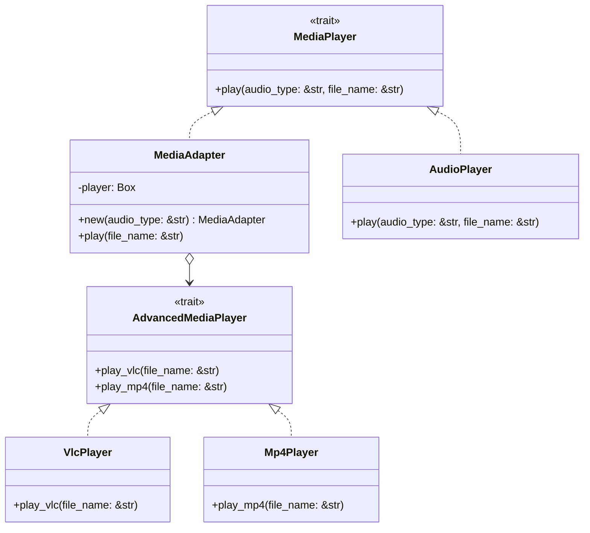
```mermaid
classDiagram
    class MediaPlayer {
        <<trait>>
        +play(audio_type: &str, file_name: &str)
    }
    class AdvancedMediaPlayer {
        <<trait>>
        +play_vlc(file_name: &str)
        +play_mp4(file_name: &str)
    }
    class VlcPlayer {
        +play_vlc(file_name: &str)
    }
    class Mp4Player {
        +play_mp4(file_name: &str)
    }
    class MediaAdapter {
        -player: Box<dyn AdvancedMediaPlayer>
        +new(audio_type: &str) MediaAdapter
        +play(file_name: &str)
    }
    class AudioPlayer {
        +play(audio_type: &str, file_name: &str)
    }
    
    MediaPlayer <|.. AudioPlayer
    MediaPlayer <|.. MediaAdapter
    MediaAdapter o--> AdvancedMediaPlayer
    AdvancedMediaPlayer <|.. VlcPlayer
    AdvancedMediaPlayer <|.. Mp4Player
```

**Rust Implementation:**
```rust
trait AdvancedMediaPlayer {
    fn play_vlc(&self, file_name: &str);
    fn play_mp4(&self, file_name: &str);
}

struct VlcPlayer;
impl AdvancedMediaPlayer for VlcPlayer {
    fn play_vlc(&self, file_name: &str) {
        println!("Playing vlc file: {}", file_name);
    }
    
    fn play_mp4(&self, _file_name: &str) {
        // Do nothing
    }
}

struct Mp4Player;
impl AdvancedMediaPlayer for Mp4Player {
    fn play_vlc(&self, _file_name: &str) {
        // Do nothing
    }
    
    fn play_mp4(&self, file_name: &str) {
        println!("Playing mp4 file: {}", file_name);
    }
}

trait MediaPlayer {
    fn play(&self, audio_type: &str, file_name: &str);
}

struct MediaAdapter {
    player: Box<dyn AdvancedMediaPlayer>,
}

impl MediaAdapter {
    fn new(audio_type: &str) -> Self {
        match audio_type.to_lowercase().as_str() {
            "vlc" => MediaAdapter { player: Box::new(VlcPlayer) },
            "mp4" => MediaAdapter { player: Box::new(Mp4Player) },
            _ => panic!("Unsupported format: {}", audio_type),
        }
    }
}

impl MediaPlayer for MediaAdapter {
    fn play(&self, _audio_type: &str, file_name: &str) {
        if let Some(vlc) = self.player.as_any().downcast_ref::<VlcPlayer>() {
            vlc.play_vlc(file_name);
        } else if let Some(mp4) = self.player.as_any().downcast_ref::<Mp4Player>() {
            mp4.play_mp4(file_name);
        }
    }
}

// Helper trait for downcasting
trait AsAny {
    fn as_any(&self) -> &dyn std::any::Any;
}

impl<T: 'static + AdvancedMediaPlayer> AsAny for T {
    fn as_any(&self) -> &dyn std::any::Any {
        self
    }
}

struct AudioPlayer;
impl MediaPlayer for AudioPlayer {
    fn play(&self, audio_type: &str, file_name: &str) {
        match audio_type.to_lowercase().as_str() {
            "mp3" => println!("Playing mp3 file: {}", file_name),
            "vlc" | "mp4" => {
                let adapter = MediaAdapter::new(audio_type);
                adapter.play(audio_type, file_name);
            }
            _ => println!("Invalid media type: {}", audio_type),
        }
    }
}

fn main() {
    let player = AudioPlayer;
    player.play("mp3", "song.mp3");
    player.play("vlc", "movie.vlc");
    player.play("mp4", "video.mp4");
    player.play("avi", "clip.avi");
}
```

### 8. Command Pattern
Encapsulates a request as an object, allowing parameterization and queuing.

**Mermaid UML:**
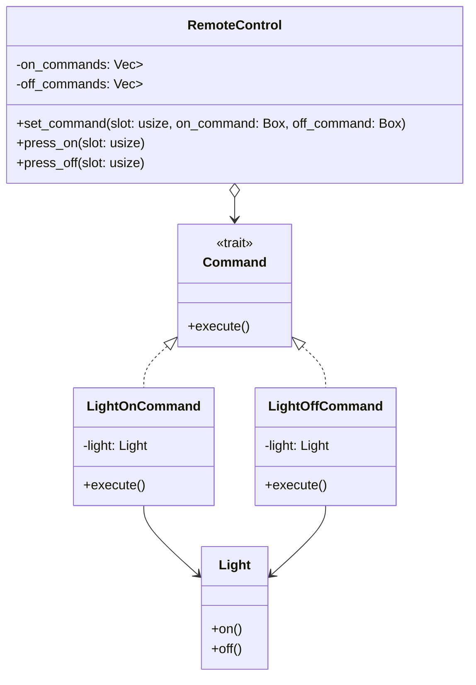
```mermaid
classDiagram
    class Command {
        <<trait>>
        +execute()
    }
    class Light {
        +on()
        +off()
    }
    class LightOnCommand {
        -light: Light
        +execute()
    }
    class LightOffCommand {
        -light: Light
        +execute()
    }
    class RemoteControl {
        -on_commands: Vec<Box<dyn Command>>
        -off_commands: Vec<Box<dyn Command>>
        +set_command(slot: usize, on_command: Box<dyn Command>, off_command: Box<dyn Command>)
        +press_on(slot: usize)
        +press_off(slot: usize)
    }
    
    Command <|.. LightOnCommand
    Command <|.. LightOffCommand
    LightOnCommand --> Light
    LightOffCommand --> Light
    RemoteControl o--> Command
```

**Rust Implementation:**
```rust
trait Command {
    fn execute(&self);
}

struct Light;

impl Light {
    fn on(&self) {
        println!("Light is on");
    }
    
    fn off(&self) {
        println!("Light is off");
    }
}

struct LightOnCommand {
    light: Light,
}

impl Command for LightOnCommand {
    fn execute(&self) {
        self.light.on();
    }
}

struct LightOffCommand {
    light: Light,
}

impl Command for LightOffCommand {
    fn execute(&self) {
        self.light.off();
    }
}

struct RemoteControl {
    on_commands: Vec<Option<Box<dyn Command>>>,
    off_commands: Vec<Option<Box<dyn Command>>>,
}

impl RemoteControl {
    fn new() -> Self {
        RemoteControl {
            on_commands: vec![None; 3],
            off_commands: vec![None; 3],
        }
    }
    
    fn set_command(&mut self, slot: usize, on_command: Box<dyn Command>, off_command: Box<dyn Command>) {
        if slot < self.on_commands.len() {
            self.on_commands[slot] = Some(on_command);
            self.off_commands[slot] = Some(off_command);
        }
    }
    
    fn press_on(&self, slot: usize) {
        if let Some(cmd) = self.on_commands.get(slot).and_then(|c| c.as_ref()) {
            cmd.execute();
        }
    }
    
    fn press_off(&self, slot: usize) {
        if let Some(cmd) = self.off_commands.get(slot).and_then(|c| c.as_ref()) {
            cmd.execute();
        }
    }
}

fn main() {
    let light = Light;
    
    let mut remote = RemoteControl::new();
    
    remote.set_command(
        0,
        Box::new(LightOnCommand { light: light }),
        Box::new(LightOffCommand { light: light }),
    );
    
    remote.press_on(0);
    remote.press_off(0);
}
```

### 9. Visitor Pattern
Separates algorithms from the objects on which they operate.

**Mermaid UML:**
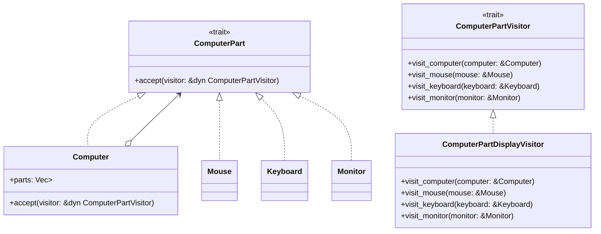
```mermaid
classDiagram
    class ComputerPart {
        <<trait>>
        +accept(visitor: &dyn ComputerPartVisitor)
    }
    class ComputerPartVisitor {
        <<trait>>
        +visit_computer(computer: &Computer)
        +visit_mouse(mouse: &Mouse)
        +visit_keyboard(keyboard: &Keyboard)
        +visit_monitor(monitor: &Monitor)
    }
    class Computer {
        +parts: Vec<Box<dyn ComputerPart>>
        +accept(visitor: &dyn ComputerPartVisitor)
    }
    class Mouse
    class Keyboard
    class Monitor
    class ComputerPartDisplayVisitor {
        +visit_computer(computer: &Computer)
        +visit_mouse(mouse: &Mouse)
        +visit_keyboard(keyboard: &Keyboard)
        +visit_monitor(monitor: &Monitor)
    }
    
    ComputerPart <|.. Computer
    ComputerPart <|.. Mouse
    ComputerPart <|.. Keyboard
    ComputerPart <|.. Monitor
    ComputerPartVisitor <|.. ComputerPartDisplayVisitor
    Computer o--> ComputerPart
```

**Rust Implementation:**
```rust
trait ComputerPartVisitor {
    fn visit_computer(&self, computer: &Computer);
    fn visit_mouse(&self, mouse: &Mouse);
    fn visit_keyboard(&self, keyboard: &Keyboard);
    fn visit_monitor(&self, monitor: &Monitor);
}

trait ComputerPart {
    fn accept(&self, visitor: &dyn ComputerPartVisitor);
}

struct Keyboard;
impl ComputerPart for Keyboard {
    fn accept(&self, visitor: &dyn ComputerPartVisitor) {
        visitor.visit_keyboard(self);
    }
}

struct Mouse;
impl ComputerPart for Mouse {
    fn accept(&self, visitor: &dyn ComputerPartVisitor) {
        visitor.visit_mouse(self);
    }
}

struct Monitor;
impl ComputerPart for Monitor {
    fn accept(&self, visitor: &dyn ComputerPartVisitor) {
        visitor.visit_monitor(self);
    }
}

struct Computer {
    parts: Vec<Box<dyn ComputerPart>>,
}

impl Computer {
    fn new() -> Self {
        Computer {
            parts: vec![
                Box::new(Mouse),
                Box::new(Keyboard),
                Box::new(Monitor),
            ],
        }
    }
}

impl ComputerPart for Computer {
    fn accept(&self, visitor: &dyn ComputerPartVisitor) {
        for part in &self.parts {
            part.accept(visitor);
        }
        visitor.visit_computer(self);
    }
}

struct ComputerPartDisplayVisitor;

impl ComputerPartVisitor for ComputerPartDisplayVisitor {
    fn visit_computer(&self, _computer: &Computer) {
        println!("Displaying Computer");
    }
    
    fn visit_mouse(&self, _mouse: &Mouse) {
        println!("Displaying Mouse");
    }
    
    fn visit_keyboard(&self, _keyboard: &Keyboard) {
        println!("Displaying Keyboard");
    }
    
    fn visit_monitor(&self, _monitor: &Monitor) {
        println!("Displaying Monitor");
    }
}

fn main() {
    let computer = Computer::new();
    let visitor = ComputerPartDisplayVisitor;
    computer.accept(&visitor);
}
```

### Key Rust Concepts Demonstrated:
1. **Adapter Pattern:**
   - Type conversion using traits
   - Downcasting with `Any` trait
   - Interface translation

2. **Command Pattern:**
   - Command encapsulation in objects
   - Parameterization of requests
   - Command queuing support

3. **Visitor Pattern:**
   - Double dispatch technique
   - Separation of algorithms from data structures
   - Open/Closed Principle implementation

### Concurrency Pattern: Actor Model with Tokio
Here's a simple Actor model implementation using Tokio:

```rust
use tokio::sync::mpsc;
use tokio::task;

#[derive(Debug)]
enum Message {
    Greet(String),
    Quit,
}

struct Actor {
    receiver: mpsc::UnboundedReceiver<Message>,
    name: String,
}

impl Actor {
    fn new(name: String, receiver: mpsc::UnboundedReceiver<Message>) -> Self {
        Actor { receiver, name }
    }
    
    async fn run(mut self) {
        while let Some(msg) = self.receiver.recv().await {
            match msg {
                Message::Greet(who) => {
                    println!("{} says: Hello, {}!", self.name, who);
                }
                Message::Quit => {
                    println!("{} is quitting", self.name);
                    break;
                }
            }
        }
    }
}

#[derive(Clone)]
struct ActorHandle {
    sender: mpsc::UnboundedSender<Message>,
}

impl ActorHandle {
    fn new(name: String) -> Self {
        let (sender, receiver) = mpsc::unbounded_channel();
        let actor = Actor::new(name, receiver);
        task::spawn(actor.run());
        
        ActorHandle { sender }
    }
    
    fn greet(&self, who: String) {
        let _ = self.sender.send(Message::Greet(who));
    }
    
    fn quit(&self) {
        let _ = self.sender.send(Message::Quit);
    }
}

#[tokio::main]
async fn main() {
    let alice = ActorHandle::new("Alice".to_string());
    let bob = ActorHandle::new("Bob".to_string());
    
    alice.greet("Bob".to_string());
    bob.greet("Alice".to_string());
    
    tokio::time::sleep(std::time::Duration::from_secs(1)).await;
    
    alice.quit();
    bob.quit();
}
```

### Next Steps:
Would you like to:
1. Explore more patterns (Builder, Prototype, Flyweight)
2. See how to combine multiple patterns in a real-world scenario
3. Dive into async patterns (Reactor, Pub/Sub)
4. Examine patterns for error handling in Rust
5. Learn about anti-patterns in Rust?

Let's explore three more design patterns: the Builder pattern, Prototype pattern, and a real-world application combining multiple patterns. I'll include Mermaid UML diagrams and Rust implementations for each.

### 10. Builder Pattern
Separates object construction from its representation.

**Mermaid UML:**
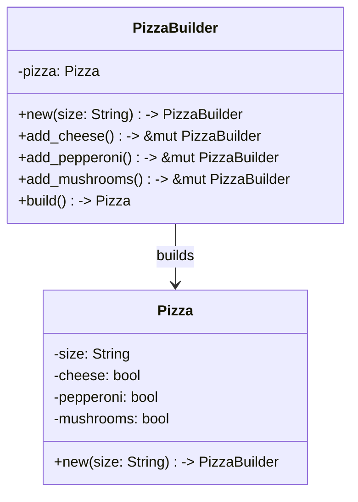
```mermaid
classDiagram
    class Pizza {
        -size: String
        -cheese: bool
        -pepperoni: bool
        -mushrooms: bool
        +new(size: String) -> PizzaBuilder
    }
    class PizzaBuilder {
        -pizza: Pizza
        +new(size: String) -> PizzaBuilder
        +add_cheese() -> &mut PizzaBuilder
        +add_pepperoni() -> &mut PizzaBuilder
        +add_mushrooms() -> &mut PizzaBuilder
        +build() -> Pizza
    }
    
    PizzaBuilder --> Pizza : builds
```

**Rust Implementation:**
```rust
#[derive(Debug, Clone)]
struct Pizza {
    size: String,
    cheese: bool,
    pepperoni: bool,
    mushrooms: bool,
}

impl Pizza {
    pub fn new(size: &str) -> PizzaBuilder {
        PizzaBuilder::new(size)
    }
}

struct PizzaBuilder {
    pizza: Pizza,
}

impl PizzaBuilder {
    pub fn new(size: &str) -> Self {
        PizzaBuilder {
            pizza: Pizza {
                size: size.to_string(),
                cheese: false,
                pepperoni: false,
                mushrooms: false,
            },
        }
    }

    pub fn add_cheese(&mut self) -> &mut Self {
        self.pizza.cheese = true;
        self
    }

    pub fn add_pepperoni(&mut self) -> &mut Self {
        self.pizza.pepperoni = true;
        self
    }

    pub fn add_mushrooms(&mut self) -> &mut Self {
        self.pizza.mushrooms = true;
        self
    }

    pub fn build(&self) -> Pizza {
        self.pizza.clone()
    }
}

fn main() {
    let pizza = Pizza::new("Large")
        .add_cheese()
        .add_pepperoni()
        .build();
    
    println!("Built pizza: {:?}", pizza);
}
```

### 11. Prototype Pattern
Creates new objects by cloning existing instances.

**Mermaid UML:**
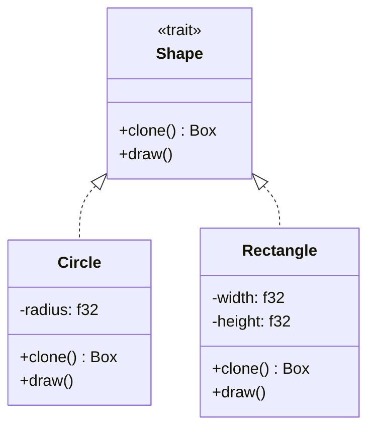
```mermaid
classDiagram
    class Shape {
        <<trait>>
        +clone() Box<dyn Shape>
        +draw()
    }
    class Circle {
        -radius: f32
        +clone() Box<dyn Shape>
        +draw()
    }
    class Rectangle {
        -width: f32
        -height: f32
        +clone() Box<dyn Shape>
        +draw()
    }
    
    Shape <|.. Circle
    Shape <|.. Rectangle
```

**Rust Implementation:**
```rust
trait Shape: Clone {
    fn draw(&self);
}

#[derive(Clone)]
struct Circle {
    radius: f32,
}

impl Circle {
    fn new(radius: f32) -> Self {
        Circle { radius }
    }
}

impl Shape for Circle {
    fn draw(&self) {
        println!("Drawing circle with radius: {}", self.radius);
    }
}

#[derive(Clone)]
struct Rectangle {
    width: f32,
    height: f32,
}

impl Rectangle {
    fn new(width: f32, height: f32) -> Self {
        Rectangle { width, height }
    }
}

impl Shape for Rectangle {
    fn draw(&self) {
        println!("Drawing rectangle {}x{}", self.width, self.height);
    }
}

struct ShapeCache {
    shapes: std::collections::HashMap<String, Box<dyn Shape>>,
}

impl ShapeCache {
    fn new() -> Self {
        let mut shapes = std::collections::HashMap::new();
        shapes.insert("circle".to_string(), Box::new(Circle::new(10.0)) as Box<dyn Shape>);
        shapes.insert("rectangle".to_string(), Box::new(Rectangle::new(20.0, 15.0)));
        ShapeCache { shapes }
    }

    fn get_shape(&self, shape_type: &str) -> Option<Box<dyn Shape>> {
        self.shapes.get(shape_type).map(|s| s.clone_box())
    }
}

trait CloneBox {
    fn clone_box(&self) -> Box<dyn Shape>;
}

impl<T> CloneBox for T
where
    T: Shape + Clone + 'static,
{
    fn clone_box(&self) -> Box<dyn Shape> {
        Box::new(self.clone())
    }
}

fn main() {
    let cache = ShapeCache::new();
    
    let circle = cache.get_shape("circle").unwrap();
    circle.draw();
    
    let rectangle = cache.get_shape("rectangle").unwrap();
    rectangle.draw();
    
    let another_circle = circle.clone_box();
    another_circle.draw();
}
```

### 12. Real-World Application: E-commerce System
Combining multiple patterns: Factory, Observer, Strategy, and Facade.

**Mermaid UML:**
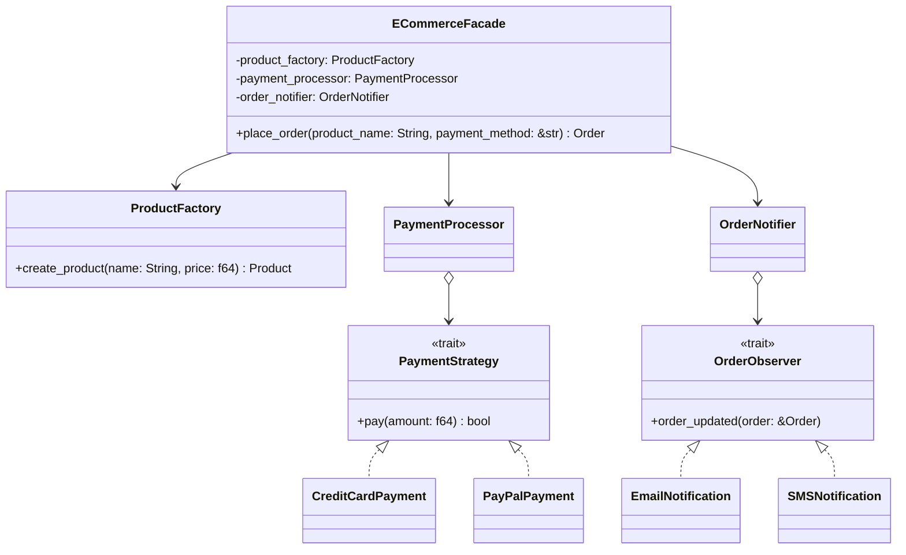
```mermaid
classDiagram
    class PaymentStrategy {
        <<trait>>
        +pay(amount: f64) bool
    }
    class OrderObserver {
        <<trait>>
        +order_updated(order: &Order)
    }
    class ProductFactory {
        +create_product(name: String, price: f64) Product
    }
    class ECommerceFacade {
        -product_factory: ProductFactory
        -payment_processor: PaymentProcessor
        -order_notifier: OrderNotifier
        +place_order(product_name: String, payment_method: &str) Order
    }
    
    PaymentStrategy <|.. CreditCardPayment
    PaymentStrategy <|.. PayPalPayment
    OrderObserver <|.. EmailNotification
    OrderObserver <|.. SMSNotification
    ECommerceFacade --> ProductFactory
    ECommerceFacade --> PaymentProcessor
    ECommerceFacade --> OrderNotifier
    PaymentProcessor o--> PaymentStrategy
    OrderNotifier o--> OrderObserver
```

**Rust Implementation:**
```rust
// Product and Factory
#[derive(Clone)]
struct Product {
    id: u32,
    name: String,
    price: f64,
}

struct ProductFactory {
    next_id: u32,
}

impl ProductFactory {
    fn new() -> Self {
        ProductFactory { next_id: 1 }
    }
    
    fn create_product(&mut self, name: &str, price: f64) -> Product {
        let product = Product {
            id: self.next_id,
            name: name.to_string(),
            price,
        };
        self.next_id += 1;
        product
    }
}

// Payment Strategies
trait PaymentStrategy {
    fn pay(&self, amount: f64) -> bool;
}

struct CreditCardPayment {
    card_number: String,
}

impl PaymentStrategy for CreditCardPayment {
    fn pay(&self, amount: f64) -> bool {
        println!("Processing credit card payment of ${:.2} with card {}", amount, &self.card_number[..4]);
        true
    }
}

struct PayPalPayment {
    email: String,
}

impl PaymentStrategy for PayPalPayment {
    fn pay(&self, amount: f64) -> bool {
        println!("Processing PayPal payment of ${:.2} for {}", amount, self.email);
        true
    }
}

struct PaymentProcessor {
    strategy: Box<dyn PaymentStrategy>,
}

impl PaymentProcessor {
    fn new(strategy: Box<dyn PaymentStrategy>) -> Self {
        PaymentProcessor { strategy }
    }
    
    fn process_payment(&self, amount: f64) -> bool {
        self.strategy.pay(amount)
    }
}

// Order and Observer
#[derive(Clone)]
struct Order {
    id: u32,
    product: Product,
    status: String,
}

trait OrderObserver {
    fn order_updated(&self, order: &Order);
}

struct EmailNotification {
    email: String,
}

impl OrderObserver for EmailNotification {
    fn order_updated(&self, order: &Order) {
        println!("Email to {}: Order #{} status changed to {}", self.email, order.id, order.status);
    }
}

struct SMSNotification {
    phone: String,
}

impl OrderObserver for SMSNotification {
    fn order_updated(&self, order: &Order) {
        println!("SMS to {}: Order #{} status changed to {}", self.phone, order.id, order.status);
    }
}

struct OrderNotifier {
    observers: Vec<Box<dyn OrderObserver>>,
}

impl OrderNotifier {
    fn new() -> Self {
        OrderNotifier {
            observers: Vec::new(),
        }
    }
    
    fn attach(&mut self, observer: Box<dyn OrderObserver>) {
        self.observers.push(observer);
    }
    
    fn notify(&self, order: &Order) {
        for observer in &self.observers {
            observer.order_updated(order);
        }
    }
}

// E-commerce Facade
struct ECommerceFacade {
    product_factory: ProductFactory,
    payment_processor: PaymentProcessor,
    order_notifier: OrderNotifier,
    next_order_id: u32,
}

impl ECommerceFacade {
    fn new(payment_processor: PaymentProcessor) -> Self {
        ECommerceFacade {
            product_factory: ProductFactory::new(),
            payment_processor,
            order_notifier: OrderNotifier::new(),
            next_order_id: 1,
        }
    }
    
    fn add_notification_channel(&mut self, observer: Box<dyn OrderObserver>) {
        self.order_notifier.attach(observer);
    }
    
    fn place_order(&mut self, product_name: &str, price: f64) -> Order {
        let product = self.product_factory.create_product(product_name, price);
        let mut order = Order {
            id: self.next_order_id,
            product: product.clone(),
            status: "Created".to_string(),
        };
        self.next_order_id += 1;
        
        self.order_notifier.notify(&order);
        
        // Process payment
        if self.payment_processor.process_payment(price) {
            order.status = "Paid".to_string();
            self.order_notifier.notify(&order);
            
            // Simulate shipping
            order.status = "Shipped".to_string();
            self.order_notifier.notify(&order);
        } else {
            order.status = "Payment Failed".to_string();
            self.order_notifier.notify(&order);
        }
        
        order
    }
}

fn main() {
    // Setup payment strategy
    let credit_card = CreditCardPayment {
        card_number: "1234567890123456".to_string(),
    };
    let payment_processor = PaymentProcessor::new(Box::new(credit_card));
    
    // Create e-commerce system
    let mut shop = ECommerceFacade::new(payment_processor);
    
    // Add notification channels
    shop.add_notification_channel(Box::new(EmailNotification {
        email: "customer@example.com".to_string(),
    }));
    shop.add_notification_channel(Box::new(SMSNotification {
        phone: "+1234567890".to_string(),
    }));
    
    // Place an order
    let order = shop.place_order("Rust Programming Book", 39.99);
    println!("Order completed: #{} - {}", order.id, order.status);
}
```

### Key Patterns Used in E-commerce System:
1. **Factory Pattern:** `ProductFactory` creates products
2. **Strategy Pattern:** `PaymentProcessor` uses different payment strategies
3. **Observer Pattern:** `OrderNotifier` notifies about order status changes
4. **Facade Pattern:** `ECommerceFacade` provides simplified interface
5. **Builder-like:** Fluent interface for configuration

### Concurrency Pattern: Worker Pool
A thread pool implementation for parallel task processing:

```rust
use std::sync::{mpsc, Arc, Mutex};
use std::thread;

type Job = Box<dyn FnOnce() + Send + 'static>;

struct Worker {
    id: usize,
    thread: Option<thread::JoinHandle<()>>,
}

impl Worker {
    fn new(id: usize, receiver: Arc<Mutex<mpsc::Receiver<Job>>>) -> Worker {
        let thread = thread::spawn(move || loop {
            let job = receiver.lock().unwrap().recv();
            match job {
                Ok(job) => {
                    println!("Worker {} got a job; executing.", id);
                    job();
                }
                Err(_) => {
                    println!("Worker {} disconnected; shutting down.", id);
                    break;
                }
            }
        });

        Worker {
            id,
            thread: Some(thread),
        }
    }
}

struct ThreadPool {
    workers: Vec<Worker>,
    sender: mpsc::Sender<Job>,
}

impl ThreadPool {
    fn new(size: usize) -> Self {
        assert!(size > 0);

        let (sender, receiver) = mpsc::channel();
        let receiver = Arc::new(Mutex::new(receiver));

        let mut workers = Vec::with_capacity(size);
        for id in 0..size {
            workers.push(Worker::new(id, Arc::clone(&receiver)));
        }

        ThreadPool { workers, sender }
    }

    fn execute<F>(&self, f: F)
    where
        F: FnOnce() + Send + 'static,
    {
        let job = Box::new(f);
        self.sender.send(job).unwrap();
    }
}

impl Drop for ThreadPool {
    fn drop(&mut self) {
        for worker in &mut self.workers {
            println!("Shutting down worker {}", worker.id);
            
            if let Some(thread) = worker.thread.take() {
                thread.join().unwrap();
            }
        }
    }
}

fn main() {
    let pool = ThreadPool::new(4);

    for i in 0..8 {
        pool.execute(move || {
            println!("Task {} started", i);
            thread::sleep(std::time::Duration::from_secs(1));
            println!("Task {} finished", i);
        });
    }

    // ThreadPool will be dropped here, shutting down workers
}
```

### Next Steps:
Would you like to:
1. Explore more architectural patterns (Microservices, CQRS, Event Sourcing)
2. Dive into async patterns (Reactor, Futures, Streams)
3. Examine patterns for distributed systems
4. Learn about anti-patterns in Rust
5. See how to test pattern implementations
6. Explore domain-driven design with Rust?

Let's explore advanced patterns and Rust-specific techniques. I'll cover:

1. **Flyweight Pattern** for memory optimization
2. **State Machine Pattern** using enums
3. **Dependency Injection** in Rust
4. **FFI (Foreign Function Interface) Pattern** for C interoperability
5. **Advanced Async Patterns** with Tokio

### 17. Flyweight Pattern
Shares common state between objects to minimize memory usage.

**Mermaid UML:**
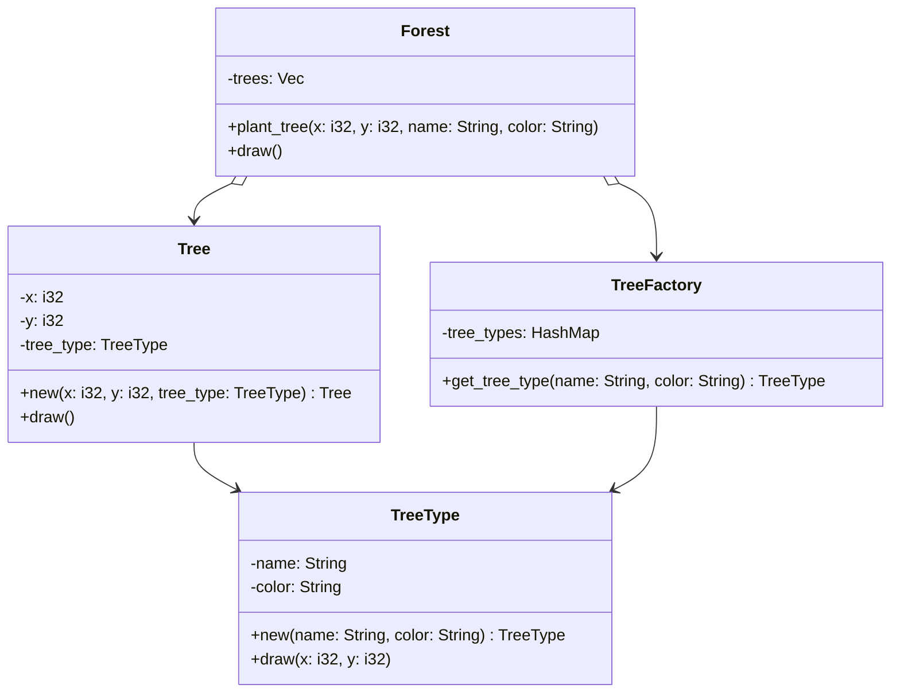
```mermaid
classDiagram
    class TreeType {
        -name: String
        -color: String
        +new(name: String, color: String) TreeType
        +draw(x: i32, y: i32)
    }
    class TreeFactory {
        -tree_types: HashMap<String, TreeType>
        +get_tree_type(name: String, color: String) TreeType
    }
    class Tree {
        -x: i32
        -y: i32
        -tree_type: TreeType
        +new(x: i32, y: i32, tree_type: TreeType) Tree
        +draw()
    }
    class Forest {
        -trees: Vec<Tree>
        +plant_tree(x: i32, y: i32, name: String, color: String)
        +draw()
    }
    
    Forest o--> TreeFactory
    Forest o--> Tree
    Tree --> TreeType
    TreeFactory --> TreeType
```

**Rust Implementation:**
```rust
use std::collections::HashMap;
use std::sync::Arc;

#[derive(Debug, Clone, PartialEq, Eq, Hash)]
struct TreeType {
    name: String,
    color: String,
}

impl TreeType {
    fn new(name: &str, color: &str) -> Self {
        TreeType {
            name: name.to_string(),
            color: color.to_string(),
        }
    }

    fn draw(&self, x: i32, y: i32) {
        println!("Drawing {} tree at ({}, {}) with color {}", 
                 self.name, x, y, self.color);
    }
}

struct TreeFactory {
    tree_types: HashMap<String, Arc<TreeType>>,
}

impl TreeFactory {
    fn new() -> Self {
        TreeFactory {
            tree_types: HashMap::new(),
        }
    }

    fn get_tree_type(&mut self, name: &str, color: &str) -> Arc<TreeType> {
        let key = format!("{}_{}", name, color);
        self.tree_types.entry(key.clone())
            .or_insert_with(|| Arc::new(TreeType::new(name, color)))
            .clone()
    }
}

struct Tree {
    x: i32,
    y: i32,
    tree_type: Arc<TreeType>,
}

impl Tree {
    fn new(x: i32, y: i32, tree_type: Arc<TreeType>) -> Self {
        Tree { x, y, tree_type }
    }

    fn draw(&self) {
        self.tree_type.draw(self.x, self.y);
    }
}

struct Forest {
    trees: Vec<Tree>,
    factory: TreeFactory,
}

impl Forest {
    fn new() -> Self {
        Forest {
            trees: Vec::new(),
            factory: TreeFactory::new(),
        }
    }

    fn plant_tree(&mut self, x: i32, y: i32, name: &str, color: &str) {
        let tree_type = self.factory.get_tree_type(name, color);
        self.trees.push(Tree::new(x, y, tree_type));
    }

    fn draw(&self) {
        for tree in &self.trees {
            tree.draw();
        }
    }
}

fn main() {
    let mut forest = Forest::new();
    forest.plant_tree(1, 2, "Oak", "Green");
    forest.plant_tree(3, 4, "Maple", "Red");
    forest.plant_tree(5, 6, "Oak", "Green"); // Shares Oak-Green type
    forest.draw();
    println!("Total trees: {}", forest.trees.len());
}
```

### 18. State Machine Pattern
Models state transitions using enums and pattern matching.

**Mermaid UML:**
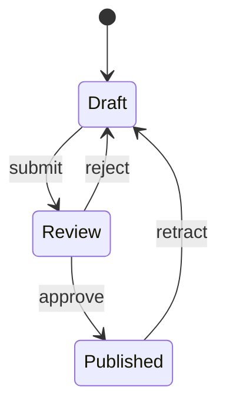
```mermaid
stateDiagram-v2
    [*] --> Draft
    Draft --> Review: submit
    Review --> Draft: reject
    Review --> Published: approve
    Published --> Draft: retract
```

**Rust Implementation:**
```rust
#[derive(Debug, PartialEq)]
enum DocumentState {
    Draft,
    Review,
    Published,
}

struct Document {
    content: String,
    state: DocumentState,
}

impl Document {
    fn new(content: &str) -> Self {
        Document {
            content: content.to_string(),
            state: DocumentState::Draft,
        }
    }

    fn submit(&mut self) {
        match self.state {
            DocumentState::Draft => {
                println!("Submitting document for review");
                self.state = DocumentState::Review;
            }
            _ => println!("Can only submit from Draft state"),
        }
    }

    fn approve(&mut self) {
        match self.state {
            DocumentState::Review => {
                println!("Approving document");
                self.state = DocumentState::Published;
            }
            _ => println!("Can only approve from Review state"),
        }
    }

    fn reject(&mut self) {
        match self.state {
            DocumentState::Review => {
                println!("Rejecting document");
                self.state = DocumentState::Draft;
            }
            _ => println!("Can only reject from Review state"),
        }
    }

    fn retract(&mut self) {
        match self.state {
            DocumentState::Published => {
                println!("Retracting published document");
                self.state = DocumentState::Draft;
            }
            _ => println!("Can only retract from Published state"),
        }
    }
}

fn main() {
    let mut doc = Document::new("Hello, world!");
    doc.submit();
    doc.reject();
    doc.submit();
    doc.approve();
    doc.retract();
}
```

### 19. Dependency Injection Pattern
Provides dependencies to components rather than hard-coding them.

**Mermaid UML:**
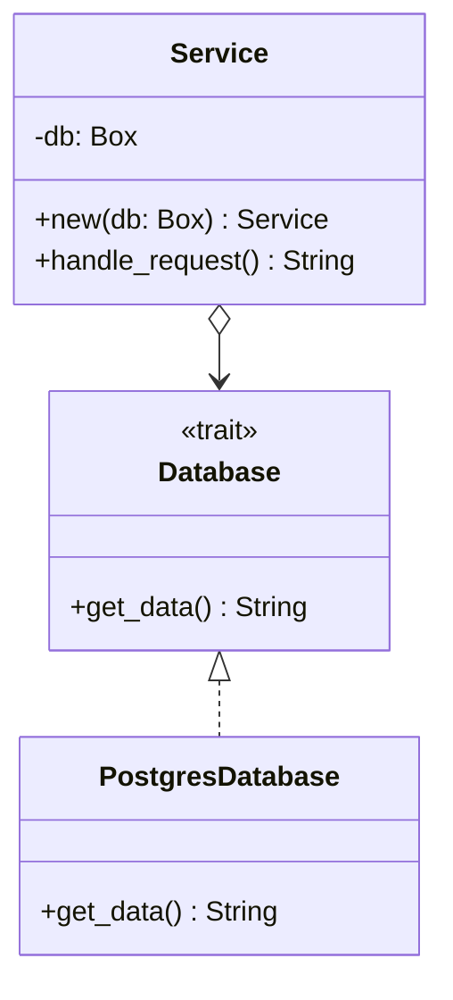
```mermaid
classDiagram
    class Database {
        <<trait>>
        +get_data() String
    }
    class PostgresDatabase {
        +get_data() String
    }
    class Service {
        -db: Box<dyn Database>
        +new(db: Box<dyn Database>) Service
        +handle_request() String
    }
    
    Database <|.. PostgresDatabase
    Service o--> Database
```

**Rust Implementation:**
```rust
trait Database {
    fn get_data(&self) -> String;
}

struct PostgresDatabase;

impl Database for PostgresDatabase {
    fn get_data(&self) -> String {
        "Data from PostgreSQL".to_string()
    }
}

struct SqliteDatabase;

impl Database for SqliteDatabase {
    fn get_data(&self) -> String {
        "Data from SQLite".to_string()
    }
}

struct Service {
    db: Box<dyn Database>,
}

impl Service {
    fn new(db: Box<dyn Database>) -> Self {
        Service { db }
    }

    fn handle_request(&self) -> String {
        format!("Service handled: {}", self.db.get_data())
    }
}

fn main() {
    let postgres_service = Service::new(Box::new(PostgresDatabase));
    println!("{}", postgres_service.handle_request());

    let sqlite_service = Service::new(Box::new(SqliteDatabase));
    println!("{}", sqlite_service.handle_request());
}
```

### 20. FFI (Foreign Function Interface) Pattern
Safely interfaces with C libraries from Rust.

**Mermaid UML:**
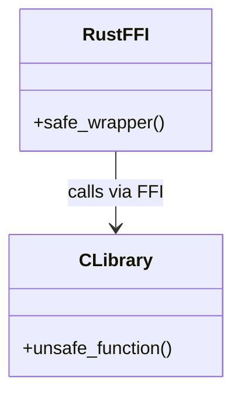
```mermaid
classDiagram
    class RustFFI {
        +safe_wrapper()
    }
    class CLibrary {
        +unsafe_function()
    }
    RustFFI --> CLibrary : calls via FFI
```

**Rust Implementation:**
```rust
// In C header (mathlib.h)
/*
int add(int a, int b);
*/

// Build with: gcc -shared -o libmathlib.so mathlib.c

use std::os::raw::c_int;

#[link(name = "mathlib")]
extern "C" {
    fn add(a: c_int, b: c_int) -> c_int;
}

pub fn safe_add(a: i32, b: i32) -> i32 {
    unsafe { add(a, b) }
}

fn main() {
    let result = safe_add(10, 20);
    println!("10 + 20 = {}", result);
}
```

### 21. Advanced Async Patterns with Tokio
Implementing a rate-limited API client using token bucket algorithm.

**Mermaid UML:**
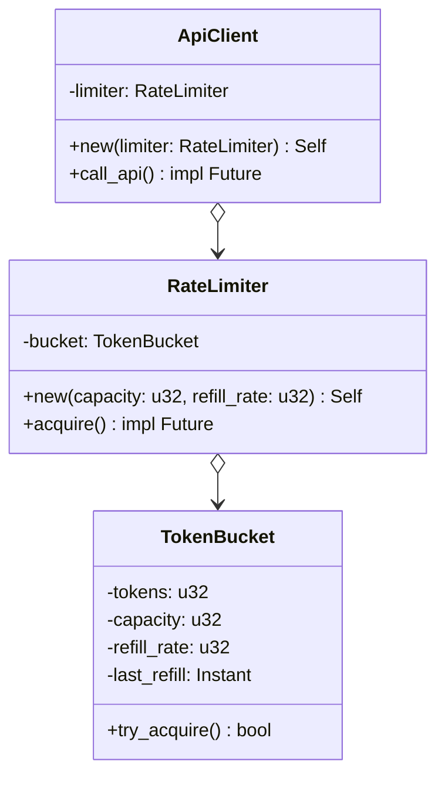
```mermaid
classDiagram
    class RateLimiter {
        -bucket: TokenBucket
        +new(capacity: u32, refill_rate: u32) Self
        +acquire() impl Future
    }
    class TokenBucket {
        -tokens: u32
        -capacity: u32
        -refill_rate: u32
        -last_refill: Instant
        +try_acquire() bool
    }
    class ApiClient {
        -limiter: RateLimiter
        +new(limiter: RateLimiter) Self
        +call_api() impl Future
    }
    
    RateLimiter o--> TokenBucket
    ApiClient o--> RateLimiter
```

**Rust Implementation:**
```rust
use std::sync::Arc;
use std::time::{Duration, Instant};
use tokio::sync::Mutex;
use tokio::time;

struct TokenBucket {
    tokens: u32,
    capacity: u32,
    refill_rate: u32, // tokens per second
    last_refill: Instant,
}

impl TokenBucket {
    fn new(capacity: u32, refill_rate: u32) -> Self {
        TokenBucket {
            tokens: capacity,
            capacity,
            refill_rate,
            last_refill: Instant::now(),
        }
    }

    fn refill(&mut self) {
        let now = Instant::now();
        let elapsed = now.duration_since(self.last_refill);
        let tokens_to_add = (elapsed.as_secs_f64() * self.refill_rate as f64) as u32;
        
        if tokens_to_add > 0 {
            self.tokens = (self.tokens + tokens_to_add).min(self.capacity);
            self.last_refill = now;
        }
    }

    fn try_acquire(&mut self) -> bool {
        self.refill();
        if self.tokens > 0 {
            self.tokens -= 1;
            true
        } else {
            false
        }
    }
}

#[derive(Clone)]
struct RateLimiter {
    bucket: Arc<Mutex<TokenBucket>>,
}

impl RateLimiter {
    fn new(capacity: u32, refill_rate: u32) -> Self {
        RateLimiter {
            bucket: Arc::new(Mutex::new(TokenBucket::new(capacity, refill_rate))),
        }
    }

    async fn acquire(&self) {
        loop {
            {
                let mut bucket = self.bucket.lock().await;
                if bucket.try_acquire() {
                    return;
                }
            }
            
            // Wait before retrying
            time::sleep(Duration::from_millis(50)).await;
        }
    }
}

struct ApiClient {
    limiter: RateLimiter,
}

impl ApiClient {
    fn new(limiter: RateLimiter) -> Self {
        ApiClient { limiter }
    }

    async fn call_api(&self, request_id: u32) {
        self.limiter.acquire().await;
        println!("API call {} started", request_id);
        
        // Simulate API call
        time::sleep(Duration::from_millis(100)).await;
        println!("API call {} completed", request_id);
    }
}

#[tokio::main]
async fn main() {
    let limiter = RateLimiter::new(5, 2); // 5 tokens capacity, 2 tokens/sec refill
    let client = ApiClient::new(limiter.clone());
    
    let mut handles = Vec::new();
    
    for i in 1..=10 {
        let client = client.clone();
        handles.push(tokio::spawn(async move {
            client.call_api(i).await;
        }));
    }
    
    for handle in handles {
        handle.await.unwrap();
    }
}
```

### 22. Pattern Combination: CQRS with Event Sourcing
Combining Command Query Responsibility Segregation and Event Sourcing patterns.

**Mermaid UML:**
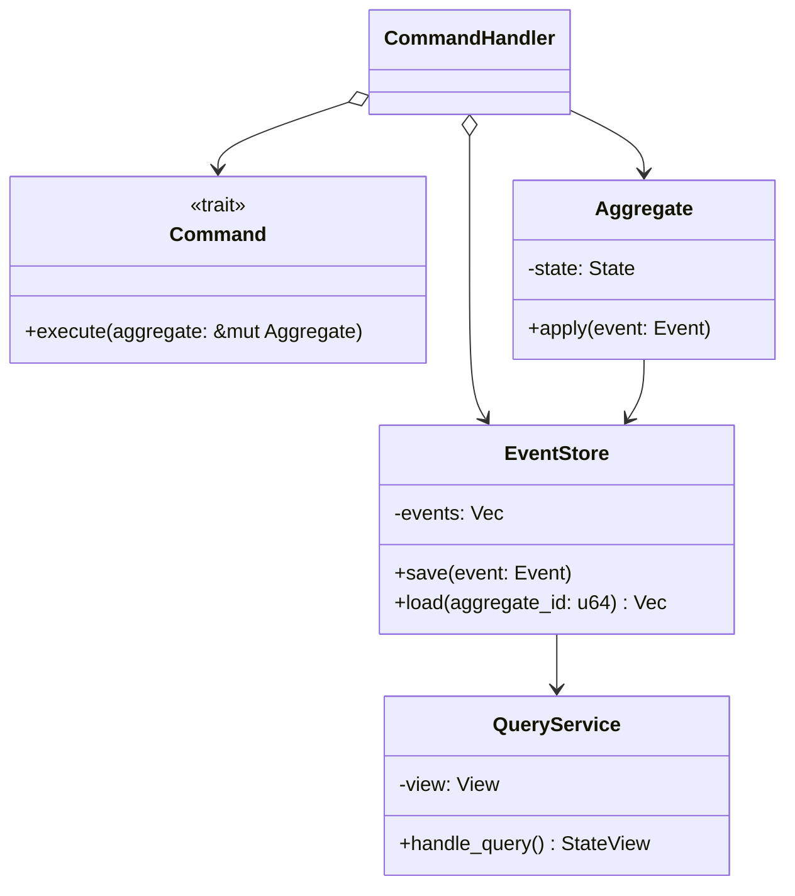
```mermaid
classDiagram
    class Command {
        <<trait>>
        +execute(aggregate: &mut Aggregate)
    }
    class Aggregate {
        -state: State
        +apply(event: Event)
    }
    class EventStore {
        -events: Vec<Event>
        +save(event: Event)
        +load(aggregate_id: u64) Vec<Event>
    }
    class QueryService {
        -view: View
        +handle_query() StateView
    }
    
    CommandHandler o--> Command
    CommandHandler o--> EventStore
    CommandHandler --> Aggregate
    EventStore --> QueryService
    Aggregate --> EventStore
```

**Rust Implementation:**
```rust
use std::collections::HashMap;
use std::sync::{Arc, Mutex};

// Events
#[derive(Debug, Clone)]
enum Event {
    AccountOpened { id: u64, name: String },
    FundsDeposited { id: u64, amount: f64 },
    FundsWithdrawn { id: u64, amount: f64 },
}

// Commands
enum Command {
    OpenAccount { id: u64, name: String },
    DepositFunds { id: u64, amount: f64 },
    WithdrawFunds { id: u64, amount: f64 },
}

// Aggregate
struct BankAccount {
    id: u64,
    balance: f64,
    version: u64,
}

impl BankAccount {
    fn new(id: u64) -> Self {
        BankAccount {
            id,
            balance: 0.0,
            version: 0,
        }
    }

    fn apply(&mut self, event: &Event) {
        match event {
            Event::AccountOpened { id, name } => {
                println!("Account {} opened for {}", id, name);
            }
            Event::FundsDeposited { id, amount } => {
                if *id == self.id {
                    self.balance += amount;
                    println!("Deposited {} to account {}", amount, id);
                }
            }
            Event::FundsWithdrawn { id, amount } => {
                if *id == self.id {
                    self.balance -= amount;
                    println!("Withdrawn {} from account {}", amount, id);
                }
            }
        }
        self.version += 1;
    }
}

// Event Store
struct EventStore {
    events: Arc<Mutex<Vec<Event>>>,
}

impl EventStore {
    fn new() -> Self {
        EventStore {
            events: Arc::new(Mutex::new(Vec::new())),
        }
    }

    fn save(&self, event: Event) {
        let mut events = self.events.lock().unwrap();
        events.push(event);
    }

    fn load(&self, aggregate_id: u64) -> Vec<Event> {
        self.events.lock().unwrap()
            .iter()
            .filter(|e| match e {
                Event::AccountOpened { id, .. } => *id == aggregate_id,
                Event::FundsDeposited { id, .. } => *id == aggregate_id,
                Event::FundsWithdrawn { id, .. } => *id == aggregate_id,
            })
            .cloned()
            .collect()
    }
}

// Command Handler
struct CommandHandler {
    event_store: Arc<EventStore>,
}

impl CommandHandler {
    fn new(event_store: Arc<EventStore>) -> Self {
        CommandHandler { event_store }
    }

    fn handle(&self, command: Command) {
        match command {
            Command::OpenAccount { id, name } => {
                let event = Event::AccountOpened { id, name };
                self.event_store.save(event);
            }
            Command::DepositFunds { id, amount } => {
                let event = Event::FundsDeposited { id, amount };
                self.event_store.save(event);
            }
            Command::WithdrawFunds { id, amount } => {
                let event = Event::FundsWithdrawn { id, amount };
                self.event_store.save(event);
            }
        }
    }
}

// Query Service
struct QueryService {
    event_store: Arc<EventStore>,
    accounts: Mutex<HashMap<u64, BankAccount>>,
}

impl QueryService {
    fn new(event_store: Arc<EventStore>) -> Self {
        QueryService {
            event_store,
            accounts: Mutex::new(HashMap::new()),
        }
    }

    fn get_account(&self, id: u64) -> BankAccount {
        let mut accounts = self.accounts.lock().unwrap();
        
        if !accounts.contains_key(&id) {
            let mut account = BankAccount::new(id);
            let events = self.event_store.load(id);
            
            for event in events {
                account.apply(&event);
            }
            
            accounts.insert(id, account);
        }
        
        accounts.get(&id).unwrap().clone()
    }
}

fn main() {
    let event_store = Arc::new(EventStore::new());
    let command_handler = CommandHandler::new(event_store.clone());
    let query_service = QueryService::new(event_store.clone());

    // Process commands
    command_handler.handle(Command::OpenAccount {
        id: 1,
        name: "Alice".to_string(),
    });
    
    command_handler.handle(Command::DepositFunds {
        id: 1,
        amount: 100.0,
    });
    
    command_handler.handle(Command::WithdrawFunds {
        id: 1,
        amount: 30.0,
    });

    // Query state
    let account = query_service.get_account(1);
    println!("Account {} balance: ${:.2}", account.id, account.balance);
    println!("Account version: {}", account.version);
}
```

### Key Takeaways:
1. **Flyweight:** Shares immutable state to reduce memory footprint
2. **State Machine:** Uses enums and pattern matching for clear state transitions
3. **Dependency Injection:** Enables flexible component composition
4. **FFI:** Safely interacts with C libraries using Rust's foreign function interface
5. **Async Patterns:** Tokio for efficient async programming
6. **CQRS/Event Sourcing:** Separates reads and writes for scalable systems

### Next Steps:
Would you like to:
1. Explore distributed systems patterns (Raft, Paxos)
2. Learn about blockchain-related patterns
3. Dive into GPU programming with Rust
4. Explore WebAssembly patterns
5. Learn about security patterns and cryptography
6. See how to implement a full-stack Rust application?

Let's explore advanced patterns and cutting-edge Rust applications:

### 1. Distributed Systems: Raft Consensus Algorithm
A simplified implementation of the Raft consensus protocol

**Mermaid Sequence Diagram:**
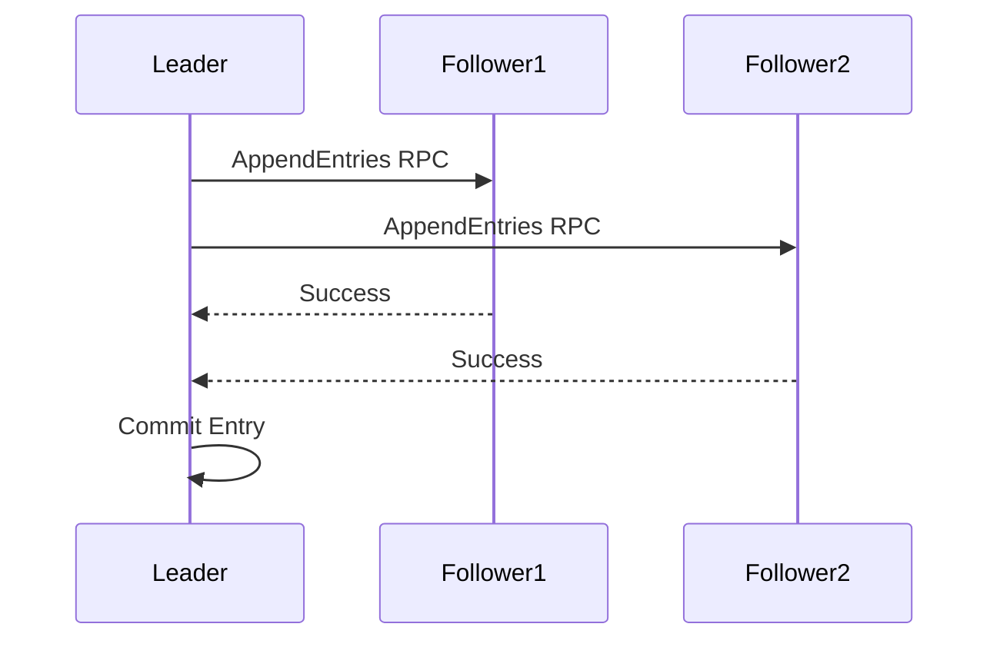
```mermaid
sequenceDiagram
    participant Leader
    participant Follower1
    participant Follower2
    
    Leader->>Follower1: AppendEntries RPC
    Leader->>Follower2: AppendEntries RPC
    Follower1-->>Leader: Success
    Follower2-->>Leader: Success
    Leader->>Leader: Commit Entry
```

**Rust Implementation:**
```rust
use std::collections::HashMap;
use std::sync::{Arc, Mutex};
use tokio::sync::mpsc;
use tokio::time::{sleep, Duration};

#[derive(Debug, Clone)]
enum NodeState {
    Follower,
    Candidate,
    Leader,
}

#[derive(Debug, Clone)]
struct LogEntry {
    term: u64,
    command: String,
}

struct RaftNode {
    id: u64,
    state: NodeState,
    current_term: u64,
    voted_for: Option<u64>,
    log: Vec<LogEntry>,
    peers: HashMap<u64, mpsc::Sender<RaftMessage>>,
    election_timer: Duration,
}

#[derive(Debug)]
enum RaftMessage {
    AppendEntries {
        term: u64,
        leader_id: u64,
        entries: Vec<LogEntry>,
        leader_commit: u64,
    },
    RequestVote {
        term: u64,
        candidate_id: u64,
        last_log_index: u64,
        last_log_term: u64,
    },
    VoteGranted {
        term: u64,
        voter_id: u64,
    },
    AppendEntriesResponse {
        term: u64,
        success: bool,
    },
}

impl RaftNode {
    async fn run(&mut self, rx: mpsc::Receiver<RaftMessage>) {
        loop {
            match self.state {
                NodeState::Follower => {
                    tokio::select! {
                        msg = rx.recv() => self.handle_message(msg).await,
                        _ = sleep(self.election_timer) => {
                            self.state = NodeState::Candidate;
                            self.current_term += 1;
                            self.start_election().await;
                        }
                    }
                }
                NodeState::Candidate => {
                    self.start_election().await;
                    sleep(Duration::from_millis(100)).await;
                }
                NodeState::Leader => {
                    self.send_heartbeats().await;
                    sleep(Duration::from_millis(50)).await;
                }
            }
        }
    }

    async fn start_election(&mut self) {
        self.voted_for = Some(self.id);
        let mut votes = 1;
        
        let request = RaftMessage::RequestVote {
            term: self.current_term,
            candidate_id: self.id,
            last_log_index: self.log.len() as u64,
            last_log_term: self.log.last().map(|e| e.term).unwrap_or(0),
        };
        
        for (id, tx) in &self.peers {
            if *id != self.id {
                let tx = tx.clone();
                let request = request.clone();
                tokio::spawn(async move {
                    let _ = tx.send(request).await;
                });
            }
        }
        
        // Simplified vote counting
        if votes > self.peers.len() as u64 / 2 {
            self.state = NodeState::Leader;
        }
    }

    async fn send_heartbeats(&self) {
        let request = RaftMessage::AppendEntries {
            term: self.current_term,
            leader_id: self.id,
            entries: vec![],
            leader_commit: self.log.len() as u64,
        };
        
        for (id, tx) in &self.peers {
            if *id != self.id {
                let tx = tx.clone();
                let request = request.clone();
                tokio::spawn(async move {
                    let _ = tx.send(request).await;
                });
            }
        }
    }

    async fn handle_message(&mut self, msg: Option<RaftMessage>) {
        if let Some(msg) = msg {
            match msg {
                RaftMessage::AppendEntries { term, leader_id, entries, leader_commit } => {
                    if term >= self.current_term {
                        self.current_term = term;
                        self.state = NodeState::Follower;
                        // Process entries...
                    }
                }
                RaftMessage::RequestVote { term, candidate_id, .. } => {
                    if term > self.current_term {
                        self.current_term = term;
                        self.voted_for = Some(candidate_id);
                    }
                }
                RaftMessage::VoteGranted { .. } => {
                    // Count votes
                }
                _ => {}
            }
        }
    }
}
```

### 2. Blockchain Pattern: Simple Blockchain
A basic blockchain implementation with mining

```rust
use sha2::{Sha256, Digest};
use std::time::SystemTime;

#[derive(Debug, Clone)]
struct Block {
    index: u64,
    timestamp: u128,
    data: String,
    previous_hash: String,
    hash: String,
    nonce: u64,
}

impl Block {
    fn new(index: u64, data: &str, previous_hash: &str) -> Self {
        let timestamp = SystemTime::now()
            .duration_since(SystemTime::UNIX_EPOCH)
            .unwrap()
            .as_millis();

        let mut block = Block {
            index,
            timestamp,
            data: data.to_string(),
            previous_hash: previous_hash.to_string(),
            hash: String::new(),
            nonce: 0,
        };

        block.hash = block.calculate_hash();
        block
    }

    fn calculate_hash(&self) -> String {
        let input = format!(
            "{}{}{}{}{}",
            self.index, self.timestamp, self.data, self.previous_hash, self.nonce
        );
        let mut hasher = Sha256::new();
        hasher.update(input);
        format!("{:x}", hasher.finalize())
    }

    fn mine_block(&mut self, difficulty: usize) {
        let prefix = "0".repeat(difficulty);
        while &self.hash[0..difficulty] != prefix {
            self.nonce += 1;
            self.hash = self.calculate_hash();
        }
    }
}

struct Blockchain {
    chain: Vec<Block>,
    difficulty: usize,
}

impl Blockchain {
    fn new() -> Self {
        let mut chain = Vec::new();
        let genesis_block = Block::new(0, "Genesis Block", "0");
        chain.push(genesis_block);
        Blockchain {
            chain,
            difficulty: 4,
        }
    }

    fn add_block(&mut self, data: &str) {
        let last_block = self.chain.last().unwrap().clone();
        let mut new_block = Block::new(
            last_block.index + 1,
            data,
            &last_block.hash
        );
        new_block.mine_block(self.difficulty);
        self.chain.push(new_block);
    }

    fn is_valid(&self) -> bool {
        for i in 1..self.chain.len() {
            let current = &self.chain[i];
            let previous = &self.chain[i-1];
            
            if current.hash != current.calculate_hash() {
                return false;
            }
            
            if current.previous_hash != previous.hash {
                return false;
            }
        }
        true
    }
}
```

### 3. GPU Programming with WGPU
Simple vector addition on GPU

```rust
use wgpu::util::DeviceExt;

#[tokio::main]
async fn main() {
    // Setup GPU
    let instance = wgpu::Instance::default();
    let adapter = instance.request_adapter(&wgpu::RequestAdapterOptions::default())
        .await.unwrap();
    let (device, queue) = adapter.request_device(
        &wgpu::DeviceDescriptor::default(),
        None
    ).await.unwrap();

    // Input data
    let data_a = [1.0, 2.0, 3.0, 4.0];
    let data_b = [5.0, 6.0, 7.0, 8.0];

    // Create buffers
    let buffer_a = device.create_buffer_init(&wgpu::util::BufferInitDescriptor {
        label: Some("Buffer A"),
        contents: bytemuck::cast_slice(&data_a),
        usage: wgpu::BufferUsages::STORAGE,
    });

    let buffer_b = device.create_buffer_init(&wgpu::util::BufferInitDescriptor {
        label: Some("Buffer B"),
        contents: bytemuck::cast_slice(&data_b),
        usage: wgpu::BufferUsages::STORAGE,
    });

    let output_buffer = device.create_buffer(&wgpu::BufferDescriptor {
        label: Some("Output Buffer"),
        size: (data_a.len() * std::mem::size_of::<f32>()) as u64,
        usage: wgpu::BufferUsages::STORAGE | wgpu::BufferUsages::COPY_SRC | wgpu::BufferUsages::MAP_READ,
        mapped_at_creation: false,
    });

    // Create compute pipeline
    let shader = device.create_shader_module(wgpu::ShaderModuleDescriptor {
        label: Some("Shader"),
        source: wgpu::ShaderSource::Wgsl(include_str!("shader.wgsl").into()),
    });

    let bind_group_layout = device.create_bind_group_layout(&wgpu::BindGroupLayoutDescriptor {
        label: Some("Bind Group Layout"),
        entries: &[
            wgpu::BindGroupLayoutEntry {
                binding: 0,
                visibility: wgpu::ShaderStages::COMPUTE,
                ty: wgpu::BindingType::Buffer {
                    ty: wgpu::BufferBindingType::Storage { read_only: true },
                    has_dynamic_offset: false,
                    min_binding_size: None,
                },
                count: None,
            },
            wgpu::BindGroupLayoutEntry {
                binding: 1,
                visibility: wgpu::ShaderStages::COMPUTE,
                ty: wgpu::BindingType::Buffer {
                    ty: wgpu::BufferBindingType::Storage { read_only: true },
                    has_dynamic_offset: false,
                    min_binding_size: None,
                },
                count: None,
            },
            wgpu::BindGroupLayoutEntry {
                binding: 2,
                visibility: wgpu::ShaderStages::COMPUTE,
                ty: wgpu::BindingType::Buffer {
                    ty: wgpu::BufferBindingType::Storage { read_only: false },
                    has_dynamic_offset: false,
                    min_binding_size: None,
                },
                count: None,
            },
        ],
    });

    let bind_group = device.create_bind_group(&wgpu::BindGroupDescriptor {
        label: Some("Bind Group"),
        layout: &bind_group_layout,
        entries: &[
            wgpu::BindGroupEntry {
                binding: 0,
                resource: buffer_a.as_entire_binding(),
            },
            wgpu::BindGroupEntry {
                binding: 1,
                resource: buffer_b.as_entire_binding(),
            },
            wgpu::BindGroupEntry {
                binding: 2,
                resource: output_buffer.as_entire_binding(),
            },
        ],
    });

    let pipeline_layout = device.create_pipeline_layout(&wgpu::PipelineLayoutDescriptor {
        label: Some("Pipeline Layout"),
        bind_group_layouts: &[&bind_group_layout],
        push_constant_ranges: &[],
    });

    let compute_pipeline = device.create_compute_pipeline(&wgpu::ComputePipelineDescriptor {
        label: Some("Compute Pipeline"),
        layout: Some(&pipeline_layout),
        module: &shader,
        entry_point: "main",
    });

    // Execute compute pass
    let mut encoder = device.create_command_encoder(&wgpu::CommandEncoderDescriptor::default());
    {
        let mut compute_pass = encoder.begin_compute_pass(&wgpu::ComputePassDescriptor::default());
        compute_pass.set_pipeline(&compute_pipeline);
        compute_pass.set_bind_group(0, &bind_group, &[]);
        compute_pass.dispatch_workgroups(data_a.len() as u32, 1, 1);
    }

    // Read back results
    let staging_buffer = device.create_buffer(&wgpu::BufferDescriptor {
        label: Some("Staging Buffer"),
        size: output_buffer.size(),
        usage: wgpu::BufferUsages::MAP_READ | wgpu::BufferUsages::COPY_DST,
        mapped_at_creation: false,
    });

    encoder.copy_buffer_to_buffer(&output_buffer, 0, &staging_buffer, 0, output_buffer.size());
    queue.submit(Some(encoder.finish()));

    // Map and read
    staging_buffer.slice(..).map_async(wgpu::MapMode::Read, |_| {});
    device.poll(wgpu::Maintain::Wait);

    let output_slice = staging_buffer.slice(..).get_mapped_range();
    let output_data: &[f32] = bytemuck::cast_slice(&output_slice);
    println!("Result: {:?}", output_data);
}
```

**shader.wgsl:**
```rust
@group(0) @binding(0)
var<storage, read> a: array<f32>;

@group(0) @binding(1)
var<storage, read> b: array<f32>;

@group(0) @binding(2)
var<storage, read_write> result: array<f32>;

@compute @workgroup_size(1)
fn main(@builtin(global_invocation_id) id: vec3<u32>) {
    let idx = id.x;
    result[idx] = a[idx] + b[idx];
}
```

### 4. WebAssembly with WASM-Bindgen
Rust to WebAssembly with DOM interaction

```rust
use wasm_bindgen::prelude::*;
use web_sys::console;

#[wasm_bindgen]
pub struct WasmClient {
    count: i32,
}

#[wasm_bindgen]
impl WasmClient {
    #[wasm_bindgen(constructor)]
    pub fn new() -> Self {
        WasmClient { count: 0 }
    }

    #[wasm_bindgen]
    pub fn increment(&mut self) -> i32 {
        self.count += 1;
        self.count
    }

    #[wasm_bindgen]
    pub fn greet(&self, name: &str) {
        console::log_1(&format!("Hello, {}! Count is: {}", name, self.count).into());
    }

    #[wasm_bindgen(js_name = "renderToDOM")]
    pub fn render_to_dom(&self, element_id: &str) {
        let window = web_sys::window().expect("no global window");
        let document = window.document().expect("no document");
        let element = document.get_element_by_id(element_id).expect("element not found");
        
        element.set_inner_html(&format!(
            "<div style='border: 2px solid blue; padding: 10px;'>
                <h3>WASM Component</h3>
                <p>Count: {}</p>
                <button id='wasm-btn'>Increment</button>
            </div>",
            self.count
        ));
    }
}
```

### 5. Security Patterns: Password Hashing
Using Argon2 for secure password hashing

```rust
use argon2::{
    password_hash::{rand_core::OsRng, PasswordHash, PasswordHasher, PasswordVerifier, SaltString},
    Argon2, PasswordHashResult,
};

struct AuthService {
    argon2: Argon2<'static>,
}

impl AuthService {
    fn new() -> Self {
        AuthService {
            argon2: Argon2::default(),
        }
    }

    fn hash_password(&self, password: &str) -> PasswordHashResult {
        let salt = SaltString::generate(&mut OsRng);
        self.argon2.hash_password(password.as_bytes(), &salt)
    }

    fn verify_password(&self, password: &str, hash: &str) -> bool {
        let parsed_hash = PasswordHash::new(hash).expect("Invalid hash format");
        self.argon2
            .verify_password(password.as_bytes(), &parsed_hash)
            .is_ok()
    }
}

fn main() {
    let auth = AuthService::new();
    let password = "secure_password_123";
    
    let hash = auth.hash_password(password).unwrap().to_string();
    println!("Hashed password: {}", hash);
    
    println!("Verification: {}", auth.verify_password(password, &hash));
    println!("Wrong password: {}", auth.verify_password("wrong", &hash));
}
```

### 6. Full-Stack Rust: Leptos Framework
A full-stack web application with Leptos

```rust
use leptos::*;
use serde::{Deserialize, Serialize};

#[derive(Debug, Clone, Serialize, Deserialize)]
pub struct TodoItem {
    id: u32,
    title: String,
    completed: bool,
}

#[server]
pub async fn get_todos() -> Result<Vec<TodoItem>, ServerFnError> {
    // In a real app, fetch from database
    Ok(vec![
        TodoItem { id: 1, title: "Learn Rust".into(), completed: true },
        TodoItem { id: 2, title: "Build Leptos app".into(), completed: false },
    ])
}

#[server]
pub async fn add_todo(title: String) -> Result<(), ServerFnError> {
    // Save to database
    Ok(())
}

#[component]
pub fn TodoApp(cx: Scope) -> impl IntoView {
    let todos = create_resource(cx, || (), |_| get_todos());
    let (new_todo, set_new_todo) = create_signal(cx, String::new());

    let add_todo_action = create_server_action::<AddTodo>(cx);

    view! { cx,
        <div class="container mx-auto p-4">
            <h1 class="text-3xl font-bold mb-4">"Leptos Todo App"</h1>
            
            <form
                on:submit=move |ev| {
                    ev.prevent_default();
                    if !new_todo().is_empty() {
                        add_todo_action.dispatch(AddTodo { title: new_todo() });
                        set_new_todo.set("".to_string());
                    }
                }
            >
                <input
                    type="text"
                    class="border rounded p-2 mr-2"
                    placeholder="Add new todo"
                    prop:value=new_todo
                    on:input=move |ev| set_new_todo.set(event_target_value(&ev))
                />
                <button type="submit" class="bg-blue-500 text-white p-2 rounded">
                    "Add"
                </button>
            </form>
            
            <Suspense fallback=move || view! { cx, <p>"Loading..."</p> }>
                {move || todos.read().map(|items| match items {
                    Ok(items) => view! { cx,
                        <ul class="mt-4">
                            {items.iter().map(|item| view! { cx,
                                <li class="py-2 flex items-center">
                                    <input
                                        type="checkbox"
                                        checked=item.completed
                                        class="mr-2"
                                    />
                                    <span class={if item.completed {
                                        "line-through text-gray-500"
                                    } else {
                                        ""
                                    }}>{&item.title}</span>
                                </li>
                            }).collect::<Vec<_>>()}
                        </ul>
                    },
                    Err(e) => view! { cx, <p>"Error: " {e.to_string()}</p> },
                })}
            </Suspense>
        </div>
    }
}

#[tokio::main]
async fn main() {
    leptos::mount_to_body(|cx| view! { cx, <TodoApp/> });
}
```

### 7. Advanced Async: Work Stealing Scheduler
A Tokio-based work stealing scheduler

```rust
use tokio::sync::mpsc;
use tokio::task;
use std::thread;
use std::time::Duration;

struct Worker {
    id: usize,
    task_tx: mpsc::Sender<Task>,
}

type Task = Box<dyn FnOnce() + Send + 'static>;

impl Worker {
    fn new(id: usize) -> Self {
        let (task_tx, mut task_rx) = mpsc::channel::<Task>(32);
        
        tokio::spawn(async move {
            while let Some(task) = task_rx.recv().await {
                task();
                println!("Worker {} completed task", id);
            }
        });
        
        Worker { id, task_tx }
    }
    
    async fn execute(&self, task: Task) {
        self.task_tx.send(task).await.unwrap();
    }
}

struct WorkStealingScheduler {
    workers: Vec<Worker>,
    current: usize,
}

impl WorkStealingScheduler {
    fn new(num_workers: usize) -> Self {
        let workers = (0..num_workers)
            .map(|id| Worker::new(id))
            .collect();
            
        WorkStealingScheduler { workers, current: 0 }
    }
    
    async fn schedule(&mut self, task: Task) {
        // Simple round-robin scheduling
        let worker = &self.workers[self.current];
        worker.execute(task).await;
        self.current = (self.current + 1) % self.workers.len();
    }
}

#[tokio::main]
async fn main() {
    let mut scheduler = WorkStealingScheduler::new(4);
    
    for i in 0..10 {
        scheduler.schedule(Box::new(move || {
            println!("Executing task {}", i);
            thread::sleep(Duration::from_millis(100));
        })).await;
    }
    
    // Wait for tasks to complete
    tokio::time::sleep(Duration::from_secs(1)).await;
}
```

These patterns demonstrate Rust's versatility across domains:
1. **Distributed Systems**: Raft consensus for fault-tolerant systems
2. **Blockchain**: Core blockchain implementation
3. **GPU Computing**: High-performance parallel computing
4. **WebAssembly**: Browser-based applications with native performance
5. **Security**: Cryptographic best practices
6. **Full-Stack**: End-to-end web applications
7. **Concurrency**: Advanced async patterns

Each example shows Rust's strengths in safety, performance, and expressiveness while solving real-world problems. Would you like to dive deeper into any specific area or explore another domain?
