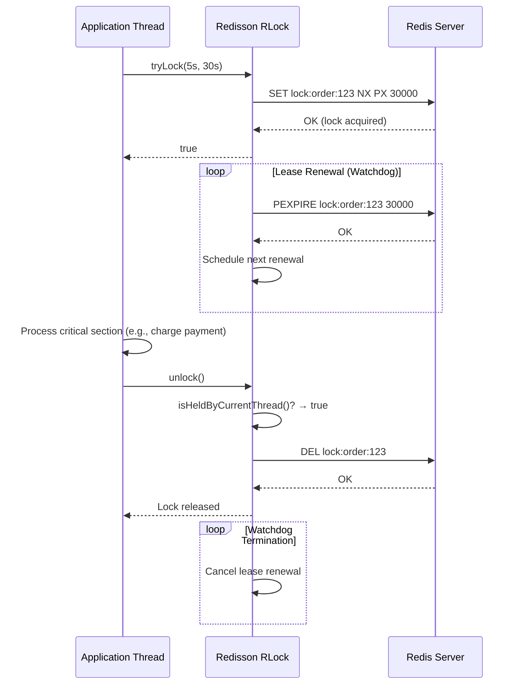
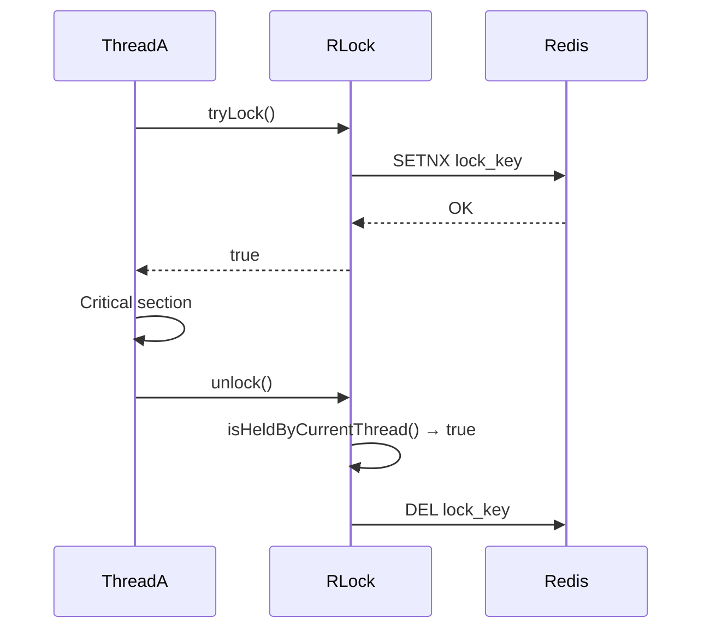
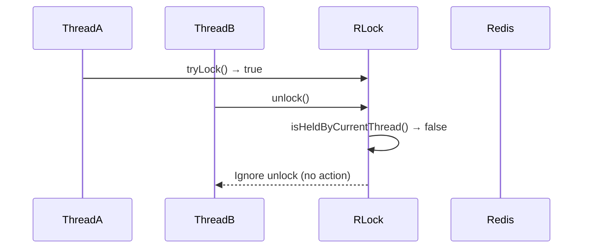
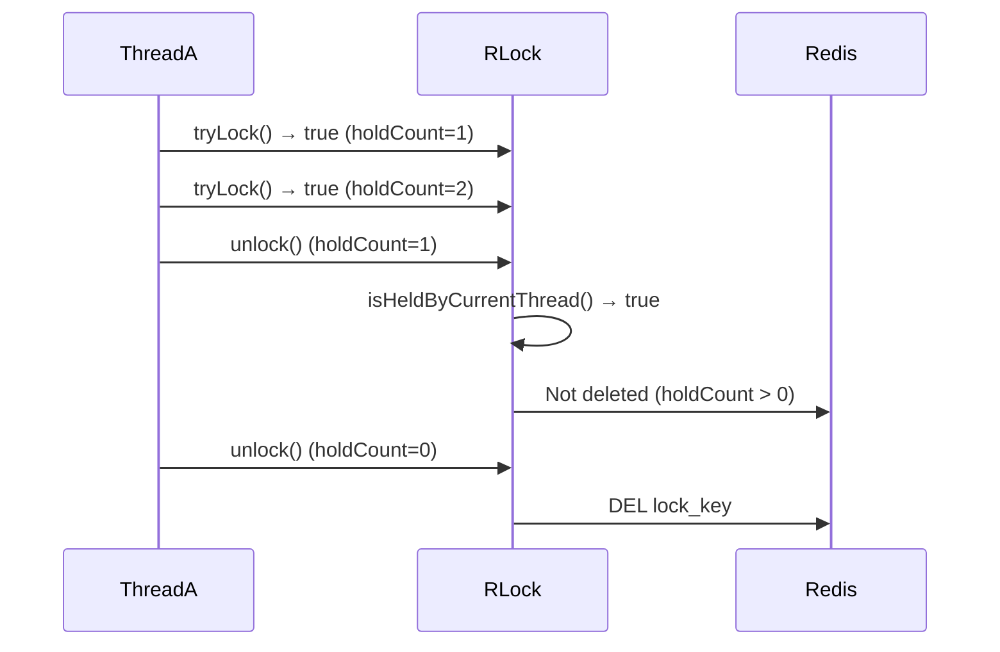
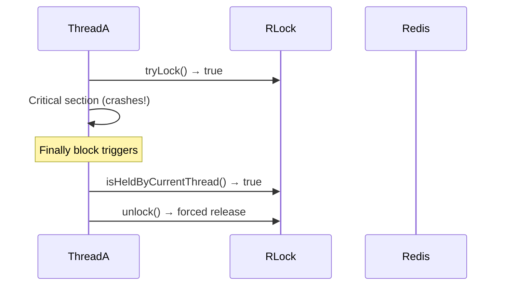
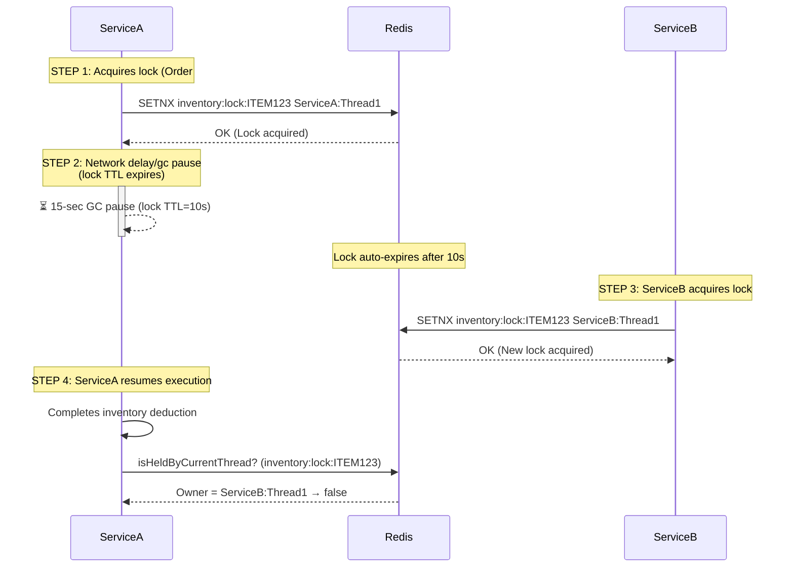
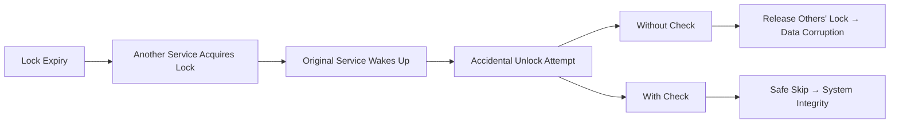

### Learning Spring Boot with and without Redisson

#### **1. Core Concepts**
- **Spring Boot**: Java framework simplifying standalone app creation with embedded servers.
- **Redisson**: Java client for Redis providing distributed objects (locks, maps, queues) and services.

#### **2. Key Differences: With vs. Without Redisson**

| **Feature**               | **Without Redisson**                          | **With Redisson**                              |
|---------------------------|-----------------------------------------------|------------------------------------------------|
| **Distributed Lock**      | Manual implementation (e.g., `SET key NX EX`) | Built-in `RLock` with auto-renewal, reentrancy |
| **Caching**               | Spring `@Cacheable` (simple key-value)        | Advanced `RMapCache` with TTL per entry        |
| **Pub/Sub**               | Basic `RedisTemplate` channels                | `RTopic` with reliable message delivery        |
| **Collections**           | Standard Redis collections                    | Distributed Java objects (`RList`, `RSet`)     |
| **Code Complexity**       | Higher (manual logic for locks, retries)      | Lower (pre-built thread-safe APIs)             |
| **Performance**           | Good for simple cases                         | Optimized for distributed scenarios            |
| **Reentrant Locks**       | Not supported natively                        | Native support                                 |
| **Lock Lease Renewal**    | Manual implementation                         | Automatic (watchdog)                           |

---

### **Without Redisson Example**
#### Distributed Lock using Spring Data Redis
```java
@Service
public class SimpleLockService {
    @Autowired
    private RedisTemplate<String, String> redisTemplate;

    public boolean acquireLock(String key, String value, long expireSeconds) {
        return redisTemplate.opsForValue()
            .setIfAbsent(key, value, Duration.ofSeconds(expireSeconds));
    }

    public void releaseLock(String key) {
        redisTemplate.delete(key);
    }
}

// Usage
public void processOrder(String orderId) {
    String lockKey = "lock:order:" + orderId;
    if (simpleLockService.acquireLock(lockKey, "locked", 30)) {
        try {
            // Business logic
        } finally {
            simpleLockService.releaseLock(lockKey);
        }
    }
}
```
**Limitations**: 
- No auto-renewal for long operations
- Risk of deadlocks if expiration isn't set
- Not reentrant

---

### **With Redisson Example**
#### Distributed Lock & Cached Map
```java
@Configuration
public class RedissonConfig {
    @Bean
    public RedissonClient redissonClient() {
        Config config = new Config();
        config.useSingleServer().setAddress("redis://127.0.0.1:6379");
        return Redisson.create(config);
    }
}

@Service
public class OrderService {
    @Autowired
    private RedissonClient redissonClient;

    public void processOrder(String orderId) {
        RLock lock = redissonClient.getLock("lock:order:" + orderId);
        try {
            if (lock.tryLock(10, 60, TimeUnit.SECONDS)) {
                // Business logic (lock auto-renews)
            }
        } finally {
            if (lock.isLocked() && lock.isHeldByCurrentThread()) {
                lock.unlock();
            }
        }
    }

    // Advanced cache with per-entry TTL
    public void cacheProduct(Product product) {
        RMapCache<String, Product> cache = redissonClient.getMapCache("products");
        cache.put(product.getId(), product, 2, TimeUnit.HOURS); // TTL=2h
    }
}
```
**Advantages**:
- Automatic lock renewal (no expiry during operations)
- Reentrant locks (same thread can relock)
- Thread-safe distributed collections

---

### **When to Use Redisson**
1. **Distributed Locks**: Critical for cluster-safe operations (e.g., inventory deduction).
2. **Shared State**: Distributed queues (`RQueue`), maps (`RMap`), or rate limiters.
3. **Complex Caching**: TTL per entry, eviction listeners.
4. **High Reliability**: Pub/Sub with delivery guarantees.

### **When Spring Data Redis Suffices**
1. **Simple Caching**: Basic key-value stores.
2. **Non-Critical Locks**: Best-effort locking (e.g., cache warming).
3. **Minimal Dependencies**: Avoiding extra libraries.

---

### **Setup Guide**
#### **Dependencies (pom.xml)**
```xml
<!-- Without Redisson -->
<dependency>
    <groupId>org.springframework.boot</groupId>
    <artifactId>spring-boot-starter-data-redis</artifactId>
</dependency>

<!-- With Redisson -->
<dependency>
    <groupId>org.redisson</groupId>
    <artifactId>redisson-spring-boot-starter</artifactId>
    <version>3.23.2</version>
</dependency>
```

#### **application.properties**
```properties
# Both approaches
spring.redis.host=localhost
spring.redis.port=6379
```

---

### **Best Practices**
1. **Always set lock timeouts** (prevent deadlocks).
2. **Use `try-finally`** for lock release.
3. **Test failure scenarios**: Simulate Redis downtime.
4. **Monitor**: Track lock wait times and cache hit rates.

### **Final Recommendation**
- **Use Redisson** for distributed systems needing reliability (ecommerce, inventory).
- **Stick to Spring Data Redis** for simple caching or non-critical tasks.

Learn more:  
[Redisson Documentation](https://redisson.org/)  
[Spring Data Redis](https://spring.io/projects/spring-data-redis)

### Deep Dive: Distributed Locking in Spring Boot with vs. without Redisson

Distributed locks are critical in clustered environments to prevent race conditions (e.g., inventory overselling, duplicate processing). Below is a focused comparison:

---

#### **1. Lock Implementation Comparison**
| **Feature**               | **Without Redisson**                          | **With Redisson**                              |
|---------------------------|-----------------------------------------------|------------------------------------------------|
| **Lock Acquisition**      | Manual `SET key NX EX` commands               | Single `RLock.tryLock()` call                  |
| **Reentrancy**            | Not supported                                 | Native support (same thread relocks)           |
| **Lease Renewal**         | Manual TTL refresh required                   | Automatic (watchdog thread)                    |
| **Unlock Safety**         | Risk of releasing others' locks              | Thread ownership validation                    |
| **Fair Locking**          | Not possible                                  | Supported via `RFairLock`                      |
| **Wait Timeout**          | Manual polling/retry logic                    | Built-in `tryLock(waitTime, leaseTime)`        |
| **Deadlock Resilience**   | Low (expiry dependent on TTL accuracy)        | High (automatic release on app/node failure)   |

---

#### **2. Without Redisson: Manual Lock Implementation**
```java
@Service
public class ManualRedisLock {
    private final RedisTemplate<String, String> redisTemplate;
    
    // Acquire lock (NX = Only set if not exists)
    public boolean tryLock(String key, String clientId, long ttlSec) {
        return Boolean.TRUE.equals(
            redisTemplate.opsForValue()
                .setIfAbsent(key, clientId, Duration.ofSeconds(ttlSec))
        );
    }

    // Release lock (validate owner)
    public void unlock(String key, String clientId) {
        String script = 
            "if redis.call('get',KEYS[1]) == ARGV[1] then " +
            "   return redis.call('del',KEYS[1]) " +
            "else " +
            "   return 0 " +
            "end";
        
        redisTemplate.execute(
            new DefaultRedisScript<>(script, Long.class),
            Collections.singletonList(key),
            clientId
        );
    }
}
```

**Pain Points:**
- **Lease Expiration Risk:**  
  If business logic exceeds TTL, other clients can acquire the lock.
- **No Reentrancy:**  
  Same thread can't re-enter locked code.
- **Complex Error Handling:**  
  Requires manual retries, backoffs, and lock state checks.
- **Atomicity Challenges:**  
  Unlock requires Lua scripts for safety.

---

#### **3. With Redisson: Production-Ready Locking**
```java
@Service
public class OrderService {
    private final RedissonClient redisson;

    public void processPayment(String orderId) {
        RLock lock = redisson.getLock("order:lock:" + orderId);
        try {
            // Wait max 5s, auto-release after 30s if unlocked
            if (lock.tryLock(5, 30, TimeUnit.SECONDS)) {
                // Critical section
                paymentService.charge(orderId);
            }
        } finally {
            if (lock.isHeldByCurrentThread()) {
                lock.unlock();
            }
        }
    }
}
```

**Advantages:**
- **Automatic Lease Renewal:**  
  Watchdog thread extends lock TTL during long operations.
- **Reentrancy:**  
  Same thread can call `lock.tryLock()` multiple times.
- **Lock Continuity:**  
  Survives Redis connection blips (retries internally).
- **Advanced Options:**  
  - Fair locks (`redisson.getFairLock()`)  
  - ReadWrite locks (`redisson.getReadWriteLock()`)  
  - MultiLock for across multiple keys

---

#### **4. Scenarios: When to Use Which?**

**Use Manual Locks When:**
- Lock duration is very short (< 100ms)
- Simple use cases (e.g., cache warming)
- Cannot add new dependencies
- Lock ownership checks aren't critical

**Use Redisson When:**
- Locking business logic > 1 second
- Reentrancy needed (e.g., nested service calls)
- High contention scenarios (many lock requests)
- Require fail-safe unlock (app crashes/network issues)
- Fair queuing for locks required

---

#### **5. Performance Considerations**
- **Redisson Overhead:**  
  ~5-10% higher latency due to watchdog/thread management.  
  *Worth it for correctness in distributed systems!*
  
- **Manual Lock Risks:**  
  - TTL too short → Premature lock loss  
  - TTL too long → Deadlock during failures  
  - Unlock collisions → Data corruption

---

#### **Final Recommendation**
For mission-critical systems, **Redisson is superior** due to:
1. Automatic lease renewal
2. Battle-tested lock reliability
3. Reentrancy support
4. Simplified error handling

**Manual locking only for trivial/transient operations.** Use Redisson's `RLock` for inventory management, financial transactions, or any state-mutating operations.

> 💡 **Pro Tip:** Combine with `@Transactional` for DB + lock consistency:  
> 1. Acquire lock  
> 2. Start DB transaction  
> 3. Commit DB transaction  
> 4. Release lock
>
> ### Why Use `isHeldByCurrentThread()` in Redisson Locks?

The `lock.isHeldByCurrentThread()` check ensures thread safety when releasing locks by:
1. **Preventing Illegal Unlock Attempts**  
   Avoids releasing locks owned by other threads (critical in high-concurrency scenarios).
2. **Handling Reentrant Locks**  
   Safely manages nested lock acquisitions (same thread locking multiple times).
3. **Exception Safety**  
   Guarantees cleanup code only releases locks actually held by the current thread.

---

### Mermaid Sequence Diagram: Lock Lifecycle with Redisson



---

### Key Scenarios Explained

#### 1. **Successful Lock Acquisition & Release**


#### 2. **Preventing Wrong Thread Unlock**


#### 3. **Reentrant Lock Handling**


#### 4. **Exception During Operation**


---

### Why This Matters in Production

1. **Avoid Race Conditions**  
   Prevents Thread A from releasing Thread B's lock after network delays.
   
2. **Handle Application Failures**  
   Ensures locks are released even during unexpected errors (OOM, crashes).

3. **Support Complex Workflows**  
   Enables safe nested locking patterns:
   ```java
   public void nestedMethod() {
       if (lock.tryLock()) {
           try {
               // Can call other locked methods safely
               innerMethod();
           } finally {
               if (lock.isHeldByCurrentThread()) {
                   lock.unlock();
               }
           }
       }
   }
   
   public void innerMethod() {
       if (lock.tryLock()) {  // Reentrant acquisition
           try { /* ... */ } 
           finally { 
               if (lock.isHeldByCurrentThread()) lock.unlock();
           }
       }
   }
   ```

---

### Best Practice Always Include:
```java
finally {
    if (lock.isHeldByCurrentThread()) {
        lock.unlock();
    }
}
```
This simple check prevents:
- `IllegalMonitorStateException`
- Accidental lock releases
- Deadlocks from orphaned locks
- Concurrency bugs in distributed systems

### Business Case: Why `lock.isHeldByCurrentThread()` Returns `false`

#### Scenario: **E-commerce Inventory Deduction**
Imagine a distributed system where:
1. **Service A** (Node 1) processes an order for the last item in stock
2. **Service B** (Node 2) tries to process the same item simultaneously



### Critical Failure Sequence:
1. ServiceA acquires lock (`ServiceA:Thread1`)
2. ServiceA experiences 15-sec GC pause (lock TTL=10 sec)
3. Lock expires automatically in Redis
4. ServiceB acquires the same lock (`ServiceB:Thread1`)
5. ServiceA wakes up and tries to release lock in `finally` block:
   ```java
   if (lock.isHeldByCurrentThread()) { // ← RETURNS FALSE!
       lock.unlock(); // ← SKIPPED!
   }
   ```
6. **Result:** ServiceB's lock remains active → **double inventory deduction**

---

### Why This Happens: The Race Condition
| Time | ServiceA (Node 1) | Redis State | ServiceB (Node 2) |
|------|-------------------|-------------|-------------------|
| t=0  | `lock.tryLock()` → success | `inventory:lock:ITEM123 = ServiceA:Thread1 (TTL 10s)` | Waiting |
| t=9  | GC pause starts | ⏳ | `lock.tryLock()` → waiting |
| t=10 | Still paused | **LOCK EXPIRED** | `lock.tryLock()` → success! |
| t=11 | Still paused | `inventory:lock:ITEM123 = ServiceB:Thread1` | Processing order |
| t=15 | Resumes processing | Lock owned by ServiceB | Still processing |
| t=16 | Tries to unlock → `isHeldByCurrentThread() = false` | ❌ Unlock skipped | Continues processing |

---

### Business Impact Without `isHeldByCurrentThread` Check
If you **didn't** use the check:
```java
// DANGEROUS CODE
try {
    lock.tryLock();
    // ...
} finally {
    lock.unlock(); // ← Would release ServiceB's lock!
}
```

**Consequences:**
1. ServiceA would forcibly delete ServiceB's lock
2. ServiceC could acquire the lock immediately
3. **Three services simultaneously deduct inventory:**
   - Physical inventory: 1 item
   - Orders processed: 3 → **$20,000 overselling loss**
   - Angry customers, chargebacks, inventory reconciliation nightmare

---

### Real-World Prevention Cases
1. **Financial Transactions**  
   `isHeldByCurrentThread()` prevents double-spending when:
   - Payment service loses lock mid-transaction
   - Reconciliation process tries to "clean up"

2. **Inventory Management**  
   Catches locks lost during:
   - Cloud VM hibernation
   - Network partitioning
   - Long garbage collection pauses

3. **Distributed Batch Processing**  
   Prevents job duplication when workers time out

---

### Key Takeaway
`lock.isHeldByCurrentThread()` is your **safety net** against:


Always use this check to:
1. Maintain lock ownership integrity
2. Prevent distributed heisenbugs
3. Avoid business logic catastrophes
4. Ensure only valid threads release locks


https://github.com/redisson/redisson/blob/master/redisson/src/main/java/org/redisson/Redisson.java
https://github.com/redisson/redisson/blob/master/redisson/src/main/java/org/redisson/RedissonLock.java
https://github.com/redisson/redisson/blob/master/redisson/src/main/java/org/redisson/RedissonBaseLock.java


在 Java 中，虽然 `try-finally` 是释放锁的标准做法，但在分布式环境下，这种简单的写法隐藏着几个**致命陷阱**。

以下是 Java 实现 Redis 分布式锁时最常见的坑以及解决方案：

---

### 1. 释放了不属于自己的锁（锁误删）

这是最经典的问题。

* **场景：**
1. 线程 A 获取了锁，设置超时时间 10 秒。
2. 线程 A 遇到了严重的 **Full GC**（STW 停顿），导致处理时间超过了 10 秒。
3. Redis 自动删除了线程 A 的锁。
4. 线程 B 乘虚而入，获取了同一个锁。
5. 线程 A 恢复运行，执行 `finally { unlock(); }`，结果把**线程 B 的锁**给删了。


* **解决方案：** 在 `unlock()` 时必须校验锁的 `Value`。加锁时存入一个唯一的 `UUID` 或 `ThreadID`，释放时通过 **Lua 脚本**原子性地“校验并删除”。

### 2. `finally` 中的空指针或非法状态

如果你的 `lock()` 方法抛出异常，或者 `tryLock()` 返回了 `false`，进入 `finally` 块时直接调用 `unlock()` 会导致错误。

* **场景：** 没拿到锁也去执行释放逻辑。
* **解决方案：**
```java
boolean isLocked = false;
try {
    isLocked = lock.tryLock(10, 30, TimeUnit.SECONDS);
    if (isLocked) {
        // 执行业务逻辑
    }
} finally {
    // 只有获取锁成功才释放，且需判断当前线程是否还持有锁
    if (isLocked && lock.isHeldByCurrentThread()) {
        lock.unlock();
    }
}

```


### 3. 可重入性问题 (Reentrancy)

Java 的 `ReentrantLock` 是可重入的，但简单的 Redis `SET NX` 锁通常**不可重入**。

* **场景：** `MethodA` 拿到了锁，随后调用了 `MethodB`，而 `MethodB` 也尝试获取同一个锁。
* **后果：** 线程会把自己锁死（死锁）。
* **解决方案：** 使用 Redis 的 **Hash 结构**来存储锁，Key 是锁名称，Field 是 `ThreadID`，Value 是 `重入次数`。

### 4. 守护线程与锁续期 (Watchdog)

如果业务逻辑执行时间不确定，给锁设置多长的 TTL（过期时间）都不安全。

* **场景：** TTL 太短，业务没执行完锁就丢了；TTL 太长，如果程序宕机，锁长时间不释放。
* **解决方案：** 引入**看门狗 (Watchdog)** 机制。在锁即将过期时，由一个后台线程自动给锁“续命”。

---

### 5. 最佳实践：使用 Redisson

手动用 `Jedis` 或 `Lettuce` 写出完美的分布式锁非常困难。在 Java 生态中，**Redisson** 是公认的工业级标准方案。

它完美解决了上述所有问题：

* **原子性：** 全部基于 Lua 脚本。
* **看门狗：** 自动续期，防止业务没跑完锁过期。
* **可重入：** 支持像 `ReentrantLock` 一样的重入逻辑。
* **公平性：** 支持公平锁（Fair Lock）。

#### Redisson 标准写法示例：

```java
RLock lock = redissonClient.getLock("order_lock");
try {
    // 1. 尝试加锁，最多等待 10 秒，上锁后 30 秒自动解锁（如果看门狗开启则自动续期）
    boolean isLocked = lock.tryLock(10, 30, TimeUnit.SECONDS);
    if (isLocked) {
        // 2. 执行核心业务逻辑
    }
} catch (InterruptedException e) {
    Thread.currentThread().interrupt(); // 处理中断
} finally {
    // 3. 只有持有锁的线程才能释放锁
    if (lock.isHeldByCurrentThread()) {
        lock.unlock();
    }
}

```

---

### 总结建议

| 维度 | 普通 `SET NX` 实现 | Redisson 实现 |
| --- | --- | --- |
| **原子性** | 需手动写 Lua 脚本 | 内置支持 |
| **误删风险** | 高（需手动比对 UUID） | 低（内部自动处理） |
| **可重入性** | 不支持（需自己改 Hash 结构） | 原生支持 |
| **续期机制** | 无（容易导致并发冲突） | 自动看门狗机制 |
| **复杂场景** | 难以实现（红锁、读写锁） | 现成组件 |

**您目前是在使用原生的 Jedis/Lettuce 手写锁逻辑，还是已经集成了 Redisson 框架？** 如果需要，我可以为您展示如何手写那个用于安全释放锁的 **Lua 脚本**。
