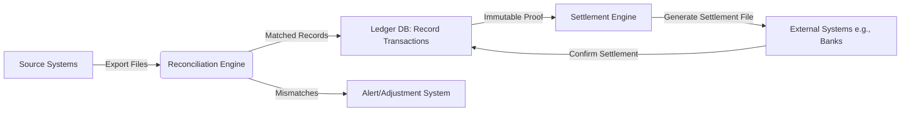

Yes, I'm familiar with **ledger database solutions**. These are specialized databases designed to provide **cryptographically verifiable, immutable, and transparent records** of data changes—ideal for scenarios requiring strong audit trails, compliance, or tamper evidence (e.g., financial transactions, supply chains, regulatory records).

Here's a comparison of leading solutions:

### 1. **Cloud-Managed Ledger Databases**
   - **Amazon QLDB (Quantum Ledger Database)**  
     - **Key Feature**: Uses an immutable transaction log with cryptographic hashing (SHA-256) for verifiable data history.  
     - **Pros**: Serverless, easy AWS integration, SQL-like querying (PartiQL).  
     - **Cons**: Vendor lock-in to AWS.  
     - **Use Case**: Auditing financial records, supply chain tracking.

   - **Azure SQL Ledger**  
     - **Key Feature**: Extends SQL Server/Azure SQL with blockchain-style tamper evidence.  
     - **Pros**: Full SQL compatibility, integrates with existing SQL workflows.  
     - **Cons**: Azure-only, limited to SQL Server ecosystem.  
     - **Use Case**: Compliance-heavy applications in Azure environments.

### 2. **Blockchain-Based Ledger Databases**
   - **ProvenanceDB**  
     - **Key Feature**: Combines traditional RDBMS with blockchain immutability.  
     - **Pros**: Supports SQL queries while providing cryptographic audit trails.  
     - **Cons**: Less mainstream than cloud options.  

   - **Hyperledger Fabric**  
     - **Key Feature**: Enterprise-grade permissioned blockchain framework.  
     - **Pros**: Highly modular, supports private transactions.  
     - **Cons**: Steeper learning curve; requires blockchain expertise.  
     - **Use Case**: Multi-party business networks (e.g., trade finance).

### 3. **PostgreSQL Extensions**
   - **PG_Ledger**  
     - Adds ledger capabilities to PostgreSQL via extensions.  
     - **Pros**: Open-source, avoids cloud lock-in.  
     - **Cons**: Self-managed, requires setup effort.  

   - **Zerover**  
     - PostgreSQL extension for cryptographic data integrity.  
     - **Pros**: Lightweight, integrates with existing PostgreSQL infra.  

### 4. **Specialized Ledger Systems**
   - **Trillian** (Google)  
     - **Key Feature**: A transparent, append-only log system (used for Certificate Transparency).  
     - **Pros**: Battle-tested for security, supports Merkle trees.  
     - **Cons**: Lower-level; needs integration effort.  

   - **Immudb**  
     - **Key Feature**: Open-source immutable database with cryptographic verification.  
     - **Pros**: High performance, supports key-value and SQL.  
     - **Cons**: Less mature for complex enterprise use.  

---

### **Key Considerations When Choosing**
- **Trust Model**: Public/private verification? (Blockchain vs. centralized ledger)  
- **Compliance**: Does it meet regulations like GDPR, HIPAA, or SOX?  
- **Integration**: Compatibility with existing infrastructure (cloud, on-prem, databases).  
- **Query Flexibility**: SQL support vs. custom query languages.  
- **Cost**: Managed services (QLDB/Azure) vs. self-hosted (PostgreSQL extensions).  

For most enterprises, **Amazon QLDB** or **Azure SQL Ledger** offer the quickest path to production. If decentralization is critical, **Hyperledger Fabric** or **Immudb** are strong choices. For PostgreSQL-centric stacks, explore **PG_Ledger** or **Zerover**.

Need help narrowing down based on your use case? Share more about your project (e.g., cloud provider, compliance needs), and I can refine recommendations!

Integrating reconciliation and settlement files with a **ledger database** is a powerful approach to automate financial workflows, ensure accuracy, and provide cryptographic proof for audits. Here’s how to design such a system and which ledger solutions fit best:

---

### **Key Components of Integration**
1. **Reconciliation**  
   - Compares transaction records (e.g., bank statements vs. internal records) to identify mismatches.  
2. **Settlement**  
   - Finalizes transactions by moving funds/assets between parties.  
3. **Ledger Database**  
   - Immutably records all steps, providing a tamper-proof audit trail.  

---

### **Architecture Workflow**

---

### **Best-Fit Ledger Database Solutions**
1. **Amazon QLDB**  
   - **Why**: Built-in cryptographic verification (SHA-256 hashing) and SQL-like queries.  
   - **Integration**:  
     - Use AWS Lambda to process reconciliation files (CSV/XML) → write matched transactions to QLDB.  
     - Settlement files generated via QLDB exports (to S3) with proof attached.  
   - **Use Case**: Payment processors reconciling daily transactions.  

2. **Azure SQL Ledger**  
   - **Why**: Combines SQL Server with blockchain-style tamper evidence.  
   - **Integration**:  
     - Use Azure Data Factory to ingest reconciliation files → validate via T-SQL.  
     - Settlement files signed via built-in cryptographic digests.  
   - **Use Case**: Financial institutions needing SQL compliance (e.g., SOX).  

3. **Immudb**  
   - **Why**: Open-source, high-speed, with cryptographic verification for every entry.  
   - **Integration**:  
     - Scripts (Python/Go) parse files → insert data via Immudb SDK.  
     - Export settlement files with embedded Merkle tree proofs.  
   - **Use Case**: Crypto exchanges or fintechs avoiding cloud lock-in.  

4. **Hyperledger Fabric**  
   - **Why**: For multi-party reconciliation (e.g., between banks, merchants).  
   - **Integration**:  
     - Smart contracts validate reconciliation rules.  
     - Settlement files cryptographically signed by all parties.  
   - **Use Case**: Cross-border payments involving multiple institutions.  

---

### **Critical Implementation Steps**
1. **Ingest & Validate Files**  
   - Use tools like **Apache NiFi** or cloud services (AWS Glue/Azure Data Factory) to ingest CSV/XML files.  
   - Validate schema/amounts before ledger writes.  

2. **Reconciliation Logic**  
   - Rules Engine (e.g., **Drools** or cloud-native solutions) to match transactions.  
   - Flag mismatches → trigger alerts or manual review.  

3. **Write to Ledger DB**  
   - Record **all actions** immutably:  
     - Original file hashes.  
     - Reconciliation results (matched/mismatched).  
     - Settlement instructions.  

4. **Generate Settlement Files**  
   - Export ledger-verified data to formatted files (e.g., ISO 20022 XML).  
   - Attach cryptographic proof (e.g., QLDB’s `proof` API or Immudb’s `verifiable export`).  

5. **Audit & Verification**  
   - Auditors verify files against ledger proofs without needing the DB.  
   - Use tools like QLDB’s **PartiQL Explorer** or Immudb’s **verification SDKs**.  

---

### **Benefits of Ledger Integration**
- **Automated Trust**: No manual reconciliation; cryptographic proof ensures data integrity.  
- **Regulatory Compliance**: Immutable records satisfy SOX, PCI-DSS, MiFID II.  
- **Dispute Resolution**: Prove transaction history in seconds.  
- **Cost Reduction**: Eliminate reconciliation errors (saves 5–20% in operational costs).  

---

### **Example Tools Stack**
| Component          | Open-Source              | Cloud-Managed               |
|--------------------|--------------------------|----------------------------|
| **File Processing**| Apache NiFi, Spark       | AWS Glue, Azure Data Factory |
| **Rules Engine**   | Drools, Camunda          | AWS Step Functions          |
| **Ledger DB**      | Immudb, Hyperledger Fabric | Amazon QLDB, Azure SQL Ledger |
| **Export/Signing** | OpenSSL, Libsodium       | AWS Signer, Azure Key Vault |

---

### **Real-World Use Case: Payment Gateway**
1. **Reconciliation**:  
   - Match daily Stripe/PayPal reports against internal orders.  
2. **Ledger Recording**:  
   - Write matched transactions to **QLDB** with timestamps.  
3. **Settlement**:  
   - Generate ACH/SEPA files from QLDB → send to banks.  
4. **Proof**:  
   - Share QLDB’s transaction proof with auditors via S3.  

---

**Need a hands-on PoC?** Describe your current stack (e.g., files in S3, on-prem databases) and compliance needs — I’ll sketch an architecture!
