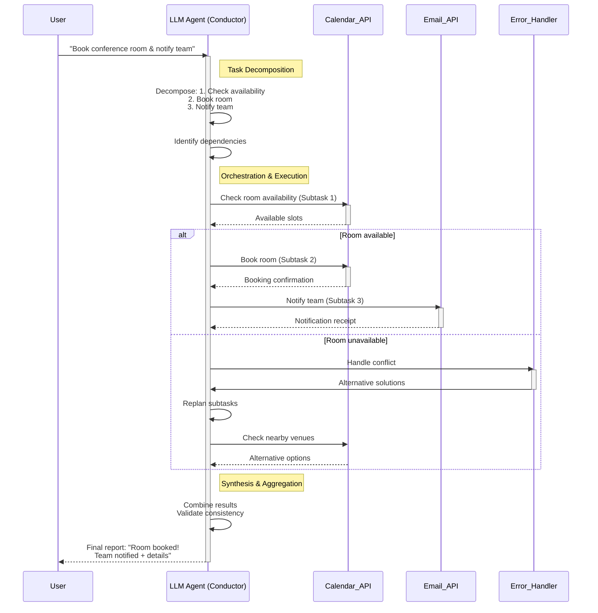
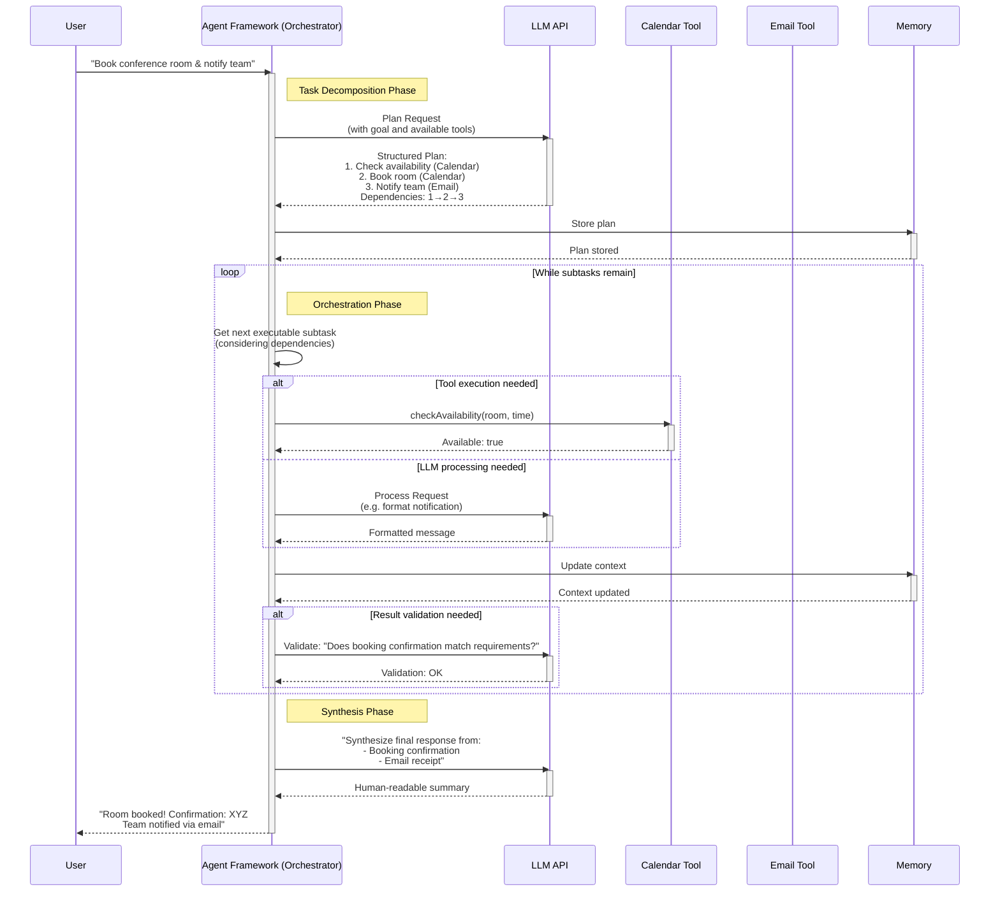
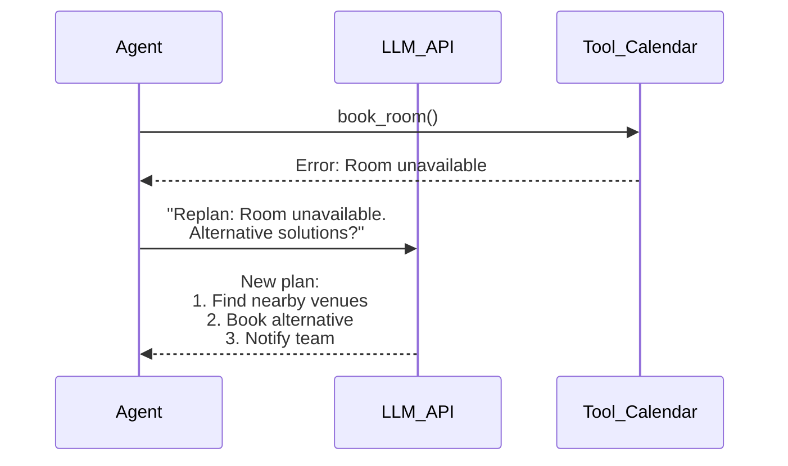

Yes, LLM-based agents can process and orchestrate subtasks in a manner analogous to a conductor leading an orchestra. Here's how it typically works, broken down into key stages:

### 1. **Task Decomposition**
   - **Mechanism**: The agent breaks a complex goal into smaller, manageable subtasks using techniques like:
     - **Chain-of-Thought (CoT)**: Step-by-step reasoning to split tasks.
     - **Tree-of-Thought (ToT)**: Exploring multiple reasoning paths.
     - **LLM function calls**: Programmatic decomposition (e.g., "Plan: [subtask1, subtask2, ...]").
   - **Example**:  
     *Goal: "Analyze climate change impacts in Paris."*  
     → Subtasks:  
     &nbsp;&nbsp;1. Fetch Paris' temperature data (1990-2023).  
     &nbsp;&nbsp;2. Retrieve precipitation trends.  
     &nbsp;&nbsp;3. Summarize key findings.

### 2. **Orchestration & Scheduling**
   - **Dependency Management**: Subtasks are ordered based on dependencies (e.g., data from subtask A is needed for subtask B).
   - **Parallelism**: Independent subtasks run concurrently (e.g., querying multiple APIs simultaneously).
   - **Tools Used**:  
     - **Workflow engines** (LangChain, AutoGen, CrewAI).  
     - **State tracking** (memory, context windows).  
     - **Priority queues** for task sequencing.

### 3. **Execution**
   - **Tool Integration**: Subtasks are routed to specialized tools:  
     - *APIs* (fetch data).  
     - *Code interpreters* (analyze datasets).  
     - *Search* (find research papers).  
   - **Autonomous Loops**: Agents self-correct using ReAct (Reason+Act) or Reflexion frameworks:  
     ```plaintext
     [Action] → [Observation] → [Reflection] → [Revised Action]  
     ```

### 4. **Synchronization & Aggregation**
   - **Results Collation**: Outputs from subtasks are combined (e.g., merging data from temperature/precipitation APIs).
   - **Conflict Resolution**: Handling inconsistent results (e.g., voting across multiple agents).
   - **Final Synthesis**: Generating cohesive output (e.g., a climate report).

### Example Workflow: *"Book a conference room + notify team"*
1. **Decompose**:  
   - Sub1: Check room availability (Calendar API).  
   - Sub2: Book room (if available).  
   - Sub3: Notify team (Email API).  
2. **Orchestrate**:  
   - Run Sub1 → If success, trigger Sub2 → then Sub3.  
   - If Sub1 fails, replan ("Find nearby venues").  
3. **Execute**:  
   - APIs handle each step; LLM validates outputs.  
4. **Synthesize**:  
   - Final confirmation: "Room booked! Team notified."

### Key Technologies Enabling This
- **Frameworks**: LangChain, LlamaIndex, AutoGen.  
- **Memory**: Vector databases (chromaDB) for context retention.  
- **Toolkits**: Custom functions (e.g., Python code executors).  
- **LLM Role**: As the "conductor," it coordinates tools, reroutes on errors, and ensures alignment with the goal.

Agents achieve this through **iterative planning-execution cycles**, mimicking human-like problem-solving while leveraging computational scalability. This orchestration turns standalone LLMs into dynamic systems capable of complex, multi-step operations.


Here's a sequence diagram illustrating how an LLM agent orchestrates subtasks using the conference room booking example. The diagram shows task decomposition, parallel execution, error handling, and synthesis:



### Key Components Explained:
1. **Task Decomposition Phase** (Yellow Note):
   - Agent breaks user request into 3 dependent subtasks
   - Identifies sequential dependencies (booking requires availability check)

2. **Orchestration & Execution** (Blue Note):
   - Sequential execution of dependent subtasks
   - Parallel execution possible for independent tasks (not shown here)
   - Error handling loop when room unavailable

3. **Error Recovery Path** (Dotted Lines):
   - When primary task fails, agent:
     1. Invokes error handler
     2. Receives alternative solutions
     3. Replans subtasks dynamically
     4. Executes fallback action

4. **Synthesis Phase** (Green Note):
   - Combines outputs from all subtasks
   - Validates consistency (e.g., ensures booking ID matches notification)
   - Generates human-friendly summary

### Real-Time Agent Operations:
- **Dependency Management**: Subtask 2 waits for Subtask 1 completion
- **State Tracking**: Maintains context (room details, team emails) across subtasks
- **Tool Routing**: Directs specific subtasks to appropriate tools (Calendar/Email APIs)
- **Self-Correction**: When primary booking fails, switches to venue-finding mode

This mirrors how frameworks like LangChain or AutoGen handle workflows: the LLM agent acts as central coordinator while specialized tools execute concrete actions, with continuous validation between steps.


You're absolutely right – the previous diagram oversimplified the distinction between the LLM API and the agent framework. Let me create a more accurate sequence diagram that clearly separates these components and shows task decomposition mechanics:



### Key Improvements & Clarifications:

1. **Explicit Separation**:
   - `Agent Framework`: The orchestration logic (LangChain/AutoGen/CrewAI)
   - `LLM API`: Pure LLM processing (OpenAI/Anthropic/etc.)
   - `Tools`: External capabilities (APIs, databases, etc.)

2. **Task Decomposition Mechanics**:
```python
# Example decomposition prompt to LLM
plan_prompt = f"""
Goal: {user_request}
Available Tools: [Calendar.check_availability, Calendar.book_room, Email.send]
Constraints: Room must seat 10+ people

Output JSON plan with:
- Subtasks with dependencies
- Required tools/inputs
- Validation criteria
"""
```

3. **Orchestration Implementation Logic**:
```python
class Orchestrator:
    def execute_plan(self, plan):
        task_queue = TopologicalSort(plan)  # Handle dependencies
        context = {}
        
        while not task_queue.empty():
            task = task_queue.next_task()
            
            if task.type == "TOOL":
                result = self.execute_tool(task, context)
                context.update({task.output_var: result})
                
            elif task.type == "LLM":
                result = self.llm(task.prompt.format(context))
                context.update({task.output_var: result})
                
            if task.validation:
                self.validate(task, result, context)
```

4. **Dynamic Replanning Path** (not shown in diagram):


### How Decomposition Affects Orchestration:

| Decomposition Approach | Orchestration Requirements | Example Frameworks |
|------------------------|----------------------------|-------------------|
| **Linear Chain**       | Sequential execution       | LangChain SimpleSequentialChain |
| **DAG-based**          | Dependency resolution<br>Parallel execution | AutoGen GroupChat<br>CrewAI TaskGraph |
| **LLM-Generated Plans**| Dynamic replanning<br>State tracking | BabyAGI<br>AutoPlan |
| **Human-in-the-loop**  | Intervention points        | LangChain HumanApprovalCallback |

### Critical Orchestration Components:
1. **State Manager**: Tracks subtask outputs/context
2. **Scheduler**: Resolves dependencies (DAG executor)
3. **Tool Router**: Matches subtasks to capabilities
4. **Error Handler**: Fallback strategies & replanning
5. **Constraints Enforcer**: Validates outputs against rules

This reflects real-world implementations where:
- The agent framework handles workflow state
- LLM is strictly a "reasoning service"
- Tools are abstracted as plugins
- Memory persists context across steps

Would you like me to elaborate on any specific aspect of this workflow?
