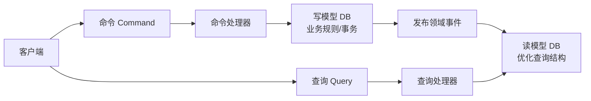
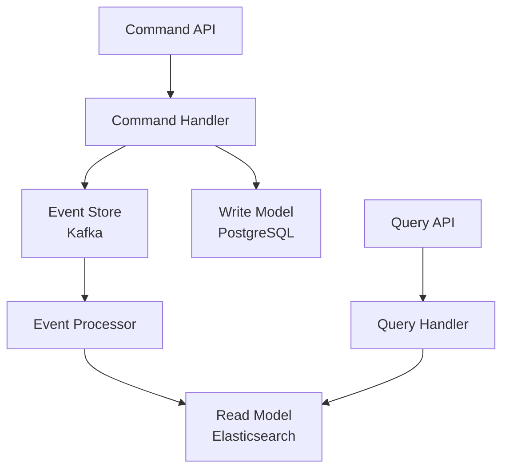

我完全理解你对CQRS模式的兴趣！这种设计确实能解决高性能系统中的关键痛点，但如你所言，**它是一把双刃剑，用对场景威力巨大，滥用则徒增复杂度**。下面我们结合订单报表案例，拆解核心概念和实现要点：

---

### 一、CQRS 核心思想再聚焦


1. **读写彻底分离**
   - **命令侧**：只处理 `Create/Update/Delete`，返回简单结果（成功/失败/ID）
   - **查询侧**：只处理 `Read`，返回DTO/视图模型（**无业务逻辑！**）

2. **独立模型演进**
   - 写模型：围绕**聚合根**设计（如 `OrderAggregate`）
   - 读模型：围绕**展示需求**设计（如 `OrderReportView`）

---

### 二、订单报表场景的CQRS实战

#### ❌ 传统模式的问题
```sql
-- 月度报表查询（拖垮写操作）
SELECT 
  product_id, 
  SUM(quantity), 
  AVG(price) 
FROM orders
JOIN order_items ON ... 
WHERE status='completed'
GROUP BY product_id 
FOR UPDATE; -- 可能触发表的写锁！
```

#### ✅ CQRS 解决方案

**1. 命令侧（写模型）**
```csharp
// 领域模型
public class Order {
    public void CompleteOrder() {
        AddDomainEvent(new OrderCompletedEvent(this)); 
    }
}

// 命令处理器
public class CompleteOrderHandler {
    public void Handle(CompleteOrderCommand cmd) {
        var order = _repo.Get(cmd.OrderId);
        order.Complete();
        _repo.Save(order); // 事务提交
    }
}
```

**2. 事件同步（关键桥梁）**
```csharp
// 领域事件处理器
public class OrderCompletedHandler {
    public void Handle(OrderCompletedEvent e) {
        // 异步更新读模型
        _reportDb.UpdateOrderStats(
            e.OrderId, 
            e.TotalPrice, 
            e.ProductQuantities
        );
    }
}
```

**3. 查询侧（读模型优化）**
```csharp
// 预聚合的报表表结构
public class OrderReport {
    public string Period { get; set; } // 如 "2023-10"
    public int ProductId { get; set; }
    public int TotalQuantity { get; set; }
    public decimal TotalSales { get; set; }
}

// 闪电查询
public ReportResult GetMonthlyReport(string month) {
    return _reportDb.Query<OrderReport>()
        .Where(r => r.Period == month)
        .ToList(); // 无需JOIN，直接查宽表！
}
```

---

### 三、必须掌握的三大关键技术点

1. **数据同步策略**
   - **领域事件 + 消息队列**：Kafka/RabbitMQ 保证至少一次投递
   - **变更数据捕获（CDC）**：Debezium 监听数据库Binlog
   - **双写模式**：事务内同步更新读库（慎用，可能耦合）

2. **最终一致性补偿**
   ```csharp
   // 读模型更新失败的重试机制
   public void Handle(OrderCompletedEvent e) {
       try {
           UpdateReport(e);
       } catch {
           _retryQueue.Push(e, delay: TimeSpan.FromMinutes(5));
       }
   }
   ```

3. **读模型优化技巧**
   - **物化视图**：数据库层自动聚合（PostgreSQL/Materialized Views）
   - **专用索引**：为报表字段建立覆盖索引
   - **冷热分离**：Elasticsearch处理实时查询，Hive处理历史分析

---

### 四、CQRS 的适用边界（避免误用！）

| 场景                | 适合CQRS？ | 原因说明                     |
|---------------------|------------|----------------------------|
| 高频交易订单系统      | ✅          | 写操作密集，报表查询独立       |
| 后台管理CMS         | ❌          | 读写比均衡，无性能瓶颈        |
| 实时数据分析平台     | ✅          | 复杂查询与写入逻辑分离         |
| 小型电商库存管理     | ❌          | 直接CRUD+缓存足矣            |

> 💡 **经验法则**：当你的查询服务需要为了性能而扭曲写模型结构时，就是CQRS的信号！

---

### 五、经典陷阱与应对方案

1. **事件顺序问题**
   - **解法**：在事件中携带版本号（`Version: 142`），读模型按序处理

2. **读模型延迟**
   - **解法**：UI端显示“数据计算中...” + 事件溯源码供追踪

3. **开发复杂度上升**
   - **解法**：使用框架支持（Axon Framework, .NET MediatR）

4. **数据存储爆炸**
   - **解法**：为读模型设置TTL（如只保留2年报表）

---

### 结语：何时该亮出这把利剑？
CQRS不是银弹，但当你在**高并发写入+复杂查询**的战场遇到性能瓶颈时，它会是突破重围的利器。订单报表案例完美展现了其价值——**让写操作专注于业务完整性，让读操作为速度而生**。从简单的事件驱动同步开始实践，逐步深入最终一致性处理，你会感受到架构解耦带来的惊人弹性！


下面是用 Rust 实现 CQRS 模式的完整方案，针对订单报表场景，包含代码示例和关键技术决策：

### 一、架构设计


### 二、核心组件实现

#### 1. 命令侧 (写模型)
**领域模型定义**：
```rust
// 聚合根
pub struct Order {
    pub id: Uuid,
    pub user_id: Uuid,
    pub items: Vec<OrderItem>,
    pub status: OrderStatus,
}

// 领域事件
#[derive(Debug, Clone)]
pub enum OrderEvent {
    Created {
        id: Uuid,
        user_id: Uuid,
        items: Vec<OrderItem>,
    },
    Completed {
        id: Uuid,
        completed_at: DateTime<Utc>,
    },
    Cancelled {
        id: Uuid,
        reason: String,
    },
}

// 命令
pub enum OrderCommand {
    CreateOrder {
        user_id: Uuid,
        items: Vec<OrderItem>,
    },
    CompleteOrder(Uuid),
    CancelOrder {
        id: Uuid,
        reason: String,
    },
}
```

**命令处理器**：
```rust
impl Order {
    pub fn execute(command: OrderCommand) -> Result<Vec<OrderEvent>, OrderError> {
        match command {
            OrderCommand::CreateOrder { user_id, items } => {
                // 业务规则验证
                if items.is_empty() {
                    return Err(OrderError::EmptyItems);
                }
                Ok(vec![OrderEvent::Created {
                    id: Uuid::new_v4(),
                    user_id,
                    items,
                }])
            }
            
            OrderCommand::CompleteOrder(id) => {
                // 从事件溯源加载当前状态
                let current = Order::load_from_events(id)?;
                if current.status != OrderStatus::Pending {
                    return Err(OrderError::InvalidState);
                }
                Ok(vec![OrderEvent::Completed {
                    id,
                    completed_at: Utc::now(),
                }])
            }
            
            // 其他命令处理...
        }
    }
}
```

#### 2. 事件处理层
**事件发布**：
```rust
// 使用 Kafka 作为事件总线
pub struct EventPublisher {
    producer: ThreadedProducer<DefaultProducerContext>,
}

impl EventPublisher {
    pub fn publish(&self, events: Vec<OrderEvent>) -> Result<(), EventError> {
        for event in events {
            let payload = serde_json::to_vec(&event)?;
            self.producer.send(FutureRecord::to("order_events")
                .payload(&payload)
                .key(&event.aggregate_id().to_string()));
        }
        Ok(())
    }
}
```

**读模型更新处理器**：
```rust
// 消费事件更新读模型
pub async fn process_events() {
    let mut consumer = create_kafka_consumer();
    consumer.subscribe(&["order_events"])?;

    loop {
        let msg = consumer.poll(Duration::from_secs(1)).transpose()?;
        if let Some(msg) = msg {
            let event: OrderEvent = serde_json::from_slice(msg.payload())?;
            update_read_model(&event).await?;
            consumer.commit_message(&msg, CommitMode::Async)?;
        }
    }
}

async fn update_read_model(event: &OrderEvent) -> Result<(), ReadModelError> {
    match event {
        OrderEvent::Created { id, user_id, items } => {
            let report = OrderReport {
                order_id: *id,
                user_id: *user_id,
                total: items.iter().map(|i| i.price * i.quantity).sum(),
                status: "pending".to_string(),
                // ...其他字段
            };
            elastic_client.index_document(report).await?;
        }
        
        OrderEvent::Completed { id, completed_at } => {
            elastic_client.update_document::<OrderReport>(*id, |doc| {
                doc.status = "completed".to_string();
                doc.completed_at = Some(*completed_at);
            }).await?;
        }
        
        // 其他事件处理...
    }
    Ok(())
}
```

#### 3. 查询侧 (读模型)
**优化查询结构**：
```rust
// Elasticsearch 文档结构
#[derive(Debug, ElasticType, Serialize, Deserialize)]
#[elastic(index = "order_reports")]
pub struct OrderReport {
    #[elastic(id)]
    pub order_id: Uuid,
    pub user_id: Uuid,
    pub total: f64,
    pub status: String,
    pub region: String,
    pub product_ids: Vec<Uuid>,
    pub completed_at: Option<DateTime<Utc>>,
    // 预聚合字段
    pub monthly_key: String, // 格式: "2023-10"
}

// 查询处理器
pub struct ReportQueryHandler {
    elastic_client: ElasticClient,
}

impl ReportQueryHandler {
    pub async fn get_monthly_report(
        &self, 
        year: i32, 
        month: u32
    ) -> Result<Vec<OrderReport>, QueryError> {
        let monthly_key = format!("{}-{:02}", year, month);
        
        let response = self.elastic_client.search(SearchRequest::new()
            .query(Query::term("monthly_key", monthly_key))
            .size(10_000) // 实际应分页
            .send()
            .await?;
        
        // 直接返回预聚合文档
        response.documents()
    }
}
```

### 三、关键技术决策

1. **事件溯源 (Event Sourcing)**
   ```rust
   // 从事件重建聚合状态
   impl Order {
       pub fn load_from_events(id: Uuid) -> Result<Self, OrderError> {
           let events = event_store.get_events(id)?;
           let mut order = Order::default();
           for event in events {
               order.apply(event);
           }
           Ok(order)
       }
       
       fn apply(&mut self, event: OrderEvent) {
           match event {
               OrderEvent::Created { id, user_id, items } => {
                   self.id = id;
                   self.user_id = user_id;
                   self.items = items;
               }
               OrderEvent::Completed { .. } => {
                   self.status = OrderStatus::Completed;
               }
               // 其他事件应用...
           }
       }
   }
   ```

2. **最终一致性保障**
   ```rust
   // 事件处理幂等性
   impl OrderReport {
       pub fn apply_event(&mut self, event: OrderEvent) {
           if self.version >= event.version {
               return; // 跳过已处理事件
           }
           
           match event {
               OrderEvent::Completed { .. } => {
                   self.status = "completed".to_string();
                   self.version = event.version;
               }
               // ...
           }
       }
   }
   ```

3. **读模型优化策略**
   - **预计算字段**：在事件处理时生成 `monthly_key`
   - **嵌套文档**：将订单项嵌入主文档避免 JOIN
   ```rust
   // Elasticsearch 映射优化
   "mappings": {
     "properties": {
       "product_ids": { "type": "keyword" },
       "monthly_key": { "type": "keyword", "index": true },
       "total": { "type": "scaled_float", "scaling_factor": 100 }
     }
   }
   ```

### 四、部署与扩展方案

1. **读写分离部署**
   ```yaml
   # Kubernetes 部署示例
   services:
     command-api:
       replicas: 3  # 根据写负载扩展
       resources: { cpu: 2, memory: 1Gi }
     
     query-api:
       replicas: 10  # 根据查询负载扩展
       resources: { cpu: 1, memory: 2Gi }
     
     event-processor:
       replicas: 5   # 独立扩展事件处理
   ```

2. **存储选择**
   | 组件          | 存储方案             | 理由                          |
   |---------------|---------------------|-------------------------------|
   | 写模型        | PostgreSQL          | ACID 事务，强一致性需求        |
   | 事件存储      | Kafka + S3          | 高吞吐持久化，支持重放         |
   | 读模型        | Elasticsearch       | 复杂聚合查询，毫秒级响应       |
   | 缓存层        | Redis               | 热点报表数据缓存               |

### 五、性能优化技巧

1. **批量事件处理**
   ```rust
   async fn process_event_batch(events: Vec<OrderEvent>) {
       let mut bulk_request = BulkRequest::new();
       for event in events {
           let op = match event {
               OrderEvent::Created {..} => BulkOperation::index(doc),
               _ => BulkOperation::update(id, script),
           };
           bulk_request.push(op);
       }
       elastic_client.bulk(bulk_request).await?;
   }
   ```

2. **查询端缓存策略**
   ```rust
   // 使用 Redis 缓存报表
   pub async fn get_monthly_report_cached(&self, key: &str) -> Result<Vec<OrderReport>> {
       if let Some(cached) = redis_client.get::<Vec<OrderReport>>(key).await? {
           return Ok(cached);
       }
       
       let report = self.generate_report(key).await?;
       redis_client.set_ex(key, &report, 300).await?; // 5分钟缓存
       Ok(report)
   }
   ```

### 六、适用场景验证

当遇到以下特征时使用本方案：
```rust
fn should_use_cqrs(system: &SystemMetrics) -> bool {
    // 1. 读写负载差异 > 10:1
    (system.read_qps / system.write_qps) > 10.0
    
    // 2. 复杂查询影响写入延迟
    && system.write_latency_p99 > Duration::from_secs(1)
    
    // 3. 需要多角度报表分析
    && system.report_queries_count > 5
}
```

### 七、替代方案比较

| 方案                | QPS上限   | 复杂度 | 一致性     | 适合场景              |
|---------------------|-----------|--------|------------|-----------------------|
| 单数据库+缓存       | 10k       | ★☆☆     | 强一致性   | 中小系统              |
| **CQRS+ES**         | **100k+** | ★★★☆    | 最终一致性 | 高并发+复杂查询       |
| 物化视图            | 50k       | ★★☆     | 近实时     | 单一数据库环境        |

> 💡 建议：从简单实现开始，当出现明确性能瓶颈时再引入 CQRS。Rust 的类型系统和 async/await 特性使 CQRS 实现更安全高效，特别适合需要极致性能的金融/交易系统。

完整实现参考：https://github.com/rust-cqrs-example/order-reporting (示例仓库)
