好的，我們來詳細講解 `gcloud services enable compute.googleapis.com` 這個指令：

### 指令作用
這個指令用於在 **Google Cloud Platform (GCP)** 的當前專案中 **啟用 Compute Engine API 服務**。簡單來說，它是使用 GCP 虛擬機器（VM）服務的必要準備步驟。

---

### 指令拆解
| 部分 | 說明 |
|------|------|
| `gcloud` | Google Cloud SDK 的命令列工具 |
| `services` | 管理 GCP API 服務的子命令群組 |
| `enable` | 啟用指定服務的操作 |
| `compute.googleapis.com` | **Compute Engine API 的正式服務名稱** |

---

### 為什麼需要這個指令？
1. **權限控制**：GCP 預設所有 API 都是關閉狀態，需手動啟用（安全與成本考量）。
2. **使用 Compute Engine 的前提**：
   - 建立/管理虛擬機器（VM）
   - 使用負載平衡器、磁碟、快照等功能
   - 操作實例群組（Instance Groups）
3. **計費觸發點**：啟用服務後，實際使用資源才會開始計費（啟用本身免費）。

---

### 執行步驟
1. **安裝 Google Cloud SDK**  
   [官方安裝指引](https://cloud.google.com/sdk/docs/install)

2. **登入並設定專案**（終端機執行）
   ```bash
   gcloud auth login        # 登入您的 Google 帳號
   gcloud config set project YOUR_PROJECT_ID  # 替換為您的專案ID
   ```

3. **執行啟用指令**
   ```bash
   gcloud services enable compute.googleapis.com
   ```

4. **驗證是否啟用成功**
   ```bash
   gcloud services list --enabled | grep compute.googleapis.com
   ```
   若看到輸出表示已啟用。

---

### 常見情境範例
#### 情境 1：首次建立 VM 前
```bash
# 啟用 Compute Engine API
gcloud services enable compute.googleapis.com

# 建立 VM 實例
gcloud compute instances create my-vm --zone=us-central1-a
```

#### 情境 2：自動化腳本中確保服務啟用
```bash
#!/bin/bash
# 檢查服務是否啟用，若未啟用則啟用之
if ! gcloud services list --enabled | grep -q compute.googleapis.com; then
  echo "啟用 Compute Engine API..."
  gcloud services enable compute.googleapis.com
fi
```

---

### 注意事項
1. **權限需求**：  
   需要專案的 `Service Usage Admin` 或 `Project Owner` 角色。
   
2. **啟用時間**：  
   通常幾秒內完成，但首次啟用可能需 1~2 分鐘。

3. **相關服務**：  
   若需完整使用 Compute Engine，建議一併啟用：
   ```bash
   gcloud services enable \
     compute.googleapis.com \
     cloudresourcemanager.googleapis.com \
     iam.googleapis.com
   ```

4. **檢視所有可啟用服務**：
   ```bash
   gcloud services list --available
   ```

---

### 替代做法
- **GCP 控制台啟用**：  
  導覽至：`API 與服務 > 資料庫` > 搜尋 "Compute Engine API" > 點擊 `啟用`

---

### 重要提示
✅ **專案層級生效**：啟用後對該專案內所有使用者開放  
⚠️ **不可逆操作**：無法「停用」只能「關閉計費」（需透過支援申請）  
💡 啟用後仍須 IAM 權限才能操作資源

掌握這個指令後，您就能開始在 GCP 上自由創建和管理虛擬機器了！

關於啟用 `compute.googleapis.com`（Compute Engine API）的成本疑慮，以下是關鍵分析與實際建議：

---

### ⚠️ 核心原則：**「啟用 API 服務本身完全免費」**
- **不產生直接費用**：單純執行 `gcloud services enable compute.googleapis.com` **不會產生任何費用**。
- **後續操作才會計費**：只有當您**實際使用 Compute Engine 資源**（如建立 VM、磁碟、負載平衡器等）時，才按用量收費。

---

### 🔍 成本風險來源（非指令本身，而是後續操作）
| **風險類型**       | **說明**                                                                 | **防範措施**                                                                 |
|--------------------|-------------------------------------------------------------------------|-----------------------------------------------------------------------------|
| **意外啟用付費資源** | 誤操作建立 VM 實例（尤其高規格機型）或長期運行                           | ✔️ 設定[預算警報](https://cloud.google.com/billing/docs/how-to/budgets) <br> ✔️ 使用 `--preemptible` 建立[可中斷VM](https://cloud.google.com/compute/docs/instances/preemptible) 省費 |
| **閒置資源累積費用** | 忘記關停測試用的 VM、磁碟或保留 IP 地址                                 | ✔️ 定期用指令檢查閒置資源：<br> `gcloud compute instances list` <br> `gcloud compute disks list` |
| **外部 IP 地址費用** | 即使 VM 關機，**未被使用的靜態外部 IP 仍按[每小時計費](https://cloud.google.com/vpc/network-pricing#ipaddress)** | ✔️ 刪除不需要的 IP：<br> `gcloud compute addresses delete [IP_NAME]` |
| **最低計費單位**     | 部分資源按秒計費但有最低門檻（例如：VM 實例最低按 1 分鐘收費）           | ✔️ 短期測試後立即刪除資源                                                                 |

---

### 💡 實務建議：安全啟用 API 且避免意外成本
1. **免費額度利用**（首年新用戶）：
   - GCP 提供 [Always Free 額度](https://cloud.google.com/free/docs/gcp-free-tier)，包含：
     - 每月 1 台 f1-micro VM (特定區域)
     - 30GB 標準磁碟
     - 5GB 快照儲存
     - 1GB 外部IP流量

2. **強制啟用預算警報**：
   ```bash
   # 建立每月 $10 預算警報（替換 [BILLING_ACCOUNT_ID]）
   gcloud billing budgets create \
     --billing-account=[BILLING_ACCOUNT_ID] \
     --display-name="防超支監控" \
     --budget-amount=10 \
     --threshold-rule=percent=0.5 \
     --threshold-rule=percent=0.9 \
     --filter-projects="[YOUR_PROJECT_ID]"
   ```

3. **測試完立即清理**：
   ```bash
   # 刪除測試用 VM 連同磁碟（範例）
   gcloud compute instances delete my-test-vm --zone=us-central1-a --delete-disks=all
   ```

4. **權限最小化原則**：
   - 避免直接賦予開發者 `Project Owner` 權限
   - 改用精細權限角色（如 `Compute Instance Admin (v1)`）

---

### ✅ 安全啟用操作流程（零成本前提）
```bash
# 1. 登入 & 設定專案
gcloud auth login
gcloud config set project YOUR_SAFE_PROJECT_ID

# 2. 啟用 API（仍免費）
gcloud services enable compute.googleapis.com

# 3. 使用免費資源（例如在 us-west1 區域建立 f1-micro）
gcloud compute instances create free-tier-vm \
  --machine-type=f1-micro \
  --zone=us-west1-a \
  --image-project=debian-cloud \
  --image-family=debian-12
```

---

### ⚠️ 重要注意
- **刪除專案 = 停止所有計費**：當您刪除整個 GCP 專案時，**所有關聯資源會立即停止計費**（最徹底的防呆法）。
- **監控入口**：隨時在 [GCP 成本管理介面](https://console.cloud.google.com/billing/) 查看即時花費。

> 💡 **結論：單純啟用 API 無需擔心費用，但後續操作需搭配成本管控措施。** 掌握「用完即刪」原則並設定預算警報，即可安全探索 Compute Engine 功能。


這個指令用途是為指定 GCP 專案**同時啟用兩個關鍵服務**，以下是詳細解析：

```bash
gcloud services enable servicenetworking.googleapis.com \
  container.googleapis.com --project=mai-today-dev
```

### 核心功能拆解
| 組件 | 說明 |
|------|------|
| `servicenetworking.googleapis.com` | **Service Networking API** - 管理 VPC 網絡服務連接 |
| `container.googleapis.com` | **Kubernetes Engine API (GKE)** - 管理 GKE 容器集群 |
| `--project=mai-today-dev` | 指定操作對象為專案 `mai-today-dev` |

---

### 為什麼需要同時啟用這兩個服務？
這兩個 API 通常需要**協同工作**來實現以下架構：
1. **GKE 集群私有部署**  
   讓 Kubernetes 節點透過私有 IP 訪問 Google 託管服務
2. **Cloud SQL/Memorystore 私有連接**  
   建立安全的私有服務連接通道
3. **Serverless VPC 訪問**  
   讓 Cloud Run/Cloud Functions 安全訪問 VPC 內資源

---

### Service Networking API 具體用途
```servicenetworking.googleapis.com```
- **私有服務連接**：建立專屬 VPC 對等連接
- **IP 範圍管理**：為託管服務保留專用 IP 段
- **DNS 自動配置**：私有 DNS 域名解析
- **典型應用場景**：
  - GKE 集群私有連接到 Cloud SQL
  - Cloud Run 訪問 Memorystore Redis
  - 混合雲環境的服務連接

---

### Kubernetes Engine API 具體用途
```container.googleapis.com```
- **GKE 集群管理**：創建/擴縮/升級 Kubernetes 集群
- **工作負載部署**：部署容器化應用
- **自動化運維**：節點自動修復、自動升級
- **集成服務**：
  - Cloud Monitoring/Logging
  - Config Connector (K8s 管理 GCP 資源)
  - 自動縮放 (HPA/VPA)

---

### 典型應用架構範例

```mermaid
graph LR
    GKE[GKE Cluster] -->|Private IP| CloudSQL
    GKE -->|Private IP| Redis[Memorystore]
    CloudRun -->|Service Networking| GKE
    
    subgraph VPC [Secure VPC Environment]
        GKE
    end
    
    subgraph GoogleManaged [Google 託管服務]
        CloudSQL[(Cloud SQL)]
        Redis[(Memorystore Redis)]
        CloudRun[Cloud Run]
    end
```


---

### 執行此指令的常見場景
1. **準備 GKE 部署環境**  
   在創建私有 GKE 集群前必須啟用
   
2. **啟用 Cloud SQL 私有連接**  
   需 Service Networking 建立 peering

3. **Terraform 部署前置作業**  
   基礎設施代碼需先啟用 API

4. **CI/CD 管道初始化**  
   自動化部署腳本的一部分

---

### 成本注意事項
| 服務 | 啟用成本 | 後續潛在費用來源 |
|------|----------|------------------|
| Service Networking | **免費** | 關聯服務的網路傳輸費 (如 Cloud SQL 流量) |
| Kubernetes Engine | **免費** | GKE 集群 (節點VM、持久磁碟、控制平面) |

> 💡 重要提示：單純啟用 API **不會產生費用**，但後續操作需注意：
> - GKE 節點的持續運行成本
> - 透過私有連接訪問託管服務的費用
> - 保留 IP 地址的費用（如果配置靜態 IP）

---

### 後續建議操作
啟用後通常需要：
```bash
# 配置私有服務連接
gcloud services vpc-peerings connect \
  --service=servicenetworking.googleapis.com \
  --network=default \
  --project=mai-today-dev

# 創建 GKE 私有集群
gcloud container clusters create private-cluster \
  --enable-private-nodes \
  --master-ipv4-cidr=172.16.0.0/28 \
  --project=mai-today-dev
```

---

### 權限需求
執行此指令需具備專案的：
- `Service Usage Admin` 角色 或
- `Owner` 權限

建議使用最小權限原則：
```bash
gcloud projects add-iam-policy-binding mai-today-dev \
  --member=user:your-account@domain.com \
  --role=roles/serviceusage.serviceUsageAdmin
```

這個組合指令是建構現代化容器化架構的基礎，特別適用於需要安全私有連接的企業級應用場景。


GKE (Google Kubernetes Engine) 的成本計費遵循 **「分層結構」**，主要由以下核心元件組成，以下是完整解析：

---

### 一、GKE 計費組成總覽
| **計費項目**         | **計費模式**                          | **備註**                                                                 |
|----------------------|---------------------------------------|--------------------------------------------------------------------------|
| **Worker Nodes**     | 按底層 Compute Engine 資源收費         | 主要成本來源 (佔比 70%~90%)                                              |
| **Control Plane**    | Standard 模式固定費 / Autopilot 免費   | 管理層差異                                                                |
| **持久化儲存**       | 按連結的 PD 磁碟收費                   | SSD/HDD 價格不同                                                         |
| **網路資源**         | 出口流量費 + 負載平衡器費              | 跨區域流量成本高                                                          |
| **其他 GCP 服務**    | 按實際使用量 (Logging/Monitoring 等)   | 可選但常被忽略                                                           |

---

### 二、核心元件詳解
#### 1. Worker Nodes 節點計費 (最大成本來源)
- **本質**：每個 Node 就是一台 Compute Engine VM
- **計費因子**：
  - **機器類型**：`e2-standard-4` 比 `n2d-highcpu-32` 便宜
  - **運行時間**：秒級計費（最低按 1 分鐘收費）
  - **區域定價**：`us-central1` 比 `asia-northeast1` 便宜約 15%
  - **折扣類型**：
    - 持續使用折扣 (自動累積)
    - 承諾使用折扣 (CUD)：1/3 年預購最高省 70%
    - 現成 VM (Spot)：比常規便宜 60~91% (**適合無狀態服務**)

- **範例成本計算**：  
  `n1-standard-4 (4vCPU, 15GB RAM)` 在 `us-central1`  
  = $0.1907/小時 × 730 小時/月 ≈ **$139.21/月**

#### 2. Control Plane 管理層計費
| **集群模式**   | Control Plane 費用                              | 適用場景                          |
|----------------|------------------------------------------------|----------------------------------|
| **Standard**   | $0.10/集群/小時 (≈ $73/月)                      | 需精細控制節點                   |
| **Autopilot**  | **免費**                                       | 免管理節點，按 Pod 請求資源收費 |

> 💡 Autopilot 省去節點管理成本，但 **Pod 資源費用比 Standard 高約 20%**

#### 3. 持久化儲存 (Persistent Volumes)
- 動態綁定 Google Persistent Disk (PD)
- **計費因子**：
  - **儲存類型**：  
    - SSD PD: $0.170/GB/月 (如 `pd-ssd`)  
    - HDD PD: $0.040/GB/月 (如 `pd-standard`)
  - **快照**：$0.026/GB/月 (按差異備份計)
  - **IOPS 操作**：無額外費 (已包含在類型定價)

#### 4. 網路費用 (易超支雷區)
| 項目                  | 計費說明                                                                 |
|-----------------------|--------------------------------------------------------------------------|
| **出口流量**          | 階梯定價：首 1TB $0.12/GB → 超過 10TB $0.08/GB (跨區域更貴)              |
| **負載平衡器**        | - 每小時 $0.025 + 每規則 $0.025/小時 <br> - 資料處理 $0.008/GB           |
| **Service Networking**| 私有通道免費，但經由 NAT 的出口流量收費                                   |

---

### 三、Autopilot vs Standard 成本對比
假設部署需求：**10 個持續運行的 Pod (2vCPU+4GB RAM 每個)**
#### 方案 1：Standard 模式
- 使用 3 台 `e2-standard-4` (4vCPU, 16GB)  
  - 節點成本：3 × $96.24/月 = **$288.72**  
  - Control Plane：**$73**  
  - **總計 ≈ $361.72**

#### 方案 2：Autopilot 模式
- Pod 資源請求成本：  
  - vCPU：10 Pod × 2 × $0.03148/小時 × 730 ≈ **$459.61**  
  - RAM：10 Pod × 4GB × $0.004236/GB-hr × 730 ≈ **$123.67**  
  - Control Plane：**免費**  
  - **總計 ≈ $583.28**

> ✅ **結論**：長期穩定負載選 **Standard + CUD 折扣**，短期波動負載選 **Autopilot**

---

### 四、7 大實用成本優化技巧
1. **精準設定資源請求**（避免過度申請）  
   ```kubectl top pods``` 監控實際用量 → 調整 `requests/limits`

2. **啟用垂直自動縮放 (VPA)**  
   ```yaml
   apiVersion: autoscaling.k8s.io/v1
   kind: VerticalPodAutoscaler
   spec:
     targetRef:
       apiVersion: "apps/v1"
       kind: Deployment
       name: my-app
   ```

3. **使用節點自動縮放 (Cluster Autoscaler)**  
   ```bash
   gcloud container clusters update my-cluster \
     --enable-autoscaling \
     --min-nodes=1 --max-nodes=10
   ```

4. **混合使用現成 VM (Spot VMs)**  
   ```yaml
   spec:
     template:
       spec:
         nodeSelector:
           cloud.google.com/gke-spot: "true"
   ```

5. **採購承諾使用折扣 (CUD)**  
   [控制台購買入口](https://console.cloud.google.com/compute/commitments)

6. **清理孤立資源**  
   ```bash
   # 找出未使用的 PV
   kubectl get pv --field-selector status.phase=Released
   ```

7. **啟用成本監控儀表板**  
   ```bash
   # 啟用 GKE 成本分配功能
   gcloud container clusters update my-cluster \
     --cost-management-config=enable-cost-allocation=true
   ```

---

### 五、隱藏成本陷阱
| **陷阱**                  | **規避方案**                                                                 |
|---------------------------|-----------------------------------------------------------------------------|
| **跨區域網路流量**        | 使用同區域 Cloud Storage/GCR 作為映像儲存庫                                  |
| **未刪除 LoadBalancer**   | 部署 `service` 時註明類型：`type: ClusterIP`                                 |
| **PD 磁碟殘留**           | 設置 `StorageClass` 回收策略：`reclaimPolicy: Delete`                       |
| **高解析度監控**          | 調整 Metrics 取樣頻率：`--monitoring-resolution=5m` (Standard 模式)         |

---

### 六、成本監控指令
```bash
# 查看集群資源分配
kubectl describe nodes | grep -A 10 "Allocated resources"

# 即時監控節點利用率
gcloud compute instances list --format="table(name,status,machineType,zone)" | grep gke-

# 導出月費用報告 (替換 [BILLING_ACCOUNT])
gcloud billing reports describe \
  --billing-account=[BILLING_ACCOUNT] \
  --format="csv(cost, project.name, service.description)" \
  > gke-cost-report.csv
```

掌握這些分項計費邏輯後，可針對應用場景選擇最佳部署模式，通常：  
🔧 **精細控制需求高** → Standard + CUD + Spot  
⚡ **快速部署無狀態服務** → Autopilot + 精準資源請求  
💾 **大數據批處理** → Standard + Preemptible VMs + 自動縮放


根據提供的 Terraform 配置，執行這些操作需要以下 IAM 權限（按服務分類）：

---

### **1. Compute Engine 權限**
- **網路與 IP 管理**：
  - `compute.networks.create`（建立 VPC）
  - `compute.networks.get`（讀取 VPC）
  - `compute.subnetworks.create`（建立子網）
  - `compute.globalAddresses.create`（建立全域內部 IP）
- **最小建議角色**：  
  `roles/compute.networkAdmin`（涵蓋所有網路操作）

---

### **2. Cloud SQL 權限**
- **實例與資料庫管理**：
  - `cloudsql.instances.create`（建立 SQL 實例）
  - `cloudsql.instances.get`（讀取實例）
  - `cloudsql.databases.create`（建立資料庫）
  - `cloudsql.users.create`（建立資料庫使用者）
- **最小建議角色**：  
  `roles/cloudsql.admin`（涵蓋所有 SQL 操作）

---

### **3. Service Networking 權限**
- **私有服務連接**：
  - `servicenetworking.services.addPeering`（建立 VPC 對等連接）
  - `servicenetworking.connections.get`（讀取連接狀態）
- **最小建議角色**：  
  `roles/servicenetworking.serviceAgent`（需額外綁定服務帳號 `service-<PROJECT_NUMBER>@service-networking.iam.gserviceaccount.com`）

---

### **4. Kubernetes Engine (GKE) 權限**
- **叢集與節點池管理**：
  - `container.clusters.create`（建立 GKE 叢集）
  - `container.clusters.get`（讀取叢集）
  - `container.nodePools.create`（建立節點池）
  - `container.operations.get`（監控操作狀態）
- **最小建議角色**：  
  `roles/container.admin`（涵蓋所有 GKE 操作）

---

### **5. IAM 權限**
- **服務帳戶管理**：
  - `iam.serviceAccounts.create`（建立 GKE 節點 SA）
  - `iam.serviceAccounts.get`（讀取 SA 資訊）
- **最小建議角色**：  
  `roles/iam.serviceAccountAdmin`

---

### **6. 專案層級權限（選用）**
- **若需綁定 IAM 角色（註釋部分）**：
  - `resourcemanager.projects.setIamPolicy`（授予 SA `cloudsql.client` 角色）
  - **最小建議角色**：`roles/resourcemanager.projectIamAdmin`

---

### **總結所需 IAM 角色**
執行完整 Terraform 配置的服務帳號需綁定以下 **預定義角色**：

| 服務類別          | 最小 IAM 角色                          |
|-------------------|----------------------------------------|
| Compute Engine    | `roles/compute.networkAdmin`           |
| Cloud SQL         | `roles/cloudsql.admin`                 |
| Service Networking| `roles/servicenetworking.serviceAgent` |
| GKE               | `roles/container.admin`                |
| IAM               | `roles/iam.serviceAccountAdmin`        |
| **選用** (IAM 綁定) | `roles/resourcemanager.projectIamAdmin` |

---

### **補充說明**
1. **Service Networking 特殊要求**：  
   需將 `roles/servicenetworking.serviceAgent` 角色授予 **Google 管理的服務帳號**：  
   `service-<PROJECT_NUMBER>@service-networking.iam.gserviceaccount.com`
   
2. **最小權限實踐**：  
   若需嚴格限制權限，可基於上述權限建立自訂角色，但預定義角色已涵蓋大部分操作。

3. **依賴服務啟用**：  
   確保專案啟用以下 API：  
   - `compute.googleapis.com`
   - `sqladmin.googleapis.com`
   - `servicenetworking.googleapis.com`
   - `container.googleapis.com`
   - `iam.googleapis.com`

> 💡 **提示**：部署前請確認服務帳號綁定所有必要角色，並檢查 API 已啟用。

要使用 `gcloud` CLI 列出所有 IAM 權限和角色，以下是詳細步驟：

---

### **1. 列出當前帳戶的所有直接授予角色**
```bash
# 獲取當前項目 ID
PROJECT_ID=$(gcloud config get-value project)

# 列出當前帳戶在項目中被直接授予的角色
gcloud projects get-iam-policy $PROJECT_ID \
  --flatten="bindings[].members" \
  --format="table(bindings.role)" \
  --filter="bindings.members:$(gcloud config get-value account)"
```

---

### **2. 列出服務帳戶的所有角色**
```bash
# 替換為目標服務帳戶郵箱
SA_EMAIL="your-service-account@project-id.iam.gserviceaccount.com"

gcloud projects get-iam-policy $PROJECT_ID \
  --flatten="bindings[].members" \
  --format="table(bindings.role)" \
  --filter="bindings.members:serviceAccount:$SA_EMAIL"
```

---

### **3. 列出所有預定義角色及其權限**
```bash
# 列出所有可用角色（含自定義角色）
gcloud iam roles list --project=$PROJECT_ID

# 查看特定角色的詳細權限（例如 roles/container.admin）
gcloud iam roles describe roles/container.admin
```

---

### **4. 列出項目中所有綁定的 IAM 角色**
```bash
# 完整輸出項目中所有 IAM 綁定關係
gcloud projects get-iam-policy $PROJECT_ID \
  --format=json | jq -r '.bindings[] | "\(.role): \(.members[])"'
```

---

### **5. 高級：使用 Asset Inventory 分析權限**
**需啟用 Cloud Asset API**：
```bash
gcloud services enable cloudasset.googleapis.com
```

**列出指定帳戶的所有權限（包括繼承）**：
```bash
# 分析當前帳戶的實際權限（需要 roles/cloudasset.viewer 權限）
gcloud asset analyze-iam-policy \
  --project=$PROJECT_ID \
  --identity="user:$(gcloud config get-value account)" \
  --permissions \
  --format="table(permissions)"
```

**輸出範例**：
```
PERMISSIONS
compute.networks.create
compute.subnetworks.create
container.clusters.create
...
```

---

### **6. 檢查特定權限是否存在**
```bash
# 檢查是否擁有特定權限（例如 container.clusters.create）
gcloud asset analyze-iam-policy \
  --project=$PROJECT_ID \
  --identity="user:$(gcloud config get-value account)" \
  --permissions='container.clusters.create' \
  --format="value(permissions)"
```

---

### **關鍵說明**
1. **權限 (Permissions) vs 角色 (Roles)**：
   - **角色** = 權限的集合（例如 `roles/container.admin` 包含 40+ 個權限）
   - **權限** = 具體操作（例如 `container.clusters.create`）

2. **繼承關係**：
   - 權限可能來自：
     - 項目層級的直接授予
     - 資料夾/組織層級的繼承
     - 群組成員資格（需使用 `--identity` 參數深度分析）

3. **必要權限**：
   - 執行這些命令需要：
     - `roles/viewer`（基本讀取）
     - `roles/cloudasset.viewer`（用於權限分析）

4. **自定義角色**：
   - 使用 `gcloud iam roles list --project=$PROJECT_ID` 查看專案自定義角色
   - 使用 `gcloud iam roles describe ROLE_ID --project=$PROJECT_ID` 查看詳細權限

> 💡 **提示**：對於完整權限分析，推薦使用 `gcloud asset analyze-iam-policy`，它能涵蓋所有繼承來源的權限。
