好的，我們來詳細講解 `gcloud services enable compute.googleapis.com` 這個指令：

### 指令作用
這個指令用於在 **Google Cloud Platform (GCP)** 的當前專案中 **啟用 Compute Engine API 服務**。簡單來說，它是使用 GCP 虛擬機器（VM）服務的必要準備步驟。

---

### 指令拆解
| 部分 | 說明 |
|------|------|
| `gcloud` | Google Cloud SDK 的命令列工具 |
| `services` | 管理 GCP API 服務的子命令群組 |
| `enable` | 啟用指定服務的操作 |
| `compute.googleapis.com` | **Compute Engine API 的正式服務名稱** |

---

### 為什麼需要這個指令？
1. **權限控制**：GCP 預設所有 API 都是關閉狀態，需手動啟用（安全與成本考量）。
2. **使用 Compute Engine 的前提**：
   - 建立/管理虛擬機器（VM）
   - 使用負載平衡器、磁碟、快照等功能
   - 操作實例群組（Instance Groups）
3. **計費觸發點**：啟用服務後，實際使用資源才會開始計費（啟用本身免費）。

---

### 執行步驟
1. **安裝 Google Cloud SDK**  
   [官方安裝指引](https://cloud.google.com/sdk/docs/install)

2. **登入並設定專案**（終端機執行）
   ```bash
   gcloud auth login        # 登入您的 Google 帳號
   gcloud config set project YOUR_PROJECT_ID  # 替換為您的專案ID
   ```

3. **執行啟用指令**
   ```bash
   gcloud services enable compute.googleapis.com
   ```

4. **驗證是否啟用成功**
   ```bash
   gcloud services list --enabled | grep compute.googleapis.com
   ```
   若看到輸出表示已啟用。

---

### 常見情境範例
#### 情境 1：首次建立 VM 前
```bash
# 啟用 Compute Engine API
gcloud services enable compute.googleapis.com

# 建立 VM 實例
gcloud compute instances create my-vm --zone=us-central1-a
```

#### 情境 2：自動化腳本中確保服務啟用
```bash
#!/bin/bash
# 檢查服務是否啟用，若未啟用則啟用之
if ! gcloud services list --enabled | grep -q compute.googleapis.com; then
  echo "啟用 Compute Engine API..."
  gcloud services enable compute.googleapis.com
fi
```

---

### 注意事項
1. **權限需求**：  
   需要專案的 `Service Usage Admin` 或 `Project Owner` 角色。
   
2. **啟用時間**：  
   通常幾秒內完成，但首次啟用可能需 1~2 分鐘。

3. **相關服務**：  
   若需完整使用 Compute Engine，建議一併啟用：
   ```bash
   gcloud services enable \
     compute.googleapis.com \
     cloudresourcemanager.googleapis.com \
     iam.googleapis.com
   ```

4. **檢視所有可啟用服務**：
   ```bash
   gcloud services list --available
   ```

---

### 替代做法
- **GCP 控制台啟用**：  
  導覽至：`API 與服務 > 資料庫` > 搜尋 "Compute Engine API" > 點擊 `啟用`

---

### 重要提示
✅ **專案層級生效**：啟用後對該專案內所有使用者開放  
⚠️ **不可逆操作**：無法「停用」只能「關閉計費」（需透過支援申請）  
💡 啟用後仍須 IAM 權限才能操作資源

掌握這個指令後，您就能開始在 GCP 上自由創建和管理虛擬機器了！

關於啟用 `compute.googleapis.com`（Compute Engine API）的成本疑慮，以下是關鍵分析與實際建議：

---

### ⚠️ 核心原則：**「啟用 API 服務本身完全免費」**
- **不產生直接費用**：單純執行 `gcloud services enable compute.googleapis.com` **不會產生任何費用**。
- **後續操作才會計費**：只有當您**實際使用 Compute Engine 資源**（如建立 VM、磁碟、負載平衡器等）時，才按用量收費。

---

### 🔍 成本風險來源（非指令本身，而是後續操作）
| **風險類型**       | **說明**                                                                 | **防範措施**                                                                 |
|--------------------|-------------------------------------------------------------------------|-----------------------------------------------------------------------------|
| **意外啟用付費資源** | 誤操作建立 VM 實例（尤其高規格機型）或長期運行                           | ✔️ 設定[預算警報](https://cloud.google.com/billing/docs/how-to/budgets) <br> ✔️ 使用 `--preemptible` 建立[可中斷VM](https://cloud.google.com/compute/docs/instances/preemptible) 省費 |
| **閒置資源累積費用** | 忘記關停測試用的 VM、磁碟或保留 IP 地址                                 | ✔️ 定期用指令檢查閒置資源：<br> `gcloud compute instances list` <br> `gcloud compute disks list` |
| **外部 IP 地址費用** | 即使 VM 關機，**未被使用的靜態外部 IP 仍按[每小時計費](https://cloud.google.com/vpc/network-pricing#ipaddress)** | ✔️ 刪除不需要的 IP：<br> `gcloud compute addresses delete [IP_NAME]` |
| **最低計費單位**     | 部分資源按秒計費但有最低門檻（例如：VM 實例最低按 1 分鐘收費）           | ✔️ 短期測試後立即刪除資源                                                                 |

---

### 💡 實務建議：安全啟用 API 且避免意外成本
1. **免費額度利用**（首年新用戶）：
   - GCP 提供 [Always Free 額度](https://cloud.google.com/free/docs/gcp-free-tier)，包含：
     - 每月 1 台 f1-micro VM (特定區域)
     - 30GB 標準磁碟
     - 5GB 快照儲存
     - 1GB 外部IP流量

2. **強制啟用預算警報**：
   ```bash
   # 建立每月 $10 預算警報（替換 [BILLING_ACCOUNT_ID]）
   gcloud billing budgets create \
     --billing-account=[BILLING_ACCOUNT_ID] \
     --display-name="防超支監控" \
     --budget-amount=10 \
     --threshold-rule=percent=0.5 \
     --threshold-rule=percent=0.9 \
     --filter-projects="[YOUR_PROJECT_ID]"
   ```

3. **測試完立即清理**：
   ```bash
   # 刪除測試用 VM 連同磁碟（範例）
   gcloud compute instances delete my-test-vm --zone=us-central1-a --delete-disks=all
   ```

4. **權限最小化原則**：
   - 避免直接賦予開發者 `Project Owner` 權限
   - 改用精細權限角色（如 `Compute Instance Admin (v1)`）

---

### ✅ 安全啟用操作流程（零成本前提）
```bash
# 1. 登入 & 設定專案
gcloud auth login
gcloud config set project YOUR_SAFE_PROJECT_ID

# 2. 啟用 API（仍免費）
gcloud services enable compute.googleapis.com

# 3. 使用免費資源（例如在 us-west1 區域建立 f1-micro）
gcloud compute instances create free-tier-vm \
  --machine-type=f1-micro \
  --zone=us-west1-a \
  --image-project=debian-cloud \
  --image-family=debian-12
```

---

### ⚠️ 重要注意
- **刪除專案 = 停止所有計費**：當您刪除整個 GCP 專案時，**所有關聯資源會立即停止計費**（最徹底的防呆法）。
- **監控入口**：隨時在 [GCP 成本管理介面](https://console.cloud.google.com/billing/) 查看即時花費。

> 💡 **結論：單純啟用 API 無需擔心費用，但後續操作需搭配成本管控措施。** 掌握「用完即刪」原則並設定預算警報，即可安全探索 Compute Engine 功能。


這個指令用途是為指定 GCP 專案**同時啟用兩個關鍵服務**，以下是詳細解析：

```bash
gcloud services enable servicenetworking.googleapis.com \
  container.googleapis.com --project=mai-today-dev
```

### 核心功能拆解
| 組件 | 說明 |
|------|------|
| `servicenetworking.googleapis.com` | **Service Networking API** - 管理 VPC 網絡服務連接 |
| `container.googleapis.com` | **Kubernetes Engine API (GKE)** - 管理 GKE 容器集群 |
| `--project=mai-today-dev` | 指定操作對象為專案 `mai-today-dev` |

---

### 為什麼需要同時啟用這兩個服務？
這兩個 API 通常需要**協同工作**來實現以下架構：
1. **GKE 集群私有部署**  
   讓 Kubernetes 節點透過私有 IP 訪問 Google 託管服務
2. **Cloud SQL/Memorystore 私有連接**  
   建立安全的私有服務連接通道
3. **Serverless VPC 訪問**  
   讓 Cloud Run/Cloud Functions 安全訪問 VPC 內資源

---

### Service Networking API 具體用途
```servicenetworking.googleapis.com```
- **私有服務連接**：建立專屬 VPC 對等連接
- **IP 範圍管理**：為託管服務保留專用 IP 段
- **DNS 自動配置**：私有 DNS 域名解析
- **典型應用場景**：
  - GKE 集群私有連接到 Cloud SQL
  - Cloud Run 訪問 Memorystore Redis
  - 混合雲環境的服務連接

---

### Kubernetes Engine API 具體用途
```container.googleapis.com```
- **GKE 集群管理**：創建/擴縮/升級 Kubernetes 集群
- **工作負載部署**：部署容器化應用
- **自動化運維**：節點自動修復、自動升級
- **集成服務**：
  - Cloud Monitoring/Logging
  - Config Connector (K8s 管理 GCP 資源)
  - 自動縮放 (HPA/VPA)

---

### 典型應用架構範例

```mermaid
graph LR
    GKE[GKE Cluster] -->|Private IP| CloudSQL
    GKE -->|Private IP| Redis[Memorystore]
    CloudRun -->|Service Networking| GKE
    
    subgraph VPC [Secure VPC Environment]
        GKE
    end
    
    subgraph GoogleManaged [Google 託管服務]
        CloudSQL[(Cloud SQL)]
        Redis[(Memorystore Redis)]
        CloudRun[Cloud Run]
    end
```


---

### 執行此指令的常見場景
1. **準備 GKE 部署環境**  
   在創建私有 GKE 集群前必須啟用
   
2. **啟用 Cloud SQL 私有連接**  
   需 Service Networking 建立 peering

3. **Terraform 部署前置作業**  
   基礎設施代碼需先啟用 API

4. **CI/CD 管道初始化**  
   自動化部署腳本的一部分

---

### 成本注意事項
| 服務 | 啟用成本 | 後續潛在費用來源 |
|------|----------|------------------|
| Service Networking | **免費** | 關聯服務的網路傳輸費 (如 Cloud SQL 流量) |
| Kubernetes Engine | **免費** | GKE 集群 (節點VM、持久磁碟、控制平面) |

> 💡 重要提示：單純啟用 API **不會產生費用**，但後續操作需注意：
> - GKE 節點的持續運行成本
> - 透過私有連接訪問託管服務的費用
> - 保留 IP 地址的費用（如果配置靜態 IP）

---

### 後續建議操作
啟用後通常需要：
```bash
# 配置私有服務連接
gcloud services vpc-peerings connect \
  --service=servicenetworking.googleapis.com \
  --network=default \
  --project=mai-today-dev

# 創建 GKE 私有集群
gcloud container clusters create private-cluster \
  --enable-private-nodes \
  --master-ipv4-cidr=172.16.0.0/28 \
  --project=mai-today-dev
```

---

### 權限需求
執行此指令需具備專案的：
- `Service Usage Admin` 角色 或
- `Owner` 權限

建議使用最小權限原則：
```bash
gcloud projects add-iam-policy-binding mai-today-dev \
  --member=user:your-account@domain.com \
  --role=roles/serviceusage.serviceUsageAdmin
```

這個組合指令是建構現代化容器化架構的基礎，特別適用於需要安全私有連接的企業級應用場景。
