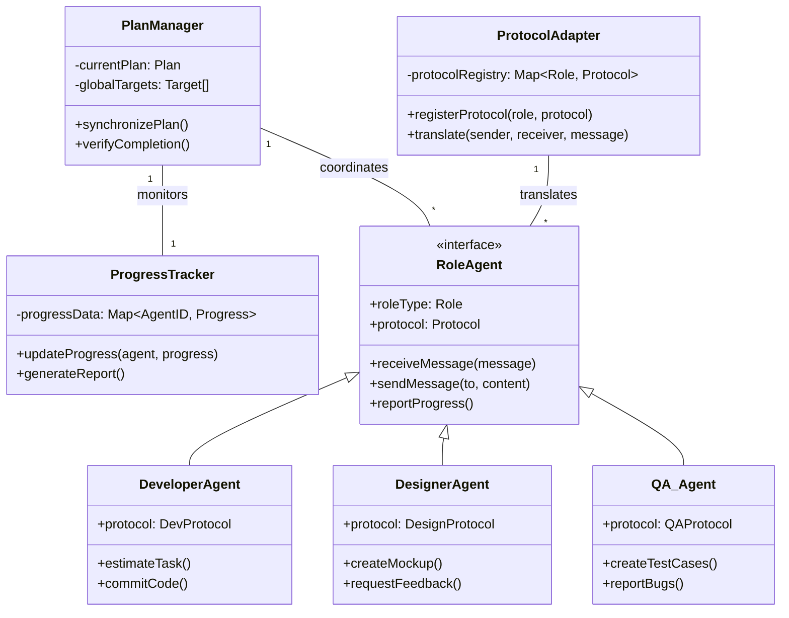
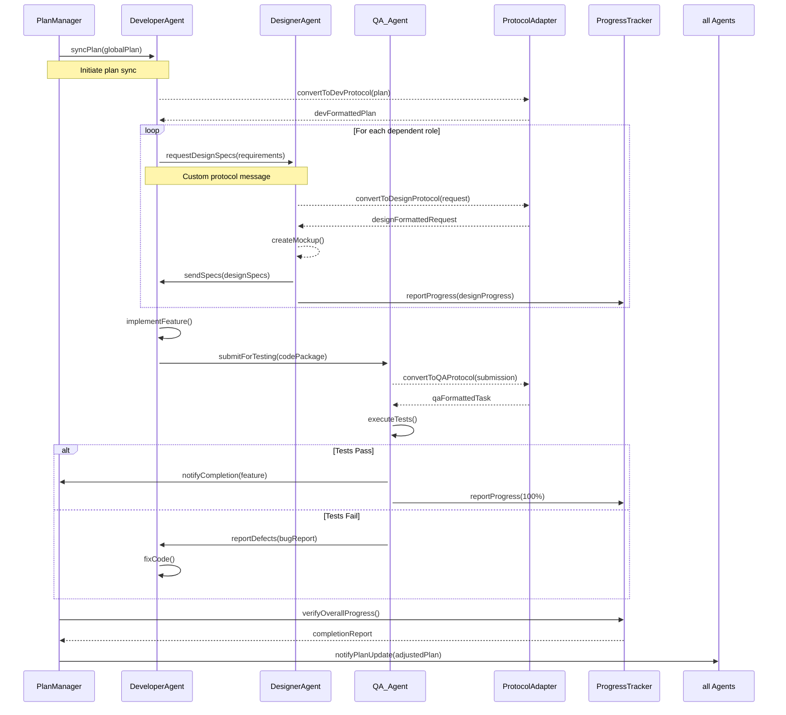
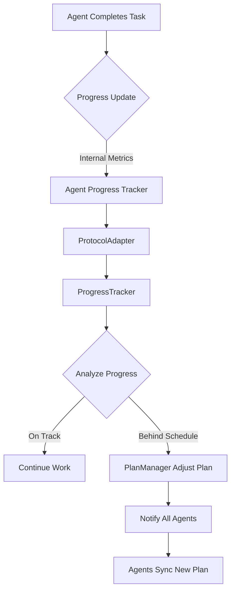

Here's a comprehensive design for a multi-role agent system with dynamic communication protocols, including UML and sequence diagrams in Mermaid format:

### System Design Overview
1. **Core Components**:
   - `PlanManager`: Central coordinator tracking global targets
   - `RoleAgents`: Specialized agents with custom communication protocols
   - `ProtocolAdapter`: Translates messages between different role protocols
   - `ProgressTracker`: Monitors and visualizes team progress

2. **Key Flows**:
   - Plan synchronization
   - Role-specific communication
   - Progress feedback loops
   - Target completion verification

---

### UML Class Diagram


---

### Sequence Diagram: Plan Synchronization & Communication


---

### Dynamic Protocol Design
1. **Protocol Registration**:
```python
class ProtocolAdapter:
    def __init__(self):
        self.protocols = {}
    
    def register_protocol(self, role: Role, protocol: Protocol):
        self.protocols[role] = protocol
        
    def translate(self, sender: RoleAgent, receiver: RoleAgent, message: dict):
        sender_proto = self.protocols[type(sender)]
        receiver_proto = self.protocols[type(receiver)]
        
        # Convert to universal format then to target protocol
        universal_msg = sender_proto.to_universal(message)
        return receiver_proto.from_universal(universal_msg)
```

2. **Role-Specific Protocol Examples**:
```json
// Developer Protocol
{
  "message_type": "code_submission",
  "commit_hash": "a1b2c3d4",
  "dependencies": ["lib_v4.2"],
  "test_coverage": 85.2,
  "technical_debt": {"level": "medium", "points": 120}
}

// Designer Protocol
{
  "message_type": "design_spec",
  "mockup_url": "https://figma.com/file/XYZ",
  "design_system": "MaterialUI_v3",
  "accessibility": {"wcag": "AA", "contrast_ratio": 4.5}
}

// QA Protocol
{
  "message_type": "test_report",
  "test_cases": {"passed": 42, "failed": 3},
  "defects": [
    {"id": "BUG-125", "severity": "high", "repro_steps": "..."}
  ],
  "performance_metrics": {"load_time": "2.4s", "memory_leak": false}
}
```

3. **Progress Tracking Structure**:
```json
{
  "plan_id": "PLAN-2025-Q3",
  "timestamp": "2025-07-27T14:30:00Z",
  "overall_progress": 65.8,
  "role_progress": {
    "developer": {
      "completed_tasks": 15,
      "blockers": ["API_DEPENDENCY"],
      "quality_metrics": {"code_coverage": 78, "tech_debt": 45}
    },
    "designer": {
      "mockups_approved": 8,
      "pending_reviews": 2
    },
    "qa": {
      "test_pass_rate": 92.4,
      "critical_bugs": 3
    }
  },
  "target_completion": "2025-08-15T00:00:00Z",
  "risk_assessment": "MEDIUM"
}
```

---

### Workflow Logic
1. **Plan Synchronization**:
```python
class PlanManager:
    def synchronize_plan(self):
        for agent in self.agents:
            agent_protocol = self.adapter.get_protocol(agent)
            agent_plan = agent_protocol.convert_plan(self.global_plan)
            agent.receive_plan(agent_plan)
            
    def verify_completion(self):
        progress = self.tracker.get_progress()
        if progress.overall >= 99.9:
            self.notify_success()
            self.initiate_next_phase()
```

2. **Agent Communication**:
```python
class RoleAgent(ABC):
    def send_message(self, receiver, content):
        translated = self.protocol_adapter.translate(
            sender=self, 
            receiver=receiver,
            message=self.protocol.format(content)
        )
        receiver.receive_message(translated)
    
    @abstractmethod
    def protocol_format(self, raw_content):
        """Convert to role-specific format"""
```

3. **Progress Feedback Loop**:


---

### Key Features
1. **Dynamic Protocol Handling**:
   - Automatic translation between role-specific formats
   - On-the-fly protocol registration
   - Schema validation for each role's messages

2. **Progress Tracking**:
   - Real-time progress dashboards
   - Predictive completion estimates
   - Automated risk detection

3. **Plan Adaptation**:
   - Dynamic task reassignment
   - Priority adjustment based on progress
   - Blockers resolution workflows

4. **Role Specialization**:
   - Custom protocols per role
   - Role-specific metrics tracking
   - Targeted communication patterns

This design enables heterogeneous agents to collaborate effectively while maintaining their specialized communication protocols. The ProtocolAdapter acts as a universal translator, allowing seamless information exchange while preserving role-specific data requirements.
